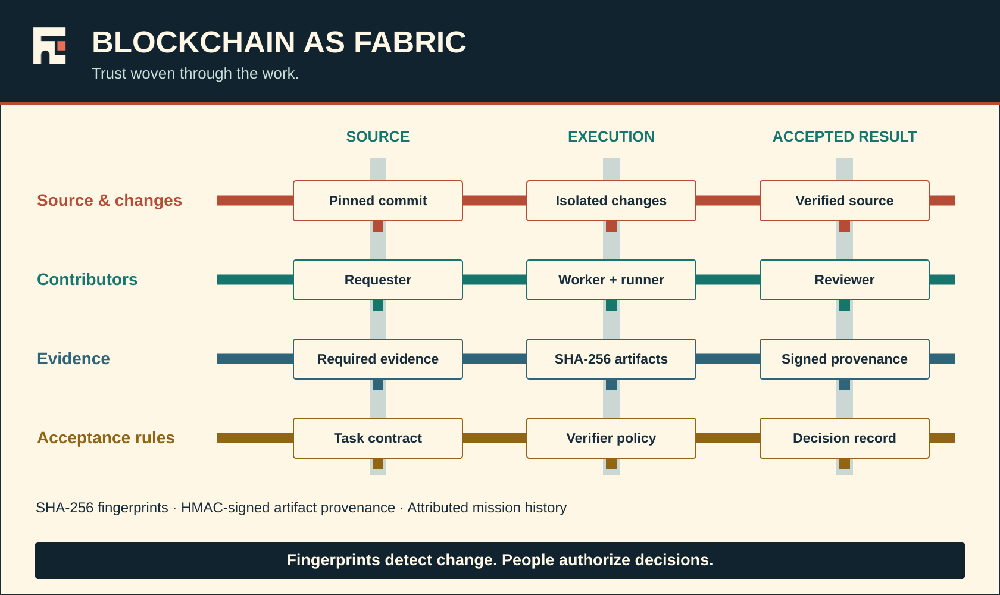

# Blockchain as fabric

In ECorp, **blockchain as fabric** is the woven provenance and integrity layer
running through the work: covered source changes, contributors, evidence, and
acceptance rules. It is not a separate product named Fabric. The strands below
are built into the current implementation.

This terminology describes their composition. It does not rename the database,
introduce a cryptocurrency, or claim a deployed distributed-consensus ledger.
Postgres remains the authority for operational state and decisions.

## The four strands

| Strand | What is recorded and checked | Implementation |
| --- | --- | --- |
| **Source and changes** | Repository, symbolic ref, and immutable Git commit travel with the mission and its tasks. Exported deliverables identify their base, verified revision, exact files, and byte digests. | [Source deliverables](ARCHITECTURE.md#portable-source-deliverable-boundary), [run source identity](../db/migrations/0022_run_source_identity.sql), and [source export](../crates/crony-runner/src/deliverable.rs) |
| **Contributors** | Corp, room, requester, worker, runner, task, run, and decision identities retain attribution across handoffs and recovery. Mission-owned workers can retire without erasing history. | [Mission-owned staffing](ARCHITECTURE.md#mission-owned-staffing-and-studio-handoffs), [domain records](../crates/crony-domain/src/lib.rs), and [staffing persistence](../crates/crony-store/src/staffing.rs) |
| **Evidence** | SHA-256 identifies artifact bytes. HMAC-SHA256 authenticates artifact provenance metadata. Reads and dependency handoffs recheck the signature, retention, digest, size, media type, source tuple, and applicable scope. | [Artifact store](../crates/crony-server/src/artifacts.rs), [dependency validation](../crates/crony-server/src/dependency_source.rs), and [artifact schema](../db/migrations/0014_artifact_objects.sql) |
| **Acceptance rules** | Persisted task contracts and verifier policies define the checks. Verification digests, authorized review decisions, and publication provenance connect the accepted result to its governing rules and exact source. | [Verification](ARCHITECTURE.md#evidence-gated-completion), [contract revisions](ARCHITECTURE.md#mission-specifications-and-contract-revisions), and [publication](../crates/crony-store/src/publication.rs) |

The implementation references were reviewed against main
`39632b957819012721c90902925d8fa7a9c7e873` on September 19, 2026 (UTC).
This documentation review is not a new runtime acceptance result.

## Follow one piece of work

1. An authorized person creates a mission against a pinned source revision.
2. ECorp accepts a bounded task graph and forms mission-owned workers for the work.
3. Runners execute in assigned worktrees; committed events retain actor and run
   attribution.
4. The runner evaluates the persisted verifier policy. A portable source
   deliverable is linked to the verification digest and exact source.
5. Evidence is stored by content digest with signed provenance. A downstream task
   consumes the accepted parent's checked deliverable, not an unverified message
   or a sibling's mutable checkout.
6. An eligible human reviews when policy requires it. Separately authorized
   publication retains the reviewed result and its provenance.

These connections are the weave. They let ECorp trace what changed, who did the
work, what evidence supports it, and which acceptance rules applied.

## What the integrity checks do—and do not—prove

- A changed artifact or signed metadata must fail the applicable integrity check.
  A matching fingerprint is not proof that the software is correct.
- Artifact signatures use a server-held HMAC key, not public-key consensus or
  independently operated blockchain validators.
- The operational event journal is persisted in Postgres. Do not describe every
  event as a block in a cryptographically chained, externally replicated ledger.
- Record links and valid signatures do not grant access. Corp/room authorization,
  current roles, control leases, reviewer eligibility, and expiry still apply.
- Verification, review, publication, merge, and deployment remain separate
  boundaries. A signature does not collapse those decisions.
- Database administration, signing-key custody, private storage, and runner
  containment remain part of the [security model](SECURITY.md).

## Multiplayer uses the same fabric

People share a mission's attributed history rather than competing local copies of
authority. One actor holds the live control lease; other authorized members can
comment, queue direction, or review through the relevant native paths.
Reconnect replays visible committed events. Worker retirement and browser closure
do not erase the source, evidence, or decision lineage.

See [rooms and threads](ARCHITECTURE.md#rooms-and-threads),
[control leases](ARCHITECTURE.md#control-lease), and the
[multiplayer parity map](multiplayer/U7_PARITY_MATRIX.md) for the current foundation
and the remaining independently authenticated, shared-execution acceptance work.
