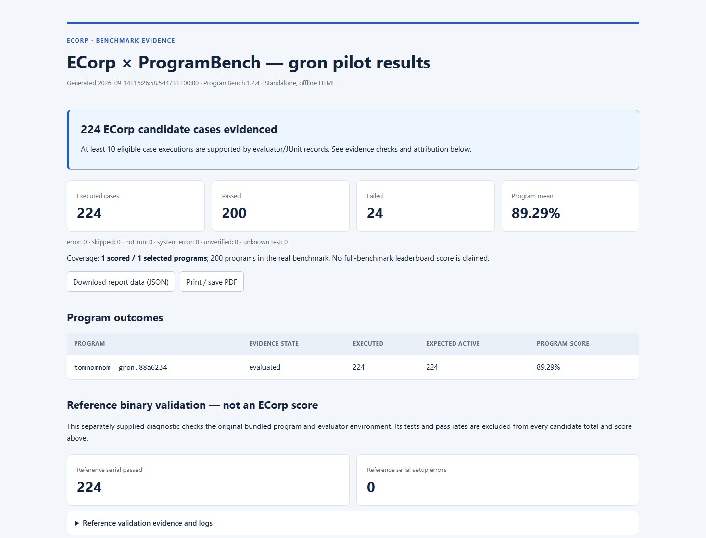

# ProgramBench gron pilot — September 14, 2026

Publication tracking: [issue #272](https://github.com/All-The-Vibes/ecorp/issues/272)
in [ECorp Build Project #3](https://github.com/users/shyamsridhar123/projects/3).

ECorp's generated `gron` implementation passed **200 of 224 eligible official
[ProgramBench](https://github.com/facebookresearch/ProgramBench) tests (89.29%)**,
with 24 failures. All 224 retained cases have
matching evaluator/JUnit execution evidence. Nine official exclusions were
removed from 233 raw result rows. Evaluation took **267.804 seconds**.

This result covers **one program out of 200**. It measures ECorp with the recorded
local Codex adapter, provider, model and settings; it is not a full-benchmark
score or a comparison of ECorp against a standalone agent.

Download [report.html](report.html) using GitHub's **Download raw file** action
and open it locally. It is a standalone offline report with all eligible cases,
search/status filters, failure details, JSON download and print support.
[report-data.json](report-data.json) contains the same structured results.



## What was tested

1. ECorp received a single task to independently re-create the `gron` CLI.
2. The agent could read supplied documentation and invoke the reference program
   with ordinary CLI inputs. Original target source and held-out tests were
   unavailable during implementation.
3. ECorp's Windows runner used Codex 0.152.0 and the existing configured
   `copilot_proxy` Responses gateway, described by the user as remote Portkey.
   Four native turn contexts recorded **gpt-6-astra / ultra**. Agent tools ran in
   the task's Linux cleanroom workspace.
4. After ECorp's persisted evidence checks passed, the accepted source was frozen
   and packaged. The official evaluator rebuilt `./executable` from that source
   in a fresh container and exercised it with hidden tests. Evaluator feedback
   was not supplied to the same candidate's generation session.

The official failure groups are:

| Group | Failed cases |
| --- | ---: |
| URL/proxy behavior | 8 |
| Statement parsing and diagnostics | 7 |
| Color output | 4 |
| Network error wording | 4 |
| Symlink-selected ungron mode | 1 |

[failure-analysis.json](failure-analysis.json) links each case to observed
assertions and separates observations from inferred causes. The self-signed TLS
case rejected the certificate correctly; the mismatch concerned error wording.

[Fix recommendations](FIX_RECOMMENDATIONS.md) reviews the failed assertions
against the frozen implementation and describes the next changes to make.
[candidate/gron.py](candidate/gron.py) and [candidate/compile.sh](candidate/compile.sh)
are byte-identical text copies from the frozen archive for line-addressable review.
The review is post-evaluation analysis; no recommended fixes have been applied
and no improved benchmark score is claimed.

## Source and execution identity

| Item | Recorded value |
| --- | --- |
| ECorp base | `b2523964e7576cafc00e84a51e1044f55826dea7` |
| System under test | Base plus the local task-scoped native Codex environment adapter |
| ProgramBench | 1.2.4, commit `b08d8621031f5f5abc4d3ffc2950256c83fbfe42` |
| Instance | `tomnomnom__gron.88a6234` |
| Active test branch | `bc90bea37ab6` |
| Test dataset revision | `de0ddfb637590c7ecb54fa0b5301f6dc7dfbcee5` |
| Cleanroom image SHA-256 | `1ee080c96c98761e0f4b69aad7cbbbe691b21bf98916b2221dcd1cf02777d9cd` |
| Accepted ECorp run | `c9c07006-98b6-4df2-871c-cfab81ddc3c8` |
| Frozen submission SHA-256 | `4e2413bb1c72582d8be77bb1978c1c1502c167c8f8cf0b515f3668d96b592fdf` |
| Compiled executable SHA-256 | `f7dd485b65c01e3f0984636484771fcaa80831e6fdaa77d346d587015817ed25` |

This publication contains the results and frozen generated submission. The local
ECorp runtime changes remain separate work; their file hashes and runner binary
hash are recorded in the report. The runtime behavior described here is not a
claim about unmodified upstream ECorp or a general UI provider-selection feature.

## Evidence and reproduction

The [run directory](runs/ecorp-gron/tomnomnom__gron.88a6234/) contains the exact
frozen `submission.tar.gz`, packaging/freeze receipts, the official `.eval.json`
(including compile/test/JUnit records), and evaluation start/finish receipts.
The freeze receipt predates evaluation and correctly records zero benchmark
executions at that stage. The later evaluator records establish the score.

With the pinned ProgramBench installation, inspect the published result without
executing the candidate:

```bash
programbench info docs/evidence/2026-09-14-programbench-gron/runs/ecorp-gron
```

The official evaluator command was:

```bash
PROGRAMBENCH_HF_REVISION=de0ddfb637590c7ecb54fa0b5301f6dc7dfbcee5 \
programbench eval RUN_DIR \
  --filter '^tomnomnom__gron\.88a6234$' \
  --image-tag task_cleanroom_v6 \
  --docker-cpus 1 --workers 1 --branch-workers 1
```

For a new evaluation, copy only the frozen archive into a new
`RUN_DIR/tomnomnom__gron.88a6234/submission.tar.gz` and retain the published result
unchanged. Use the pinned Linux image and normal evaluator isolation. The one
worker setting avoids a shared certificate/key-file race observed in the official
reference tests. [official-score-summary.txt](official-score-summary.txt) records
the official CLI's independently computed, rounded score.

## Scope and limitations

- Four recorded runs share the same task and preserved source: one namespace
  failure, two budget suspensions, and final accepted completion. Native owner
  revisions raised the token allowance from 500,000 to 1,000,000 to 1,250,000.
  Total recorded usage was **1,102,188 tokens**. No spend or failed history was reset.
- Provider model/effort were bound by trusted task-scoped configuration because
  existing discovery/selection could not select this pair through the mission
  UI. Native telemetry confirms the configured provider/model/effort; upstream
  routing and pricing were not independently attested. Monetary cost is unavailable.
- ECorp's four native acceptance checks cover runtime-proof structure, required
  files and provider evidence. The agent's 467 self-authored checks and the
  reference binary's 224 serial passes are separate from the official candidate score.
- Budget decisions used a development principal, and no independent human
  outcome-review gate was configured. This was a direct ECorp mission; this
  documentation publication does not assert native Dark Factory publication.
- The agent container used UID 1000, a read-only root, an internal network,
  2 CPUs and 8 GiB RAM. Native bubblewrap required `seccomp=unconfined`, reducing
  Docker syscall filtering. Provider credentials were absent from the agent runtime.
- Full local control-plane snapshots, provider session transcripts and runtime
  credentials are outside this public evidence set.

## Validation

The original adapter work passed migrations, formatting, Clippy, **554 workspace
tests** (323 ignored), web build/lint, 15 focused Codex tests, and 21 report/packager
helper tests. Browser verification reached the exact completed ECorp run and its
four passing native checks. These are distinct from the official benchmark count.

[report-qa.json](report-qa.json) records successful offline desktop/mobile,
case-filter, failure-detail, JSON-download and print checks, with no JavaScript
errors or external requests. The copied HTML retains the verified SHA-256
`e1eb2af63a97ad8177cc37d99922b419d3793edf762580a7021bbfccdb45c629`.

`publication-validation.json` records checks for this results-only branch.
`SHA256SUMS` identifies the exact published evidence bytes. Hosted CI status is
reported on the review pull request separately from these local checks.
