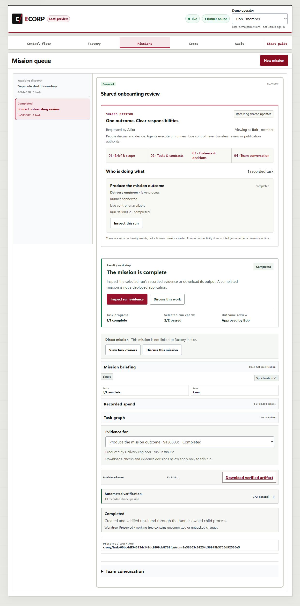
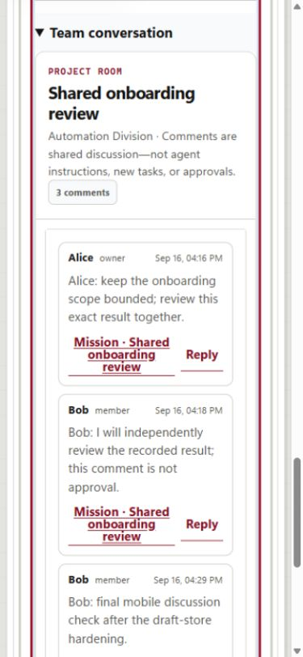

# Multiplayer UI: first collaboration slice

Date: September 16, 2026. Non-closing contribution toward #246, under #239.
Base: `b2523964e7576cafc00e84a51e1044f55826dea7` (live main verified before work).
Branch: `codex/multiplayer-ui`. Implementation remains local and uncommitted.

## Outcome and boundaries

The existing Missions surface now brings together the requester/current viewer,
recorded task and agent assignments, runner availability, recorded control holder,
and exact-run review links. Navigation opens the existing brief, task contracts,
evidence and team conversation; it is not another top-level workspace or a second
state machine. The original pixel floor and agent-inspector modal are preserved.
Control links open the exact assigned agent's existing inspector. Claim, transfer,
steer, queued messages, approvals, recovery and publication keep their existing APIs.

The same RoomPanel is used in Missions and Comms, with one viewer/Corp/room/mission
scoped in-memory draft store. React's native useSyncExternalStore keeps remounted
composers consistent. A late response cannot clear a newer draft or another operation's
idempotency key, including a same-text edit in a new draft generation. Drafts survive
surface and mission navigation within the page, not page closure/reload.

Disconnected state retains evidence, marks runner state unconfirmed, and removes the
new live-control links. The existing global runner badge also stops claiming an online
runner while browser updates are disconnected. No human presence is inferred from
actors, membership, control leases or runner liveness. A review wait and a provider-free
run are not live provider execution.

## Context correlation

- The September 14 HTML design reference supplies the shared outcome, explicit human
  responsibilities, handoff and version-specific review interaction direction. Its
  persona switches, finance delegation and specialist gates are simulations, not APIs.
- The September 15 architecture clarification keeps one authoritative server/Corp/DB
  and owner-controlled runners. Audit PRs #283/#293 were unmerged at inspection;
  this contribution does not silently incorporate them or create another ledger.
- The additional AI-generated meeting summary reinforces the centralized floor,
  modal agent interaction and human-to-human-first scope. Its Zulip guidance is
  internally mixed; no messaging product, identity store or memory backend is added.
- Proposed agent-only routine review does not change existing persisted human-review
  policies. Factory review automation and GitHub's required PR review are distinct.
  No approval, merge or deployment policy is bypassed here.
- Sign-in/invitations, owner-sharing contracts, real human presence (#253), OBO,
  named-specialist authorization, autonomous review and shared deployment remain
  separate backend/product work. This slice does not close #246 or the multiplayer epic.

## Local gates

- Existing lockfile installed offline: 27 reused packages, no downloads or dependency changes.
- Initial frontend and office pass: 271 tests. Review-corrected pass: **273 passed**,
  including **23 new collaboration tests**.
- `pnpm build:web`: passed. `pnpm lint:web`: passed without warnings.
- `node tools/check_migrations.mjs`: passed, 41 immutable migrations; none changed.
- `cargo fmt --check`: passed.
- `cargo clippy --workspace --all-targets --offline --locked -- -D warnings`: passed.
- `cargo test --workspace --offline --locked`: passed. Quiet readback rerun:
  **547 passed, 323 ignored** (1 runner, 4 server, 318 store). Ignored tests were not executed.
- `git diff --check`: passed.

## Actual browser/API/runner acceptance

Owned native PostgreSQL on loopback port 55476, API 18976 and web 15496. The source
fixture and runner worktrees are separate; the original office and other contributions
were not restarted, reset, enrolled or changed. Factory intake was off. Provider
adapters used checked-in synthetic fixtures, not personal provider accounts.

Browser actions, not injected page state, exercised:

1. Alice/Bob independent development-client views of the same mission and comments.
2. An unposted draft surviving mission A -> B -> A and Missions -> Comms navigation;
   the other mission stayed empty. Final-build posting cleared the shared draft in
   both surfaces. Unit tests cover late completion, same-text generations and key replacement.
3. Browser launch of one held plan through the real server and runner child process.
4. Alice claiming control, explicit transfer to Bob, Bob reclaiming his private token,
   Alice's competing claim being rejected, and Bob's live direction reaching the child.
5. A synthetic action approval followed by two passing persisted verifier checks.
   The fixture's "publish release" action makes no real publication call.
6. Alice's requester-excluded evidence buttons disabled; Bob inspecting the exact run
   and accepting its independent-review gate. One mission/task/run completed.
7. A server-only restart retaining the same database, runner, comments, review and artifact.
   The disconnected UI marked retained state, then resumed shared updates.
8. Bob's authorized artifact download matched its SHA-256; Eve's artifact read returned
   404 and her snapshot contained no mission. A new browser client recovered the result.
9. Desktop and actual 390px views, including Enter-to-open discussion and focus transfer.
   The 390px tab measured document width 375px, with no horizontal page overflow.
   Initial screenshots were inspected in the browser session; the review-follow-up
   image files below retain a fresh desktop view and mobile conversation.

Mission: `ba513807-fdbd-428e-970a-a3961815c17c`.
Run: `9a38803c-3423-4c56-949b-3706d92536e5`.
Artifact SHA-256: `82c6ba5dc838c03122ad3e4790082f5e4a557b40bb81540d214dab77c756c217`.
Final readback found three deliberately posted browser comments, with no duplicate run.
The separate draft-boundary mission remained held and unexecuted.

Local receipts and the owned supervisor are retained in ignored
`output/multiplayer-qa/` (`acceptance.json`, `ui-checkpoint.json`, `host-state.json`,
logs, native database and source/worktree). No credentials are included here.
The four owned QA services were stopped at closeout; API, web and PostgreSQL ports
were verified closed. Database, source, runner worktrees and evidence were retained.
The original `C:\dev\ecorp` checkout remained clean at its original HEAD. The final
mobile browser reported no warning/error console entries, and its temporary viewport
override was reset after testing.
The operator-local companion `output/multiplayer-qa/multiplayer-api.mjs` is retained
outside the proposed product diff. It relies on this machine's supervisor and exact
fixture ports, so it is not shipped as a portable or safe general-purpose seed command.
Its prepare operation must not be rerun over an existing checkpoint. Readback was
repeated only after current process ownership was verified by the owned supervisor.

## Corrections and limits

The first QA web launch pointed Vite at the repository root and returned 404; only
the owned web process was restarted with the correct app root. The first artifact
denial assertion expected 403; the native nonmember-hiding contract returns 404,
which was verified and retained in the assertion. A viewport override initially
applied to another active tab; only the subsequently measured 390px tab counts as
mobile evidence. Browser-control timeouts were recovered with fresh observations,
not duplicate POSTs. Final review found and fixed the late-response draft race above.

This is local deterministic integration evidence, not independent human production
sign-in, cross-owner execution, device-isolation qualification, full accessibility
certification, hosted CI or Azure deployment acceptance. No implementation commit,
push, PR, issue mutation, reviewer request, merge or deployment was performed.
When publication is authorized, use the then-current CONTRIBUTING.md and PR template,
reference #246 without closing it, keep the diff atomic, and submit Ready for review
to ecorp-team after verifying current repository rules.

## Pre-publication review follow-up

Two regressions were first reproduced against the candidate and then corrected:

- An explicit selected mission disappearing from the current snapshot could fall back
  to a different mission. One tested selector now binds both the card and discussion;
  only a never-selected view may default to the first record. Missing selected work
  displays "Selected mission unavailable" without substituting another discussion.
- A legacy mission with an empty description had no destination for "Brief & scope".
  The actual briefing JSX now renders a neutral empty-state explanation at that target.

The full 273-test frontend/office suite, build and lint passed after these corrections.
The existing history/office assertion was updated to verify the shared selector;
runtime tests exercise missing selection with another available mission, not only
an empty array. Actual browser switching from Bob's selected mission to Eve confirms
the unavailable view and absence of the collaboration panel. The empty-description
branch is verified by rendering the actual JSX, not by altering retained QA data.

The owned native QA stack was resumed without bootstrap, enrollment, new missions or
reset. The completed run, three comments, independent review and artifact hash remain
unchanged. New screenshots are native browser captures of this retained fixture;
they are not reconstructed UI or generated design mockups. The temporary client-only
image exporter is retained under ignored QA output and is not part of the product.

Live repository checks: #246 remains open and on ECorp Build; `ecorp-team` exists.
The effective main-branch rules require one approving team review and include
Copilot review rules. PR #278 is still open, so its exact `PR_TEMPLATE.md` headings
are used for the proposed PR body without claiming the template has landed on main.

### Desktop: shared mission and exact result

### Mobile: 390px team conversation

Measured viewport 390px and document width 375px; no horizontal page overflow.

