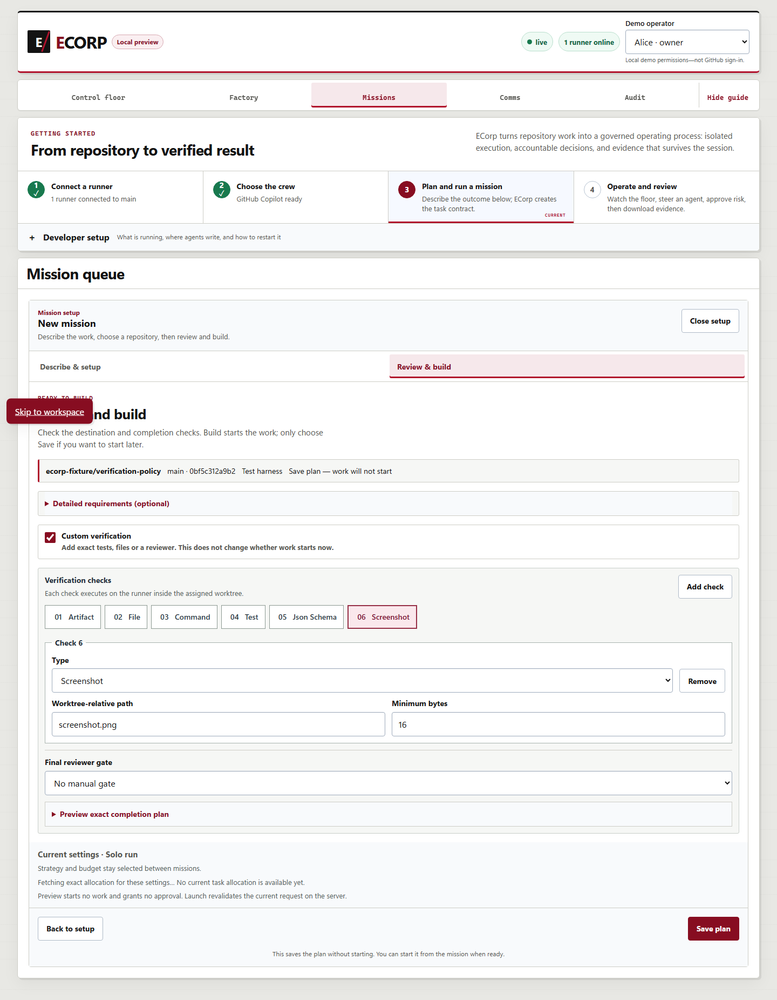
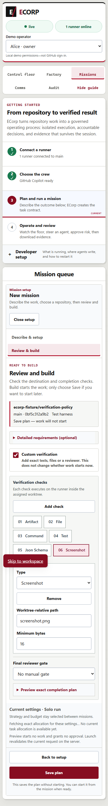
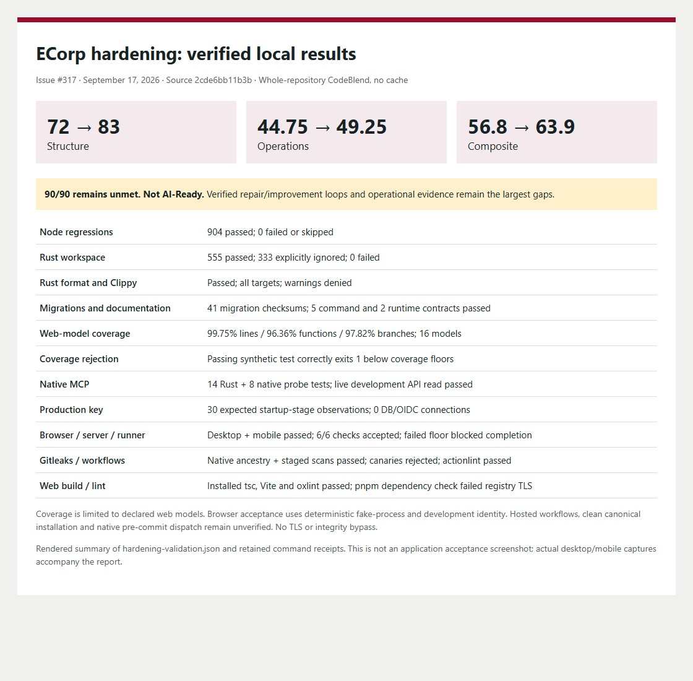

# Repository checks, native inspection and measured readiness

This follow-up to [the first validation report](2026-09-17-codeblend-readiness.md) addresses
[#317](https://github.com/All-The-Vibes/ecorp/issues/317). The implementation is commit
`2cde6bb11b3b5da96794684e8e3eb393f615a6ea`, tree `6a415629c7c859588258de527af8b77a17464c8e`,
based on `7eecd39e43720851512225844bf5d8158e8a944f`. This report is an evidence-only follow-up.

## Measured result

| Fresh whole-repository assessment | Structure | Operations | Composite |
| --- | ---: | ---: | ---: |
| Baseline `7eecd39` | 72.0 | 44.75 | 56.8 |
| Implementation `2cde6bb` | 83.0 | 49.25 | 63.9 |

The candidate remains **not AI-Ready**: L5 substrate, Bot-Assisted operations, Q2
Verifiable-but-manual, R3 Verifiable. **The requested 90/90 target is not reached.**
Relative to this fresh baseline, structure improved 11 points, operations 4.5 points and
the composite 7.1 points. The historical original result was 72/37/51.6. Operations on the
unchanged baseline have varied between assessments; live API evidence and model judgments
are not deterministic, so the entire historical difference is not a source-change effect.

Both final native evaluations used `--no-cache`, mandatory GitHub API evidence and the same
whole-repository exclusion policy (`3bb02c591009d8557365d3950208a43ef4b8bafda524044725609f1b5fe6015f`),
which excluded no paths. CodeBlend commit `0a9accccd36446c381c118b783e2e9f623643efa` and its
Windows binary SHA-256 `4229e93d77dce70e4e3493cab6bc5311c2d02551d024de33319c27ae6a323290` were
unchanged. Copilot CLI 1.0.85 ran Claude Opus 5, GPT-6 Astra and Grok 4.6 concurrently, one
round. ECorp's own SDK 1.0.11 / CLI 1.0.79 compatibility pair was not upgraded.

Native runs are `20260918-033415+0800` (baseline, 112.086 seconds) and
`20260918-033802+0800` (candidate, 115.218 seconds). All stages executed and all three judge
reports validated in each run. The candidate was evaluated from a byte-verified source snapshot
before commit; its Git tree was subsequently verified identical to the implementation tree.
The snapshot includes all 628 tracked/non-ignored source files, including new files.

An earlier raw workspace scan traversed an ignored Python environment under `output/` and is
invalid for comparison. A separate intermediate full run reused a stale security-pillar cache.
Both are preserved locally but excluded from the comparison above. Generated validation
artifacts were retained outside the final source snapshot; no evaluator rules were edited.

## Concrete improvements

- Repository gates discover all web/tool Node regression files, check current documentation
  contracts and propose bounded native Dependabot updates. This includes the first-phase fixes.
- Recommended Node/Rust versions, an install-free native version doctor, editor tasks and formatting
  settings make setup requirements explicit. CI actions are pinned and Cargo builds use lockfiles,
  including the separate desktop build.
- A native Node coverage lane preloads every one of the 16 declared framework-independent web
  models. Exact LCOV scope and source-stability checks accompany 99/95/97 percent floors for
  lines/functions/branches. New TypeScript files must be classified before the lane passes.
- Gitleaks scans selected commit ancestry with a verified native binary, redacted output and three
  exact reviewed historical exceptions. Optional local hooks invoke native tools; no shared hooks
  were installed. Inline suppression cannot bypass the configured scanner command.
- Production now rejects the public development master key, including equivalent case and surrounding
  whitespace, during startup preparation. The example environment no longer suggests that key.
- Native `crony-mcp --read-only` exposes snapshot reads, rejects writes before HTTP, requires explicit
  routing, restricts remote transport to HTTPS and does not follow redirects. Notifications have no
  tool effects; explicit null request IDs receive responses. The probe withholds private error bodies
  and emits bounded scope/count metadata. MCP configuration, an operations skill and a versioned
  contract document the native gateway without adding another harness or permission system.
- The verification-policy model and editor are extracted from `App.tsx`, reducing that file by
  456 lines while preserving controlled draft state and server/runner verification authority.

## Validation and scope

| Validation | Result |
| --- | --- |
| Native Node regression command, Node 24.19.0, concurrency 2 | 904 passed, 0 failed/skipped; 41.944 seconds; includes compiled MCP cases |
| `cargo fmt --check` | Passed; 2.194 seconds |
| `cargo clippy --workspace --all-targets --locked -- -D warnings` | Passed; 13.268 seconds |
| `cargo test --workspace --locked` | 555 passed, 0 failed, 333 ignored; 90.685 seconds |
| Migration/documentation checks | 41 immutable migration checksums; five command and two runtime contracts |
| Installed `tsc -b && vite build`, `oxlint` | Passed; installed-dependency scope |
| Native web-model coverage | 338 tests; 99.75% lines (2386/2392), 96.36% functions (212/220), 97.82% branches (1033/1056) |
| External coverage-floor negative fixture | One passing test still exits 1 below all three coverage floors |
| Actionlint 1.7.12 | All three changed workflows passed |
| Native MCP focused validation | 14 Rust tests, eight compiled-binary probe tests, fresh authorized development API read |
| Production-key regression | Original defect reproduced; fixed focused suite 5/5; 30 native startup-stage observations |
| Native Gitleaks | Reviewed HEAD ancestry and staged changes pass; new staged/committed canaries fail |

All 103 Rust/manifests retained identical hashes across the final Rust gates. The 333 ignored
tests comprise 332 explicitly opt-in PostgreSQL/SQLx cases and one stopped-session provider probe;
they are not passes. Coverage above applies only to the declared models, excluding React hooks,
TSX, Rust and other tools. Removing a redundant terminal newline in two extracted web files after
browser acceptance changed no other bytes; the final Node/coverage runs include that normalization.

The actual Edge browser, ECorp server, runner and an owned PostgreSQL cluster exercised the
policy editor at 1440- and 390-pixel widths. Six UI-authored checks persisted and passed for run
`d0c95ab5-a79f-473e-8430-99058d13d0bd`, with one accepted completion. Run
`bc2dc6e1-def6-4036-acc1-d37b77154d4d` failed its artifact floor and emitted no accepted completion.
Keyboard/focus, manual-review draft transitions and overflow checks passed. No human review was
submitted. Owned processes were stopped; source, worktrees, database files and artifacts were
preserved. This used development identities and deterministic `fake-process`, not provider inference.

Actual browser captures:

`pnpm build:web` still fails during its automatic dependency check because this host cannot complete
the canonical npm registry TLS handshake. Fresh frozen installation, hosted workflow execution and
native pre-commit framework dispatch remain unverified. TLS/integrity checks were not relaxed.
The installed native web tools and direct native scanner/checker commands passed separately.

## Remaining causes of the low operations score

The final rubric still assigns 1/4 to self-healing, continuous improvement and observability.
It lacks independently observed detection-to-repair-to-verification-to-consumption evidence,
including rollback, rejection, interruption recovery and repeated execution. This does not establish
that ECorp lacks all those capabilities; native Rust/PowerShell paths and existing operational
receipts are only partially recognized. A bounded local loop can qualify under CodeBlend's contract;
hosting, signatures and unattended scheduling are not mandatory. No trusted ECorp local-loop
verifier/profile has been established in this assessment, and no observations were manufactured.

API-confirmed agent-authored merged PR attribution remains absent, capping throughput at 2/4.
Creating this ordinary review PR does not establish a merged agent-authored Factory result.
Issues #269/#280 and draft PR #304 own broader review/autonomy work; this change does not
duplicate their mechanisms, bypass human review, relabel historical contributions or authorize merges.

The remaining structural weaknesses are coupling/large production contexts, test-quality evidence,
developer-environment completeness and agent-harness recognition. The authentic MCP registration
is detected in the evidence pack but not by two substrate configuration indicators; that discrepancy
remains unresolved. Documentation-drift coverage is **partial**, and cleanup automation remains
**70/100, Enrollment unverified**. The implemented checker blocks only its narrow command/version
contracts; complete repository-wide semantic/API drift and an enrolled cleanup loop are not claimed.

Machine-readable results and hashes: [hardening-validation.json](assets/codeblend-readiness/hardening-validation.json).
Full native reports, test logs, JUnit, initial failures and runtime receipts remain in the local
`output/codeblend-readiness-validation` directory and the native evaluator run directories.

The following image renders the measured summary; it is separate from the actual browser captures above.

