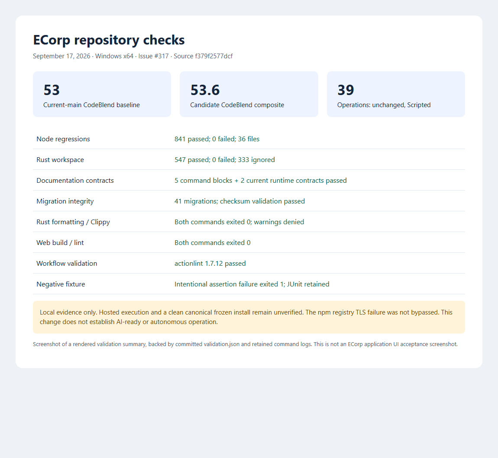

# Repository readiness checks and measured CodeBlend results

This is the first-phase report. See the [subsequent hardening and fresh assessment](2026-09-17-codeblend-hardening.md)
for the latest implementation, runtime acceptance and measured scores.

This contribution addresses [#317](https://github.com/All-The-Vibes/ecorp/issues/317).
Its validated implementation is commit `f379f2577dcfb545efa253ea9d9e106e29359005`, based on
`7eecd39e43720851512225844bf5d8158e8a944f`. The associated Git tree is
`144f5d78db3990d572163169647b1b7602d3cf50`. This report and its evidence assets were added afterward.

## Why the score was low

The original 51.6 composite combined a reasonably structured repository (72) with weak detected
operating evidence (37). The geometric mean makes the lower axis decisive. The largest weighted
gaps were self-healing CI/CD (1/4, weight 18), maintenance automation (1/4, weight 13), and recurring
improvement loops (1/4, weight 13). Tests and design documentation do not prove that an automated
repair loop has operated, validated changes, and retained reviewable provenance.

Some findings were stale or detection limits. The original checkout was from September 12;
current main already contained PR templates and the manual read-only Repo Steward workflow.
ECorp's native CLI, gateways, runners, and safeguards also exist despite incomplete recognition
in the original evidence pack. The scanner's lack of full PowerShell/control-flow interpretation,
partial branch-protection visibility, and metadata-based AI attribution constrain the result.
Its code-smell counts are heuristics: a reviewed function-span false positive and inconsistent
large-file indicators are recorded in the original local report. These are not reasons to add a
second harness or weaken the existing authority boundaries.

There were concrete repository gaps to fix: root `pnpm check` ran none of the existing web/tool
Node regressions, standard CI ran only 3 of 35 test files, the current command/version contracts
were duplicated in documentation without comparison to source, and dependency maintenance had
no native configuration.

## Changes and scope

- `pnpm test:unit` uses Node 22.23.2's native quoted glob discovery, two concurrent test files,
  and a 180-second per-test limit. It discovers the web and top-level tool regression suites,
  including newly added files, while excluding bare real-stack E2E drivers and output trees.
- The separate Repository checks workflow runs Linux/Windows PR jobs with pinned actions,
  read-only permissions, locked dependencies, and JUnit reports retained after failures.
  The previously undeclared `ws` transport-test dependency is pinned at 8.21.3.
- `pnpm check:docs` compares five marked validation-command sequences with `package.json`
  and two current Copilot compatibility paragraphs with the Cargo SDK pin and adapter runtime
  constant. It reads commands without executing them. Missing markers, drift, invalid aliases,
  and cycles fail. Historical evidence and semantic/API documentation coverage are outside scope.
- Dependabot proposes weekly Cargo, npm/pnpm, and Actions updates with bounded PR counts and
  minor/patch grouping. The Copilot SDK remains excluded for deliberate SDK/CLI compatibility
  verification. Proposed updates require review; no auto-merge or live-agent enrollment is added.

This reuses Node's test runner and GitHub's dependency updater. It adds no custom execution loop,
permission system, retry mechanism, or native provider change. PR #304 separately owns the shared
review skill; broader autonomous review/remediation remains tracked by #269/#280.

## Measured comparison

The bundled Windows evaluator is pinned to CodeBlend commit
`0a9accccd36446c381c118b783e2e9f623643efa`, binary SHA-256
`4229e93d77dce70e4e3493cab6bc5311c2d02551d024de33319c27ae6a323290`. It used an isolated Copilot
CLI 1.0.85, required GitHub API evidence, one judge round, and Claude Opus 5, GPT-6 Astra, and
Grok 4.6 concurrently. Scan policy and whole-repository scope were unchanged.

| Evaluated source | Substrate | Operation | Composite |
| --- | ---: | ---: | ---: |
| Original `b252396` | 72.0 | 37.0 | 51.6 |
| Current-main baseline `7eecd39` | 72.0 | 39.0 | 53.0 |
| Candidate tree, committed as `f379f25` | 73.6 | 39.0 | 53.6 |

The candidate was evaluated as staged local changes before commit, then its Git tree was checked
identical to the committed implementation. Baseline and candidate native runs both succeeded
with all three judge responses validated. Their run identifiers are `20260918-014450+0800`
and `20260918-015702+0800`; the evaluator names directories in UTC+8.

The measured improvement over current main is **0.6**, with **no operation-score improvement**.
The substrate increase comes from the evaluator's adjusted Security & Governance pillar;
it must not be described as measured security assurance. The candidate remains **not AI-Ready**,
**L4 Delegated / Scripted**, quadrant Q4, rung R2. Both axes must reach 80 for AI-Ready.

Native documentation coverage changed from `documented` to `partial`. The report does not
recognize all of the checker's tested failure-exit behavior and still describes some controls
as advisory. Actual negative fixtures establish nonzero exit for the narrow contracts above;
they do not establish complete repository-wide semantic drift coverage. The 70/100 cleanup
rating remains `Enrollment unverified`; no live cleanup schedule was enabled.

## Validation

Local Windows x64 evidence, using Rust/Cargo 1.98.1 and Node 22.23.2 for regression tests:

| Command / check | Result |
| --- | --- |
| `node tools/check_migrations.mjs` | Passed; 41 immutable migration checksums |
| `pnpm check:docs` | Passed; five validation and two runtime contracts |
| Native `test:unit` command with spec/JUnit reporters | 841 passed, 0 failed/skipped; 36 files; 38.866 seconds |
| `cargo fmt --check` | Passed; 3.73 seconds |
| `cargo clippy --workspace --all-targets -- -D warnings` | Passed; 86.526 seconds |
| `cargo test --workspace` | 547 passed, 0 failed, 333 ignored; 79.527 seconds |
| `pnpm build:web` | Passed |
| `pnpm lint:web` | Passed |
| `actionlint 1.7.12` on the new workflow | Passed |

The Node suite includes 28 documentation-contract tests, including mutation cases. A separate temporary fixture
proved nested discovery, TypeScript imports, excluded bare E2E/output paths, four passing tests,
and an intentionally failing assertion that retained JUnit and exited 1.

Ignored Rust tests comprise 332 opt-in PostgreSQL tests and one stopped-session provider probe;
they are not counted as passes. The first Rust attempt failed because the real npm shim was
missing from PATH; adding the existing genuine Node/npm directory to this task's PATH made the
full retry pass. Initial Node failures exposed missing installed dependencies, including the
undeclared `ws` dependency fixed here. Failed attempts remain in local evidence.

Canonical frozen installation remains **unverified on this host**: curl, PowerShell, Node 22,
and Node 24 fail the npm registry TLS handshake before HTTP, while verified nodejs.org control
requests succeed. Installed dependencies from the Microsoft npm mirror were used for passing
tests. The lockfile retains the original canonical npm URLs and integrity values, with the
minimal `ws` addition. TLS, tarball, and integrity checks were not relaxed. Hosted jobs still
need to establish clean installation and Linux/Windows execution.

No application UI behavior changed, and no full product stack, destructive database fixture,
or real-provider ECorp mission was launched for these repository checks. The benchmark's Copilot
judges are real inference; that does not substitute for product runtime acceptance.

Machine-readable measurements and hashes: [validation.json](assets/codeblend-readiness/validation.json).
The original native reports, complete command logs, JUnit files, negative fixtures, initial failures,
and registry diagnostics are retained under `output/codeblend-readiness-validation` locally.

The image below is a screenshot of the rendered validation summary, not an application UI
acceptance screenshot. It is generated from the measured JSON above.

