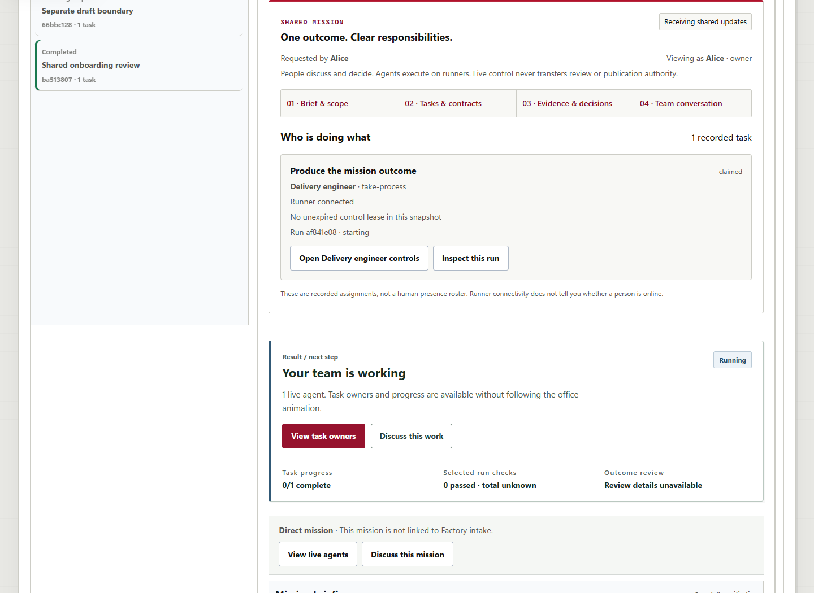
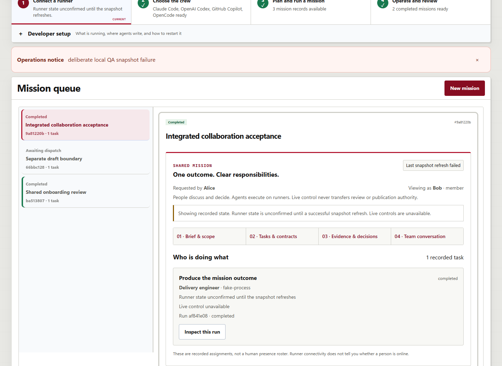
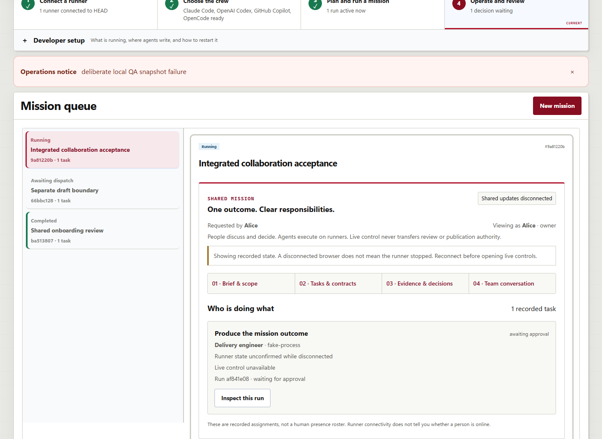
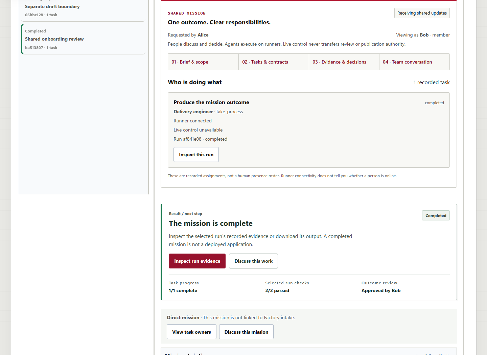
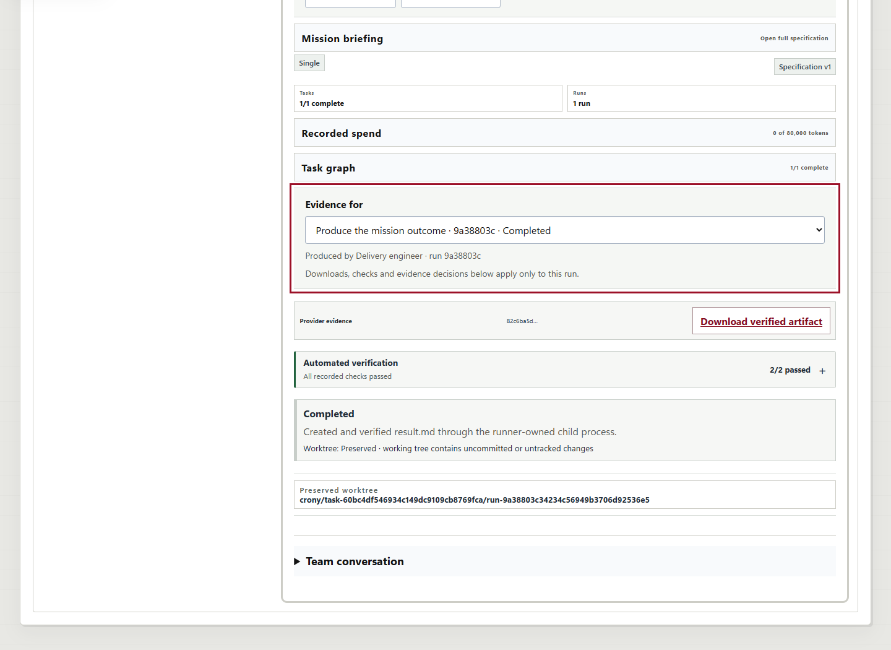
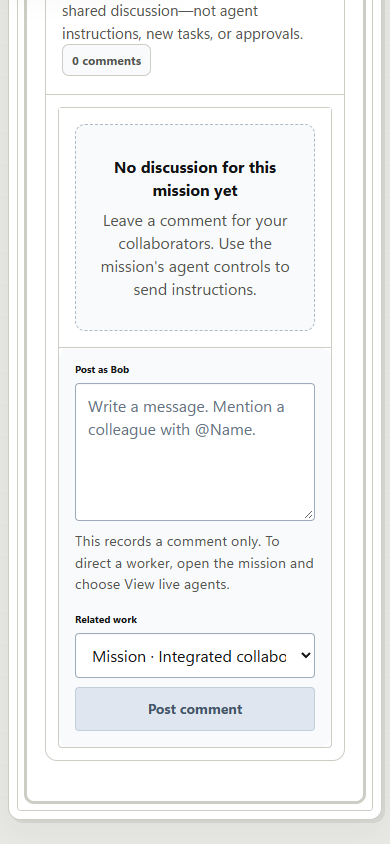

# Multiplayer UI integration with current main

Date: September 17, 2026 (America/New_York). Contribution: PR #306 / #313.

**Final local outcome: passed at the bounded synthetic-fixture scope.** The expired
QA credential blocker below was resolved only after explicit operator approval.
The native browser/server/runner path, focused regressions, and six repository gates
passed. This is not production identity, cross-owner or complete U7 acceptance.

The initial checkpoint below is retained as history; its blocked/uncommitted state
is superseded by the final acceptance section. The tested source merges main
`30ec3fab6acd566cc1fc1e574c8a6343d0ce0596` into `codex/multiplayer-ui`
(previous head `e421377a49a6f1d3fbf3a3f71d00e20eba5e3f82`).
The enclosing commit identifies the final UI source; PR #306 records publication
and reviewer-readiness separately. No merge, deployment or issue closure is claimed.

## Integration and source boundaries

The candidate incorporates the landed #265 run-activity/exact-run navigation and
finished-review reconnect work, #307 cost preflight/admission, #290 steering
lock-order fix, #288 startup validation, #278 PR template and #275 contributor
planning guidance. It does not introduce their changes again as new work.

The App conflict was resolved by retaining main's ISO snapshot receipt and
refresh-failure metadata, single refresh try/catch, viewer scope checks and
exact-evidence navigation/remount semantics. The collaboration projection now
parses the receipt at its boundary and requires a live connection, successful
snapshot and finite positive receipt before offering live-control navigation.
The global runner badge uses the same predicate. A failed read is labeled
"Last snapshot refresh failed", not a disconnected transport. Recorded evidence
remains readable. Missing receipt freshness also fails closed.

No new polling, execution, permissions, identity provider, backend/schema,
theme or harness mechanism was added. Scoped in-memory drafts and the existing
agent inspector remain the integration boundaries. Human presence is not inferred.

## Fresh validation

All commands ran on the integrated working source, not only the old published head:

| Check | Result |
| --- | --- |
| `node --experimental-strip-types --test apps/web/src/missionCollaboration.test.mjs` | 31 passed; the 8 integration regressions were first observed failing before the fix. |
| `node --experimental-strip-types --test apps/web/src/*.test.mjs apps/web/src/office/*.test.mjs` | 310 passed, none skipped or failed. Includes landed run-activity and exact-evidence regressions. |
| `node tools/check_migrations.mjs` | Passed; 41 immutable migrations unchanged. |
| `cargo fmt --check` | Passed. |
| `cargo clippy --workspace --all-targets --offline --locked -- -D warnings` | Passed. |
| `cargo test --workspace --offline --locked -- --quiet` | 554 passed, 343 ignored, zero failures. Ignored: 1 runner, 5 server, 337 store; these were not executed. |
| `pnpm build:web` / `pnpm lint:web` | Passed, no new warnings. |
| `cargo build -p crony-server -p crony-runner --offline --locked` | Passed; actual server/runner executables rebuilt for this candidate. |
| `git diff --check` | Passed. |

The separate main-based parity-map working source also passed its 279 frontend
tests, the six repository gates, and the same 554-passed/343-ignored Rust count.
It does not include the collaboration code. These are local checks; prior hosted
CI for `e421377` is not evidence for this new combination.

## Initial retained fixture readback

The owned fixture at `output/multiplayer-qa` was resumed on PostgreSQL 55476,
API 18976 and web 15496 with freshly rebuilt binaries. Resume did not run its
Prepare/Start, reset, seed, enrollment or mission-creation phases. The existing
application's normal development bootstrap still executes when a browser opens;
no reset or crew reseeding was requested.

The old PostgreSQL PID 51832 was positively identified as an unrelated Windows
WebView executable. It was left untouched; its old fixture record was retained.
Only the ignored supervisor's resume guard was adjusted to permit positively
different executables. Unknown identity, matching live executable or occupied
fixture ports still stop the operation. Product process-control code is unchanged.

Current server readback and headless Chromium browser inspection verified:

- Retained completed mission `ba513807-fdbd-428e-970a-a3961815c17c` and run
  `9a38803c-3423-4c56-949b-3706d92536e5` remain completed.
- Three existing discussion comments remain; no new comments or missions were made.
- The separate draft-boundary mission remains ready and unexecuted.
- Bob's authorized artifact bytes retain SHA-256
  `82c6ba5dc838c03122ad3e4790082f5e4a557b40bb81540d214dab77c756c217`.
- Eve's artifact request returns 404 and her snapshot has no missions.
- The current Missions UI renders its collaboration panel and receiving-updates
  status against the real API; it truthfully shows no online runner.

These checks confirm retained state, not a newly executed runner path. The prior
[foundation report](2026-09-16-multiplayer-ui-first-slice.md) and screenshots remain
historical evidence for their exact source. No new acceptance screenshots were
produced, and no fresh desktop/mobile/failure-state acceptance is claimed here.

## Initial blocking condition and approval boundary — subsequently resolved

The retained runner reports `runner registration rejected: runner credential rejected`.
Read-only metadata inspection confirmed that the file and database credential
expired at `2026-09-17T23:47:29.083833Z` (19:47 Eastern); the database reports it
expired and not revoked. The native server default credential lifetime is 86,400
seconds. Authentication requires an unexpired credential; normal resume cannot
renew an already-expired one. No credential value or hash is included in evidence.

The approved batch explicitly prohibited re-enrollment and credential replacement.
No attempt was made to extend database expiry, replace credentials, bypass auth or
enroll another runner. The separate runner warning about new-project connection
storage being inside the source checkout was also retained; it is not the
authentication cause and was not repaired under this UI scope.

Fresh live-control, snapshot failure/recovery, reconnect and full
browser -> server -> runner -> verifier/artifact acceptance therefore remain
**blocked**. Ready transitions, review requests, pushes, commits and the #313
In Review board update are paused. Both in-progress merges and all evidence are
preserved. The next step requires explicit authorization for native renewal by
re-enrollment of only this expired synthetic QA runner, retaining its identity,
database, source, old credential record and completed work. No manual database
repair or changes to the original office are proposed.

At checkpoint closeout, all four owned QA services were stopped using native
ownership checks; ports 55476, 18976 and 15496 were verified closed. The database,
credential file, original source and runner worktrees were retained. The original
`C:\dev\ecorp` remains clean at `971445e1cbf9388c51803e2adf28b11bd98b1ffa`.

#239/#246/#314/#315/#316 remain open. #244/#245 still own the shared-source and
ownership/capacity contracts, and #242 retains its separate browser-sign-in gate.
This checkpoint does not satisfy production identity, cross-owner execution,
real-provider, physical-device or full U7 acceptance.

## Final acceptance after approved native credential recovery

The operator explicitly approved native re-enrollment of only `multiplayer-ui-qa`.
Its expired credential was privately archived, its new credential was obtained
through the existing enrollment/registration path, and its runner ID, Corp,
database, source and completed work were preserved. No expiry was edited in SQL,
no auth bypass or new enrollment mechanism was introduced, and the original office
was not changed. Normal later resume used the renewed credential without enrolling
again. The initial blocked checkpoint and failed browser-helper attempts remain
under ignored output rather than being erased.

One new bounded synthetic mission was prepared through the existing preview/create
APIs and launched through the real browser. The fixture's approval action does not
perform any actual publication. No vendor inference, cloud action or GitHub effect
was part of runtime acceptance.

| Recorded object | Identity/result |
| --- | --- |
| Mission | `9a81220b-2e90-4fc7-a553-d72e416f09b3` |
| Task | `237ea103-b1c8-4c8f-a4fc-92241ba8f291` |
| Run | `af841e08-0364-4d35-a3ba-0acb9a3ece13`, completed once on `multiplayer-ui-qa` |
| Source commit | `171eafdadc6a6a738f6d45dd639fc63936ebd2c8`, unchanged clean fixture source |
| Artifact | `a466e44d-5d1e-41e4-bc91-876dc851faa0`, two persisted checks passed |
| Artifact SHA-256 | `a8757d72cc4ed7f8cdbcf2d9c518dcb7ef0c0380dcd651e03c247595e1520afd` |
| Outcome review | Alice requester excluded; Bob independently approved exact-run evidence |

Fresh native Chromium/Edge browser automation observed:

1. Missions -> another mission -> Missions and Missions -> Comms -> Missions
   preserve the scoped in-memory draft, without showing it in the other mission.
   Enter activates conversation navigation and transfers focus to its destination.
2. Browser launch reaches the actual native runner, which writes `result.md` in
   its isolated worktree, not the configured fixture source. Snapshot records,
   local output bytes and the authorized artifact download agree on the SHA-256.
3. Deliberately returning HTTP 503 for snapshot reads leaves the actual application
   WebSocket open. The panel reports the failed refresh, retains recorded work,
   removes live-control links and marks the header runner state unconfirmed.
   Removing the interception restores the state through the existing refresher.
4. Closing actual application WebSockets plus making the browser transport offline
   removes live-control links without cancelling the run. Reconnect restores the
   same run and unposted draft; HTTP offline alone was not used as disconnect proof.
5. Action approval and independent outcome review remain separate. Alice cannot
   accept her own requested result; Bob's evidence navigation is bound to the exact
   run. The native persisted review is approved by Bob and the run is completed.
6. The older completed run `9a38803c-3423-4c56-949b-3706d92536e5` remains explicitly
   navigable while newer work exists. Its evidence panel contains that exact run ID.
   The broader same-mission older/newer cases are covered by the landed #265 suites.
7. At a measured 390px viewport, document width is 390px with no horizontal page
   overflow. Reduced-motion preference is active. Bob posts one deliberate comment;
   Alice's second client sees it, and the acknowledged composer clears. Switching
   actors does not reveal the other actor's draft.
8. Eve sees no selected mission/collaboration panel, and artifact access returns
   404. Original completed work, three original comments, the old artifact hash,
   and the unexecuted draft-boundary mission are unchanged.

Screenshot review exposed one additional stale-state label in the existing start
guide. A regression failed first, then its runner completion mark and explanation
were gated on the same snapshot predicate. The final 310-test frontend pass,
build/lint and a real-browser failed-read/recovery check include this correction.
The initial live-run screenshot predates only this start-guide wording correction;
the final failure screenshot below and retained-data browser check use final source.
The rebuilt Rust server/runner source is identical across those checks.

Two operator-local helper mistakes were retained and corrected: the Comms
navigation is a link, not a button; the actual completion heading is "The mission
is complete", not "Verified outcome". The latter check failed after the native
review had already succeeded. Its persisted state was inspected, and read-only
follow-up verified completion rather than replaying launch or review. No duplicate
mission, run, review or comment was created. Browser page-error count was zero.

All six repository gates passed again during final validation, with the exact
310 frontend / 554 Rust passed / 343 Rust ignored counts listed above. The final
UI-only start-guide correction was followed by the full frontend suite/build/lint;
it changed no Rust source, migration or dependency. On final closeout all owned QA
services were stopped, ports were checked closed, and evidence/data were preserved.

The ignored operator-local helpers are `integration-browser.py` (prepare/readback),
`accept-integration.py`, `finish-integration.py`, `check-final-freshness.py` and the
owned supervisor. `integration-checkpoint.json` records the exact operations,
failures and captures. Do not rerun preparation or any uncertain mutation against
retained data; these machine-bound helpers are not a portable reset command.

## Screenshots

All images are native captures of the real local application, not reconstructed
mockups. The app's existing theme is unchanged.

### Live run and recorded controls

### Final snapshot-failure state

### Actual browser disconnect

### Completed independent review

### Exact older-run evidence

### 390px conversation

The earlier [snapshot-failure capture](images/multiplayer-ui-integration/snapshot-read-failure-641d1cf7.png)
is retained to document the start-guide inconsistency discovered during visual review;
use the final capture above for the corrected presentation.
