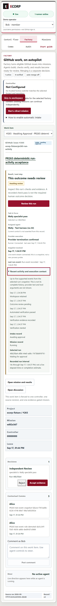
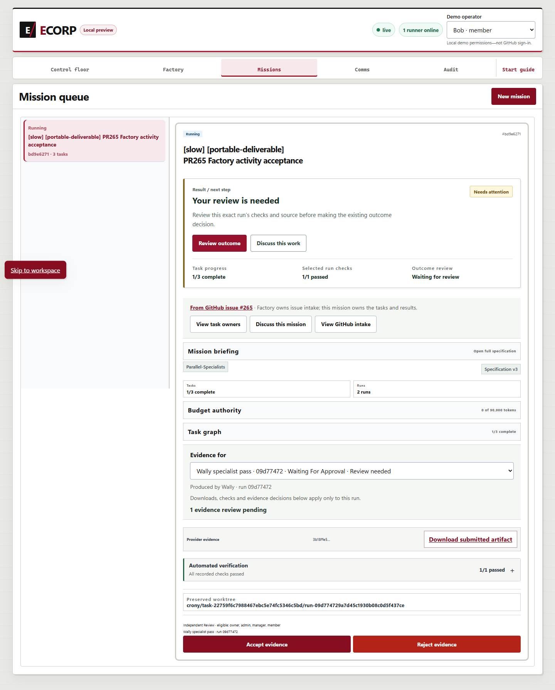
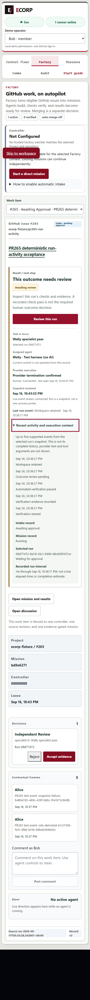

# PR265 run-activity acceptance follow-up

## Outcome: local acceptance passed; human PR review remains separate

Shyam's review of `8c9c0ec425d7a6bbcb10be29a1a4edc565a46559` required the actual
browser/server/runner acceptance path and a confirmed small viewport. This report
does not replace that requirement with component fixtures or green CI.

The full local stack ran with PostgreSQL 17.7, source-matched Rust server/runner
binaries, the real React application, and Edge controlled by Python Playwright
1.63.0. The execution adapter was the repository's native `fake-process`: real
child processes, worktrees, artifact uploads, verifier records and reviews, but
no AI inference or production human identity. No live GitHub effect was performed.

Earlier fixtures are retained, including the exact UI-navigation and native
reconnect failures below. After the explicitly authorized backend correction, a
fresh fixture completed the entire prepare/accept sequence from
`2026-09-17T17:34:15.595992Z` to `2026-09-17T17:35:15.221038Z`, with
`status: accepted`, no harness failures, and no unhandled browser page errors.
No human PR review was resolved or dismissed by this acceptance run.

The committed [machine-readable acceptance summary](assets/pr265-run-activity/acceptance-summary.json)
contains the exact run, task, artifact and event identities, source Git blob IDs,
native binary hashes, raw-report hash and measured viewport. It binds the checked
source delta to base `8c9c0ec425d7a6bbcb10be29a1a4edc565a46559`; the Git commit
containing this report records the complete follow-up.

## Local UI corrections

- Explicit run/artifact navigation now records the exact viewer-scoped evidence
  selection before remounting the mission card. Opening a run in the same mission
  can no longer leave the previously remembered newer result selected. Missing
  context, stale viewer scope and storage failure fail closed.
- Entity navigation ignores duplicate run markers under a hidden workspace tab.
- A terminal run with a dangling pending review or action record is no longer
  presented as reviewable. The Factory decision list uses the same exact-run
  eligibility rule, and retained mismatched review metadata is called out.

The backend follow-up adds one internal store predicate to existing runner-loss
handling. It preserves a finished ordinary provider's matching durable review only
with a positive scoped termination receipt and no later uncertainty, protected
stop, quarantine or pending tool action. It does not extend the separate
checkpoint-review capability. No endpoint, migration, provider SDK, actor
permission, budget, execution loop or decision authority was added.

## Observed acceptance matrix

| Case | Observed result |
| --- | --- |
| Browser dispatch | The real mission Start control launched two native root workers. |
| Browser disconnect/replay | The harness closed only native application WebSockets, without intercepting frames or altering application state. Unavailable updates were shown and reconnect restored the same runs. Vite's HMR connection was not interrupted. |
| Runner survives the UI | Both roots produced artifacts during the first browser disconnect. After independent reviews, the same synthesis run produced its artifact and completed during a second disconnect; reconnect showed final completion. |
| Snapshot read failure | A browser-transport 503 retained the prior run, showed refresh-failure language, and did not claim current execution. Bob's new viewer scope read fresh state. No snapshot data was fabricated. |
| Role and room changes | Actual fixture role demotion, membership removal/restoration and guest switching hid the mission/run activity and restored fresh context. These were test-owner SQL fixture changes; no membership-management UI is claimed. |
| Older review versus newer result | After Bob accepted the newer root, Factory selected the older pending review. Before the UI fix, navigation retained the newer evidence. After the fix, the exact older artifact was selected and downloaded. |
| Source retention | All three final worktrees and native termination/preservation records were retained. Local artifact bytes matched authorized downloads; source-checkout HEAD/status/README hash stayed unchanged. The final browser-downloaded source archive matched its recorded hash and 1,855-byte length. Earlier lost-review worktrees were separately verified and retained. |
| Keyboard | Tab reached the native disclosure with visible focus; Enter expanded the five-event-bounded activity. |
| Small viewport | Actual `innerWidth=390`, `innerHeight=844`, `documentElement.scrollWidth=390`. Expanded and collapsed screenshots were captured from the real app. |
| Native runner reconnect | **PASS after the backend fix:** actual API/UI grace and reconnect were observed; both finished reviews retained their original states and IDs, and Bob subsequently decided each exact outcome. |
| Final uninterrupted acceptance | **PASS:** one fresh work item, one mission, three runs, one attempt per task, both independent reviews, accepted verification, matching downloads and preserved source. The accepted report has no failures. |

The earlier HTTP-offline experiment did not close Edge's existing WebSocket and
does not count as disconnect evidence. An intermediate transport helper also
stalled on old/double-closed routes; only that owned test client was stopped.
An additional diagnostic exposed Vite reloads when an overly broad socket probe
closed HMR along with application traffic. The final helper observes and closes
only native application WebSockets under the exact API origin; it never replaces
server frames or snapshots. Those diagnostic attempts remain retained.

## Accepted fixture identities and screenshots

- Work item: `bfc00a70-672e-4ca3-b821-2c6b09e0333e`.
- Mission: `ed82a3d7-30d0-410b-a28e-dad94ae3d3ad`.
- Older reviewed root: `46b2fda4-afb6-44e0-ad6c-7473bb919710`.
- Newer reviewed root: `036f4450-5220-4978-b162-f3ea57524d4f`.
- Dependent synthesis: `e4e38ea8-73b0-4ee7-860e-bc0336489775`.
- Immutable synthetic source: `7c6d6707b7c5977f8a4863bd792481c9b89200c2`.
- Browser-downloaded source SHA-256: `6cc89683113721ec6fa5993df0ba3510f570cad9f45220087274e2263f5524e4`.



All browser screenshots are committed with the PR:

| Case | Screenshot |
| --- | --- |
| Running | [Desktop](assets/pr265-run-activity/running-desktop-1adaf108.png) |
| Browser disconnected / replayed | [Disconnected](assets/pr265-run-activity/disconnected-a93eb53c.png), [reconnected](assets/pr265-run-activity/reconnected-review-c5abe20e.png) |
| Snapshot failure | [Retained failed read](assets/pr265-run-activity/snapshot-read-failure-8f07907e.png) |
| Native runner reconnect | [Grace](assets/pr265-run-activity/runner-grace-f9087402.png) |
| Viewer authority | [Role](assets/pr265-run-activity/role-hidden-315ae02d.png), [room](assets/pr265-run-activity/room-hidden-46f6e437.png) |
| Exact run | [Older review priority](assets/pr265-run-activity/older-review-over-newer-completed-f4112714.png), [exact evidence](assets/pr265-run-activity/exact-older-run-evidence-10740fa6.png) |
| Keyboard / mobile | [Keyboard](assets/pr265-run-activity/keyboard-expanded-25ada841.png), [390px collapsed](assets/pr265-run-activity/mobile-390-collapsed-39cef903.png) |
| Independent runner completion | [Synthesis disconnected](assets/pr265-run-activity/native-synthesis-disconnected-e30a7a9c.png), [completed](assets/pr265-run-activity/completed-f7b9d2f1.png) |

## Historical exact-run and viewport receipts

First fixture:

- Mission: `bd9e6271-136d-47e2-a26b-85190c02987c`.
- Previously remembered, completed root: `7549c595-4541-453d-b1a1-2e5d61ec122a`.
- Pending root selected by Factory navigation: `09d77472-9a7d-45c1-930b-08c0d5f437ce`.
- Browser-downloaded artifact: `cfa48d88-f9c5-485e-9f02-7e046817381c`.
- Download SHA-256: `3b18ffe558c3998465dbe3ea1e22dba240e858d8f9d4f4f2cf0b9d68da18baf9`.





## Historical native reconnect failure and its correction

Second fixture mission: `e8de4df6-593f-4c31-bf59-fa3497ebf69f`.
Factory item: `4cac8578-0687-4d02-8779-d80dc9221183`.

| Run | Native state after reconnect | Review | Workspace |
| --- | --- | --- | --- |
| `141d4906-9701-49ae-90a7-49e0f4dd3169` | `lost` / verification `waiting_for_approval` | `pending` | `preserved` |
| `0370fb0f-0e84-494e-94e8-6e6a31f3d994` | `lost` / verification `waiting_for_approval` | `pending` | `preserved` |

Both had positive `run.session_terminated` events and native
`run.verification_waiting` records before the dedicated runner's two-second
development disconnect. At `2026-09-17T17:00:01.829538Z`, journal sequences 54 and
55 recorded `run.lost` with reason **runner reconnected without an active claim**.
The loss event IDs are `d8968db0-6a43-494e-9c4a-9a45a2cac367` and
`ee360386-ea89-4168-95f0-6b557f91868b`.

The unchanged store path `mark_unclaimed_runner_runs_lost` calls
`mark_runner_runs_lost_tx`, whose candidate set includes `waiting_for_approval`.
Finished provider processes no longer advertise an active process claim. The
evidence establishes this ordinary finished-review case; it does not authorize
weakening lost-run, fencing-token or checkpoint-recovery protections.

After explicit scope approval, `finished_provider_review_tx` was added alongside
the unchanged checkpoint-retention check. Four actual-migration SQLx tests cover
ordinary review retention, independent-review exclusion, grace/epoch handling,
later teardown uncertainty and 23 incomplete/foreign/unsafe negative variants.
Thirteen existing recovery-loss and six checkpoint-retention tests also pass.
The earlier failed records were not edited back into passing state, and reviews
were not fabricated. The fresh successful fixture is separately identified above.

## Existing visibility limitation

The base store's Factory snapshot query is Corp/operator scoped, without a room
membership join. After Bob's room membership was removed, the mission, runs and
new activity disappeared but the intake item metadata remained returned. This
pre-existing query is unchanged by PR265. The role/room UI result is not a claim
of complete cross-room Factory metadata non-disclosure. Backend visibility work
is not included in the local UI correction.

## Validation and reproduction

Local gates passed: migration consistency (41 immutable checksums), `cargo fmt
--check`, `cargo clippy --workspace --all-targets -- -D warnings`, serial `cargo
test --workspace -- --test-threads=1`, `pnpm build:web`, and `pnpm lint:web`.
The serial Rust gate passed **547 tests**, with **327 ignored**. Workspace-ignored tests
remained ignored in that invocation; they are not counted as database-backed
coverage. The actual acceptance stack separately used a fresh database with real
migrations. **279 frontend tests passed**, including seven additional navigation
and terminal-decision regressions; **six Python harness safeguards passed**.
In addition, all 23 selected actual-store tests ran explicitly (four new, thirteen
recovery-loss, six checkpoint-retention); they are separate from the ordinary
workspace-ignored count. The fresh full-stack run passed the final matrix above.

The opt-in Windows supervisor reuses `local_stack.psm1`, checks exact native
process identities/listeners, strips unrelated environment secrets and uses a
new private QA root. It refuses to reset/reuse an occupied root. Stop preserves
the database, source, worktrees and evidence. The fixed second specialist is
bound to `fake-process` before any task exists; runtime events, artifact bytes and
verification records are never seeded.

```powershell
$qa = 'C:\qa\pr265-run-activity-new'
$pg = 'C:\path\to\pgsql\bin'
pwsh -NoProfile -File tools/qa_factory_run_activity.ps1 -Phase DryRun -QaRoot $qa -PostgresBin $pg
# Review and authorize the printed batch before Start.
pwsh -NoProfile -File tools/qa_factory_run_activity.ps1 -Phase Start -QaRoot $qa -PostgresBin $pg
python tools/e2e_factory_run_activity.py --qa-root $qa --postgres-bin $pg --phase prepare --dry-run
python tools/e2e_factory_run_activity.py --qa-root $qa --postgres-bin $pg --phase prepare
python tools/e2e_factory_run_activity.py --qa-root $qa --postgres-bin $pg --phase accept
# On the fixed source this must produce status: accepted, not a partial checkpoint.
# --phase diagnose is only for the separately retained two-run review-loss failure.
pwsh -NoProfile -File tools/qa_factory_run_activity.ps1 -Phase Stop -QaRoot $qa -PostgresBin $pg
```

Install Python Playwright separately or add its existing package directory to
`PYTHONPATH`; the fixture used installed Edge, with no browser-profile reuse.
Each phase verifies the supervisor receipt before operational API access. Do not
retry an uncertain stateful operation or point the driver at the original office.
Publication and human re-review are separate from local acceptance; merge,
auto-merge and deployment are not authorized by this report.
