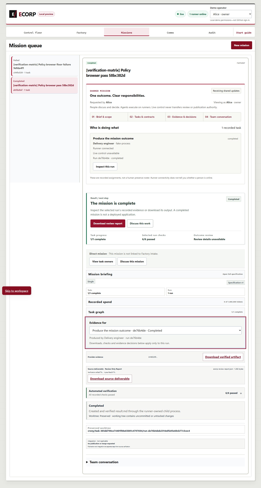

# Local recurring audit and feedback validation

Repo Steward now supports finite recurring audits with durable checkpoints,
finding deduplication, pause/stop controls and retained failure history. A bounded
candidate/active/retired corpus adds reviewed advisory guidance to later audits
without suppressing findings. The [versioned contract](../specs/recurring-audit-v1.md)
and [CLI guide](../../scenarios/repo-steward/README.md#local-recurring-audits-and-feedback)
describe the exact scope.

The integrated source base is `d4dad1ba555b58a87271b6071234f74f50258085`, merging
readiness work with upstream `0b1ad59da398e3dbd6a696d0264bcb6ebd620219`. Its sole
manual conflict resolution retained both web import groups. Local maintenance
changes were then validated by their exact source hashes in the
[machine-readable evidence](assets/codeblend-readiness/local-recurring-audit.json).

## Validation

| Check | Observed result |
| --- | --- |
| `pnpm test:steward` | **194 passed, 0 failed, 0 skipped** |
| `node tools/e2e_steward_maintenance.mjs --output NEW_ABSOLUTE_DIRECTORY` | **23 actual CLI invocations; 17 acceptance assertions passed** |
| Web/tool regressions | **1,007 passed, 0 failed, 19 compiled-MCP opt-in skips** |
| Windows Rust workspace on integrated source | **561 passed, 0 failed, 343 ignored** |
| Required migration, documentation, formatting, Clippy, web build/lint | Passed |
| Updated workflow validation | Actionlint passed |

The CLI acceptance starts separate Node 22.23.2 processes, writes real private
receipts, restarts them and checks the files. It proves unchanged-data no-ops,
changed findings, pause/resume, terminal stop, stale/partial refusal, inactive
candidate exclusion, actual review-file hashing, exact active-guidance bindings,
later consumption, retirement, stale-review refusal and byte-identical input
preservation. The review deliberately supplied a wrong digest; the command used
the actual file bytes. All input snapshots and review decisions in this driver
are synthetic. They do not authenticate a reviewer or prove live GitHub cadence.

Independent code review found and corrected combined transition-bound overflow,
incomplete historical artifact validation, unbounded guidance fanout, invalid
source-ID coercion and serialization of optional auditor fields. Regression tests
cover those failures. Windows correctly refused a directory replacement while its
lock was open; that test now awaits the original operation and checks its result.
Previous failed test attempts remain preserved outside the repository.

## Integrated browser and native runner

A clean detached `d4dad1ba` application exercised the actual browser, server,
PostgreSQL and runner with the existing deterministic `fake-process` adapter.
The positive task passed **all six verifier types**. The intentional artifact-size
failure remained failed with **zero accepted completions**. Two collaboration
cases selected the exact run's evidence by keyboard at desktop and 390-pixel
widths; there were no page errors, blocked requests or horizontal overflow.

The first fixture lacked its two command/test files and correctly failed; that
attempt was retained. A fresh fixture reused the established files and passed.
Setup refusals and an initial navigation-helper failure were also retained. Both
owned stacks were stopped, with evidence and worktrees preserved. This is local
deterministic integration, not provider inference or production authentication.

## Fresh Linux Rust coverage

The integrated Rust source was measured from a fresh clone, build directory,
profiles and owned PostgreSQL service. **873 tests passed, none failed**: 531 unit,
337 store SQLx and five server SQLx tests. Native `cargo-llvm-cov` recorded
**50,109 / 73,525 lines = 68.1523%** across 70 compiled files, passing the existing
67% floor. The run took **1,235.137397 seconds**. All 102 Rust/Cargo inputs remained
unchanged and match the local integration checkout; no prior profiles or reports
were reused. Both owned containers are stopped and retained.

This is compiled Linux Rust coverage. It excludes web/provider execution and the
still-unexecuted runner stopped-session probe. The workflow later added a separate
Node maintenance-test step; the measured Rust coverage script and source are
unchanged.

These results establish local mechanisms and their stated acceptance paths. They
do not assign a new operation score or establish unattended Factory delivery. The
latest completed [CodeBlend assessment](2026-09-18-codeblend-v3.md) remains
**92.0 structure / 68.25 operations / 79.2 composite** on its recorded earlier
source. The requested 90/90 goal remains incomplete.
