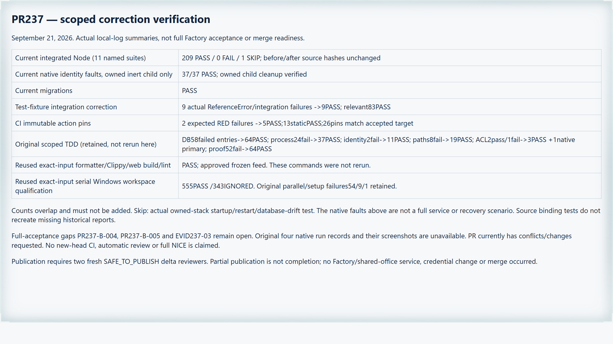
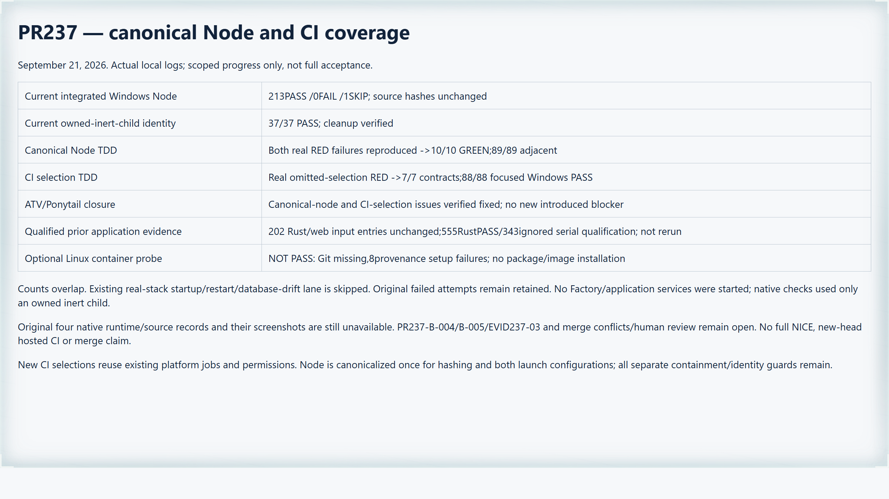

# PR237: reviewed correction progress, not final acceptance

This candidate is an incremental correction to remote head
`6e69bc543ef16d11ecf4baf5f2488a6a7b478100`, not a claim that the full PR is NICE.
It preserves the eight prior scoped fixes and their TDD history, adds the missing
source-binding dependencies to the attempt-path test fixture, and pins the
existing CI action references to the accepted target's immutable SHAs. It does
not start Factory, introduce another test platform, close #50, merge the PR or
waive human review.

## Current verification

- Eleven named Node suites: **209 passed, 0 failed, 1 skipped**. The skipped
  owned-stack startup/two-restart/database-drift lane was not executed.
- Real owned-inert-child identity fault checks: **37 passed**; child cleanup
  verified. These are not a native Factory/budget-recovery scenario.
- Current migration checker passed.
- Attempt-path test integration: the actual nine current failures became nine
  passes without accepting `ReferenceError`, weakening path assertions or
  replacing the driver's admission logic. The actual source-binding helpers now
  execute in the controlled fixture. The relevant three-suite run passed 83.
- CI pinning: two real contract failures became five passes; thirteen broader
  static CI checks passed. All 26 remote uses match accepted target
  `39632b957819012721c90902925d8fa7a9c7e873`; the immutable Rust action's explicit
  `1.98.1` input was checked. Jobs, permissions, options and cold-primary ordering
  were preserved.

Focused counts overlap; they are not additional unique coverage. The complete
current commands, ordered suite list, before/after input hashes and native
readback are in [the selected current packet](pr237-progress/manifest.json).
Original eight-fixer evidence remains in
[the historical packet](pr237-review-fixes/README.md).

## Source-identical baseline reuse

The recorded Rust and web input manifests still match this candidate. The
earlier formatter, workspace/all-target Clippy and approved frozen-feed web
build/lint passes are reused, not described as new runs. The later Windows
workspace qualification passed **555 tests, with 343 ignored**, using
`--test-threads=1`; it did not skip/filter additional tests. Original parallel
and setup failures (54, 9 and 1) remain retained, not retroactively passed.

The packet includes the original command results and logs plus the current
continuity check. A recorded base HEAD is lineage, not a substitute for the
tested working-tree hashes. No original unavailable native report was
reconstructed.

## Still open

- **PR237-B-004:** original four native runtime/source/executable/cleanup records
  remain unavailable. New source-binding code and its tests do not recreate them.
- **PR237-B-005:** current correction screenshots do not supply images for those
  original unprovided native runs.
- **EVID237-03:** current qualified evidence is provided, but the full review's
  outstanding evidence requirements await independent closure.
- The PR currently has merge conflicts and a changes-requested review. New-head
  hosted checks, fresh Copilot feedback, full Santa acceptance and required human
  gates are not claimed by this local report.

Any permission to publish this correction must come from two fresh independent
`SAFE_TO_PUBLISH` delta reviews under the deployed trusted policy. Those reviews
cannot stand in for full-PR NICE.

## Follow-up before publication

The first scoped publication pair disagreed: one reviewer found that the
installed Node junction was rejected by mandatory executable binding. That
candidate was not pushed. After a recorded retry, the driver now selects the
canonical trusted Node executable once and uses it for hashing and both Node
launch configurations. The real selected Windows Node and an owned alias/target
regression pass without relaxing any separate path, source or cleanup guard.

The three missing CI regression files are now selected in the existing
platform-appropriate jobs, including the Windows-specific cases. Pins, job
permissions, opt-in boundaries and cold-primary ordering remain unchanged.

Current integrated Windows validation: **213 passed, 0 failed, 1 skipped**;
owned-inert-child identity checks: **37/37**, with cleanup verified. Canonical
Node TDD reproduced both failures before **10/10 green** and **89/89 adjacent**
checks. CI selection retained real red runs, then **7/7 contract checks** and
**88/88 focused Windows cases**. These counts overlap.

An optional cached Linux-container probe was **not successful**: eight
provenance cases could not launch Git because the image lacks it. That is not
a source failure or a Linux pass. No Git/package/image was installed to hide
the failure; actual hosted Linux validation remains a future gate.

All 202 recorded Rust/web input entries still match the original qualified
baseline evidence. One checkout's CRLF-only Rust-test materialization was
returned to the exact tested bytes after verifying identical Git blobs; no
semantic code change or new Rust run is claimed.

[Current follow-up raw receipts](pr237-progress/round-3/manifest.json) preserve
the commands, failures and hashes. Earlier receipt packets remain byte-exact.
The original three full-acceptance gaps, merge conflicts and human review gates
remain open. Fresh scoped publication reviews still precede any push.

