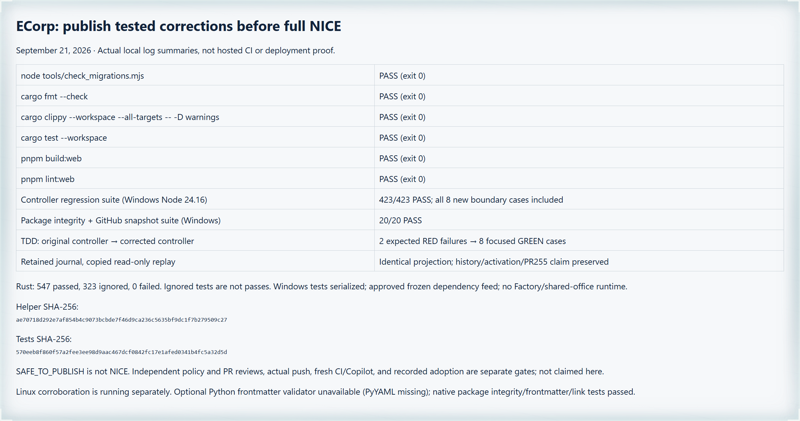

# Review executor: publish corrections without declaring completion

This correction separates permission to publish a tested PR correction from
the full PR's final Santa verdict. Two independent native Astra reviewers
evaluate the remote-head-to-candidate delta for `SAFE_TO_PUBLISH`; later full
PR acceptance needs a different fresh pair and the complete template rubric.
Open findings, branch protections, human approvals and stopping bounds remain.

`progress-rubric` and `progress-published` reuse the existing journal, claims,
push readback and recovery paths. Unfinished published work checkpoints as
`blocked`, not a completed CI wait. A reviewed post-activation `deploy` preserves
existing history and uncharged claims; it refuses active charged execution.
These commands record evidence, not its authenticity or a GitHub effect.

## Local verification on September 21, 2026

| Check | Actual result |
| --- | --- |
| Original-controller publication/deployment regressions | 2 expected failures |
| Corrected focused boundary tests | 8 passed |
| Complete controller suite, Windows Node 24.16.0 | 423 passed, no failures/skips |
| Package integrity and GitHub snapshot suites | 20 passed |
| `node tools/check_migrations.mjs` | passed |
| `cargo fmt --check` | passed |
| `cargo clippy --workspace --all-targets -- -D warnings` | passed |
| `cargo test --workspace` | 547 passed, 323 ignored, no failures |
| `pnpm build:web` | passed |
| `pnpm lint:web` | passed |
| Copied retained-journal replay | identical projection and unchanged journal |

The eight focused cases are included in the 423 controller cases, not additional
coverage. Rust 1.98.1 tests used `RUST_TEST_THREADS=1`, an owned short temporary
directory and two build jobs. Web dependencies used pnpm 11.19.0 and the approved
frozen package feed. Application source inputs were unchanged throughout the
baseline run. No shared office or Factory runtime was used.

The optional Python skill validator could not import PyYAML. Native package
frontmatter, links and all ten pinned upstream resources passed instead; no new
runtime dependency was installed.

The image is a Kimi WebBridge capture of the actual local log summaries, not
proof of hosted CI, a browser-to-runner application test, policy adoption or
completed PR remediation. Linux corroboration was still running at capture.
Raw red/green logs, baseline results, source digests and replay results are
retained by the owning executor outside the PR worktree.

This is pre-publication validation. Independent exact-policy and full-PR
reviews, the real push, new-head CI/Copilot feedback and recorded policy
adoption are separate subsequent gates. The PR's draft, target-update and
human-review requirements are not waived.
