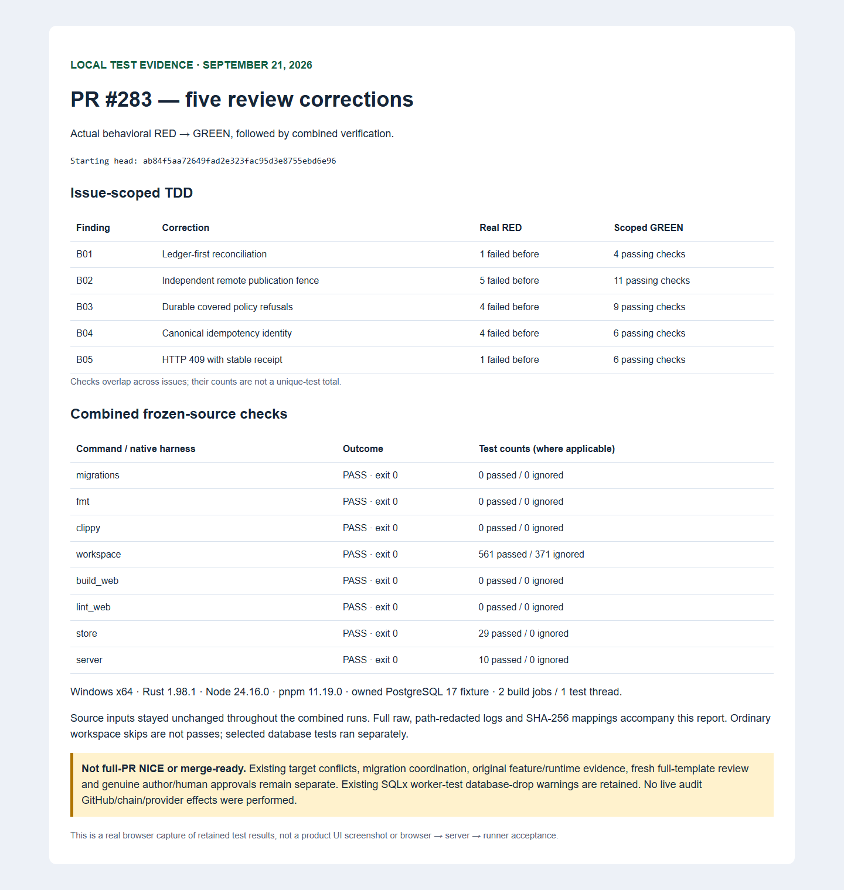

# State-audit review corrections — September 21, 2026

Five introduced findings from the independent PR283 review are corrected. Starting remote head: `ab84f5aa72649fad2e323fac95d3e8755ebd6e96`. This is corrective progress, **not full-PR NICE or merge authorization**.



The image is an actual browser capture of [retained local test results](verification.html), not the product UI or full-stack acceptance. [Machine results](verification.json), [TDD outcomes](tdd-summary.json), and [original/private-to-public SHA-256 mappings](redaction-manifest.json) accompany the path-redacted, whitespace-normalized log derivatives. Original logs remain retained; no historical failure was rewritten.

## Corrections

- **B01/A02:** lock the ledger before the destination during reconciliation, matching configuration.
- **B02:** bind each independent remote witness to its immutable destination and check both remote and database ancestry fences inside publication, before writes. The documented bootstrap limitation remains explicit; legacy nonnull commits need an explicit destination ID.
- **B03/A01:** classify the two semantic verifier-policy denials using the existing native refusal type, without broadly converting SQL/auth/integrity failures.
- **B04/A03:** derive audit and native source-upgrade identities from one canonical key.
- **B05:** retain the native error prefix while attaching its receipt, preserving HTTP409 and exact refused replay.

## Actual verification

Fifteen behavioral RED assertions failed before their respective fixes. Every issue's regression then passed. Per-issue passing counts overlap; do not sum them as distinct tests.

All six contributor commands passed on the combined frozen source: migrations, format, all-target Clippy with warnings denied, workspace tests, web build, web lint. Rust builds used `--locked --offline -j 2`; tests used one thread. The complete workspace result is **561 passed, 0 failed, 371 ignored**, including synthetic in-process REVM compatibility, not live chain execution.

Selected current workspace-built native harnesses separately ran the database/audit cases: **store 29 passed, server 10 passed, zero failures and zero ignored**. These use real migrations, native service/store/handler paths, synthetic metadata and deterministic remote transport. The two existing worker-start tests retain their SQLx database-drop warnings; their assertions passed. Source files and executable hashes were verified unchanged during these runs. No cleanup warning is erased or counted as behavioral RED.

Reproduce the selected lanes using an explicitly owned disposable PostgreSQL maintenance database in `DATABASE_URL` (never a shared/application database):

```sh
cargo test -p crony-store --lib --locked --offline state_audit_tests:: -- --include-ignored --test-threads=1 contract_revision::state_audit_refusal_tests::
cargo test -p crony-server --locked --offline state_audit:: -- --include-ignored --test-threads=1 factory_source_audit_tests::
```

The parent executed the native Rust test executables freshly built by `cargo test --workspace`; their exact commands/hashes are retained. No substitute test implementation was used. A separate earlier frontend run passed233 tests on unchanged frontend source; this is not a product browser check.

Environment: Windows x64, Rust1.98.1, Node24.16.0, pnpm11.19.0, PostgreSQL17-alpine. Unrelated credentials were scrubbed. Ephemeral fixture credentials used child environment delivery, explicitly reduced assurance. Fixture keys and transport are synthetic. No real audit-publication GitHub write, provider inference, live Factory activation or chain transaction occurred.

## Remaining gates

The initial full-template review remains BLOCKED until freshly assessed; these corrections do not promote an old or scoped report into NICE. Target integration, PR255 migration0042 coordination and downstream PR293 reservations remain separate; no applied SQL was rewritten. The original feature's portable runtime/browser-server-runner evidence and genuine author self-review/human approvals remain separate from this correction packet. A new passing local run does not rewrite earlier failed runs. Current-head hosted CI and automatic Copilot review must be checked after publication. No merge, force/base push, draft-ready change or approval impersonation is authorized by this report.

Published log SHA-256 values cover canonical Git LF bytes, not a CRLF checkout. Normalization and private-original hashes are explicit in the manifest; original raw logs are preserved outside Git. No test result, error or failure was removed.
