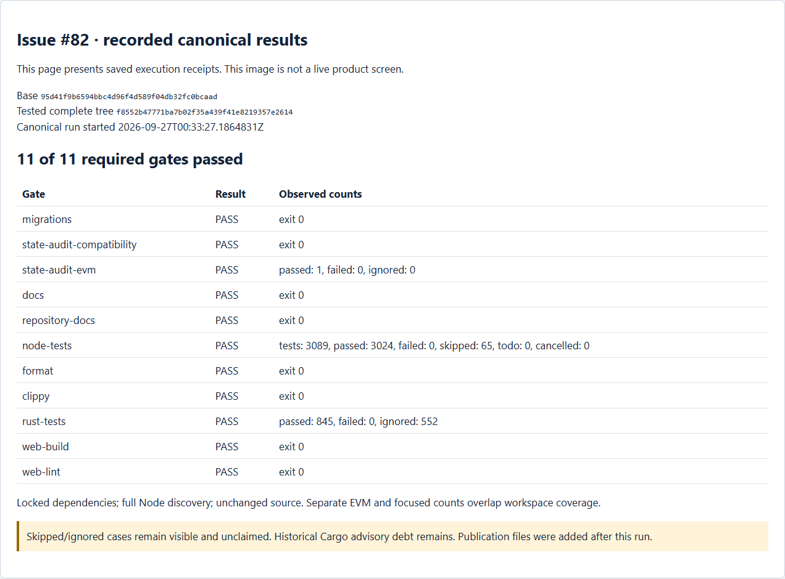
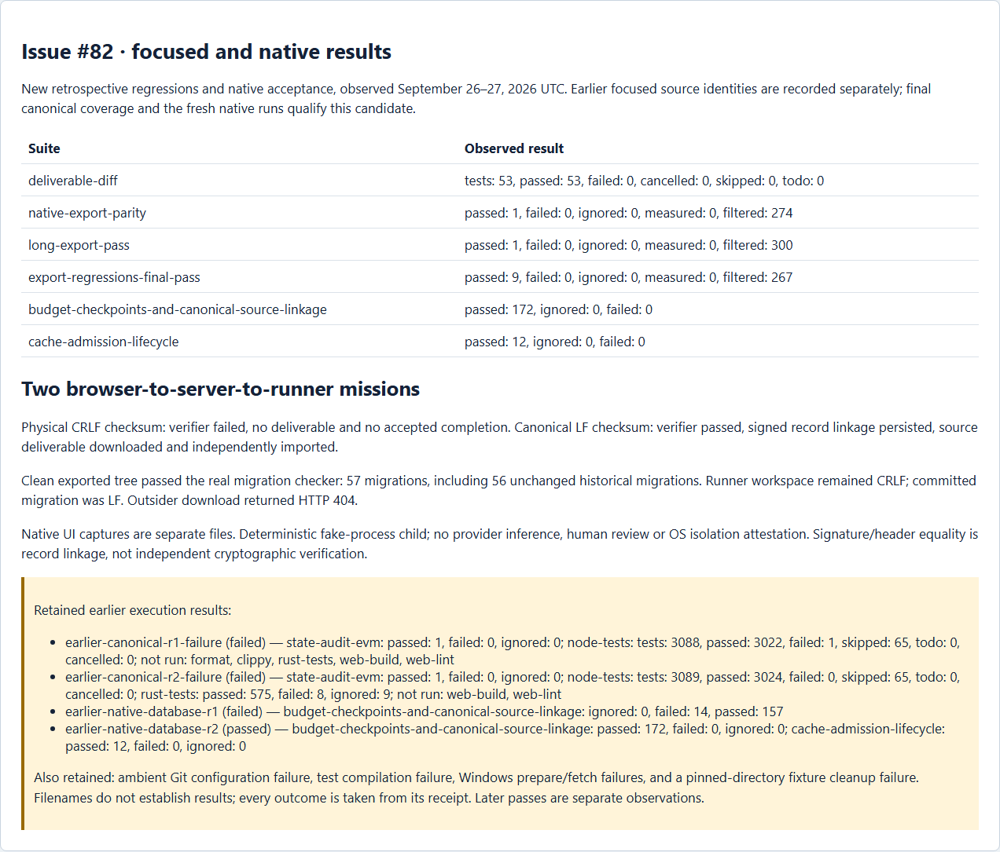
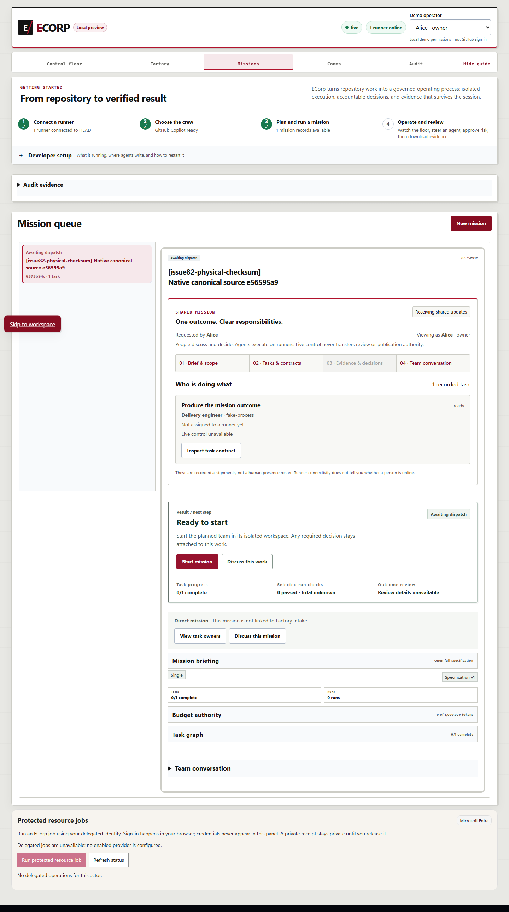
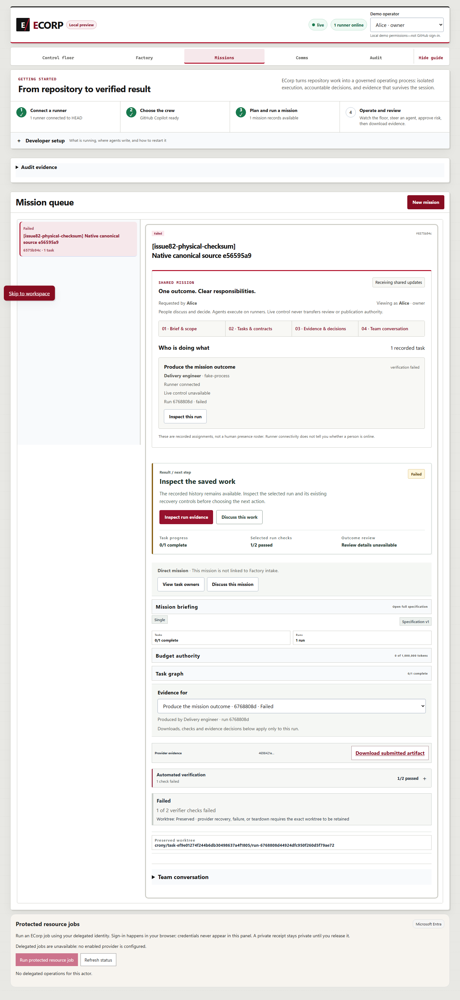
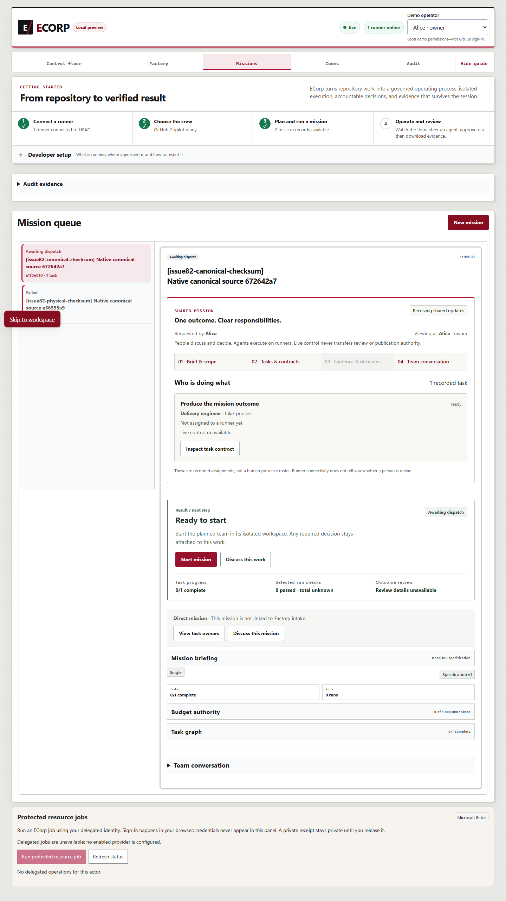
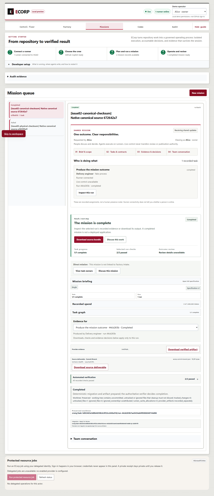

# Canonical source verification — September 26–27, 2026

Issue #82 is a whole-candidate verification problem: a physical workspace can pass while Git normalization or omitted companion files makes the selected exported tree fail. The runner now freezes a native Git index, materializes the complete selected tree from raw blobs in an independent private repository, and runs every command/test check against that candidate. Export reuses that exact tree and the successful report digest. Persisted verifier evidence, source events, envelopes and signed metadata share a typed source identity.

The required `canonical-source-verification-v1` runner capability is checked during planning, scheduling and current-epoch Start/Resume/Verify dispatch. Older runners cannot receive new source-deliverable assignments until upgraded. Historical reads and tasks without source deliverables remain compatible. Ignored build inputs are bounded and fingerprinted; omitted tracked source, provider artifacts, sensitive paths and original Git controls are excluded. This uses native Git and existing verifier/cancellation boundaries, not a new permission engine or an OS sandbox claim.

## Observed validation

`canonical-report.json` records the complete 11-gate `pnpm check` plan with locked dependencies, full Node discovery, state-audit compatibility and EVM checks. `summary.json` gives exact counts, source identity and original/published receipt hashes. Full Node discovery: tests: 3089, passed: 3024, failed: 0, skipped: 65, todo: 0, cancelled: 0. Workspace Rust tests: passed: 845, failed: 0, ignored: 552. Separate focused/native counts overlap workspace coverage and must not be added to it.

The focused helper suite: tests: 53, passed: 53, failed: 0, cancelled: 0, skipped: 0, todo: 0. The final exporter regression rerun: passed: 9, failed: 0, ignored: 0, measured: 0, filtered: 267. Its cases cover all eight exporter tests that failed in canonical r2 and a new Windows long-path regression. Export commands and their upload-pack child enable long-path handling without changing source/global Git configuration. The test drops its pinned fixture directory before cleanup. Earlier native exporter parity covered eight Git tracing variants and inherited `GIT_CONFIG_COUNT`; final canonical workspace coverage reran the implementation after subsequent fixes.

The fresh owned PostgreSQL fixture matched the final candidate: budget-checkpoints-and-canonical-source-linkage: passed: 172, ignored: 0, failed: 0; cache-admission-lifecycle: passed: 12, ignored: 0, failed: 0. SCRAM authentication and wrong-password rejection were observed. The database was stopped and retained. Earlier database receipts remain historical and are not substituted for this final-source run.

The native acceptance driver built the same source, started an owned Windows server/runner/PostgreSQL/web stack, and used Edge to author, save and launch two policies. A deterministic child created a new CRLF migration with Windows conversion enabled. The physical-checksum case failed verification without publishing a source deliverable or accepted completion. The canonical-checksum case completed only after persisted verification/export linkage. An independent repository imported the downloaded bundle and passed the real checker over 57 migrations, with all 56 historical SQL hashes unchanged. The original worktree retained CRLF while the commit contained LF. An outsider received HTTP 404. Native processes were stopped in `finally` and exact ownership was verified.

`native-browser.json` contains the persisted checks and source identity. Signature/header equality proves record linkage, **not independent cryptographic signature verification**; separate signing and tamper regression tests remain relevant. The child is `fake-process`: this acceptance makes no provider-inference or human-review claim. Environment-only SQLx credential delivery remains reduced assurance.

## Source and publication binding

The canonical and native runs used base `95d41f9b6594bbc4d96f4d589f04db32fc0bcaad` plus the tested complete tree `f8552b47771ba7b02f35a439f41e8219357e2614`. All original physical source files were fingerprinted before adding this directory. `tested-code.patch`, source digests and native receipts bind the implementation. The separate publication validation reconstructs the tested tree, proves original bytes and the full gate/Node-discovery plan unchanged, checks documentation, verifies Git preserves artifact bytes, and performs native secret scanning.

These publication files were added after the successful code-candidate runs. Do not infer that the earlier commands executed on the later publication commit. Exact final-head hosted checks and merge/closure receipts are separate. Publication text replaces Windows profile roots, including shell-escaped forms, with `<USERPROFILE>` and strips any UTF-8 BOM; originals and original hashes are retained privately. The first publication check detected escaped profile paths in initialization logs. Those publication copies were corrected separately; implementation and execution receipts did not change. No enrollment material, credentials or credential digests are publication inputs.

Packet attributes preserve every artifact byte. Structured JSON retains its recorded Windows line endings; raw command logs and patch context retain generated whitespace. Source, authored documentation and driver copies keep normal whitespace checks. The staged check initially flagged only these preserved representations; no execution receipt was rewritten to make it pass.

## Evidence captures

The two images above are actual Edge captures of the saved results page, not product acceptance screenshots. The following are actual native product UI captures:

Earlier canonical and database attempts are retained separately:

- earlier-canonical-r1-failure (failed) — state-audit-evm: passed: 1, failed: 0, ignored: 0; node-tests: tests: 3088, passed: 3022, failed: 1, skipped: 65, todo: 0, cancelled: 0; not run: format, clippy, rust-tests, web-build, web-lint
- earlier-canonical-r2-failure (failed) — state-audit-evm: passed: 1, failed: 0, ignored: 0; node-tests: tests: 3089, passed: 3024, failed: 0, skipped: 65, todo: 0, cancelled: 0; rust-tests: passed: 575, failed: 8, ignored: 9; not run: web-build, web-lint
- earlier-native-database-r1 (failed) — budget-checkpoints-and-canonical-source-linkage: ignored: 0, failed: 14, passed: 157
- earlier-native-database-r2 (passed) — budget-checkpoints-and-canonical-source-linkage: passed: 172, failed: 0, ignored: 0; cache-admission-lifecycle: passed: 12, failed: 0, ignored: 0

The focused receipts also preserve the ambient-Git failure, a regression test compilation error, the Windows prepare/fetch failures, and the pinned-directory cleanup failure (7 passed / 1 failed) before the final rerun. A historical filename containing `green` is not treated as a success when its actual exit status failed. No original development chronology is invented. Skipped/ignored cases are explicitly unqualified. This packet does not claim a clean Cargo security audit or an independent reviewer decision.

## Reproduction

Use pinned, locked dependencies and run `pnpm check`. The six readable `.txt` driver copies document the native fixture and browser actions without adding executable test-discovery inputs. Run them as their indicated script types from an evidence directory, with a fresh owned QA root and a complete matching canonical receipt. Do not reuse a live database or configured source checkout. The fixture copies current historical migrations, adds only migration 9999, and preserves original SQL bytes. The native driver captures exact executable hashes and stops only processes whose ownership matches the fixture.
