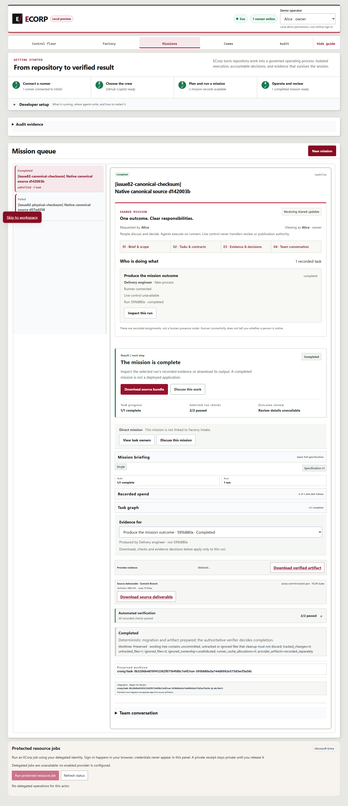
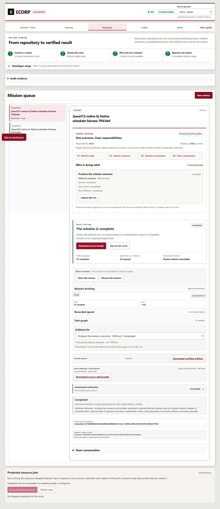

# PR #375 independent private Git objects and current acceptance — September 27, 2026

The runner now retains ownership of trusted private Git processes until their pipes and workspace handles are released. Windows reuses the existing Job Object adapter and awaits bounded cleanup on success, rejection and timeout. Raw blob reading uses the same adapter. Trusted Unix Git retains its existing Tokio child kill/reap behavior; unsupported external-provider execution remains unsupported. Native Git pack-objects now writes an independent pack containing the candidate and base history directly into the private repository. Revision input sets an explicit shallow boundary at the base, which is also recorded in the private shallow file. No source metadata or object alternates are borrowed. New delta search and compression are disabled for these temporary packs; existing Windows long-path support is retained. The 30-second Git timeout and output bounds remain.

The Factory fixture now verifies exported portable-untracked.txt separately from provider evidence result.md. It reads the actual exported Git blob and tree, confirms the tracked README change and artifact exclusion, and checks persisted verifier-to-Corp/task/run/source/base/artifact linkage. After the native run completes, it polls persisted workspace disposition for at most 60 seconds, rejects removal, and requires preserved before checking exported source and verifier evidence. Three Windows regressions cover timeout descendants, descendants surviving successful root exit, and raw-blob rejection cleanup. A further regression checks exact candidate/base history, inaccessible older commits and blobs, independent metadata and objects, raw tree bytes, connectivity, and preservation of source config/index/refs/HEAD/staged bytes.

The exact prepublication candidate is 9ddca9d6bbf522827f53a3a5d11554a10c96337a on published parent b5a84b182e07d7bb6ebff4b959f1e74ca41fc964. All 6702 original physical files were fingerprinted before this evidence directory was added. The earlier implementation and review-followup directories remain history for their own tested revisions.

## Observed current-source results

Locked offline root/web installs and Steward npm ci preceded all 11 canonical pnpm check gates, including state-audit compatibility/EVM and full Node discovery. Node: **3089 total, 3024 passed, 0 failed, 65 skipped, 0 cancelled, 0 todo**. Rust: **853 passed, 0 failed, 558 ignored**, across 41 summaries. Skips and ignores are not executed acceptance.

The focused private-pack regression passed **1/1**, with 279 filtered cases, on the exact current physical source. The canonical Rust suite separately executes the cleanup tests on this source. The earlier **16/16** cleanup run, with 263 filtered cases, remains historical evidence for its earlier source. The real timeout red run failed one case before the cleanup fix; its retained log is distinct from the earlier attempt that discovered zero tests. The focused helper recorded a PowerShell line-ending representation of the patch; patch_representation retains both original byte digests and their verified normalized equality. The raw candidate diff and original focused patch are published separately.

Fresh SCRAM PostgreSQL: **budget-checkpoints-and-canonical-source-linkage-after-store-fix: 178 passed, 0 failed, 0 ignored; cache-admission-lifecycle: 12 passed, 0 failed, 0 ignored**. These opt-in cases are separate executions and overlap some focused coverage.

Fresh native Edge-to-server-to-runner acceptance rejected the physical CRLF checksum mission and completed the canonical LF mission. The actual exported bundle imported cleanly, passed all 57 migration checks and preserved all 56 historical SQL hashes. Outsider download returned 404. Source identity and exact-owned process cleanup are recorded.

The complete Factory controller passed on matching-source native CLI/server/runner binaries with a fresh owned SCRAM database and deterministic fake GitHub. Its actual exported bytes and persisted canonical verifier evidence passed the assertions above. No live GitHub publication occurred. The full private database snapshot stays local; only its digest and selected verifier evidence are published.

The unchanged Windows external-adapter driver passed all six reports: native external adapters, parallel and mixed-provider graphs, controlled readiness, identity rotation/revocation and budgets. This lane uses a synthetic loopback-trust database and is not production authentication proof.

## Scheduler issue #172 acceptance

The already implemented same-Corp runner rotation was exercised with two native runners and two browser-authored missions against this same candidate. Runner A failed command handling 3 times before B became eligible and 5 times by completion. A's required command remained pending. After the explicit owned-database missed-wakeup injection, B dispatched in **2421 ms**, without another browser mutation, reconnect or synthetic lifecycle event. Both missions completed with native verifier/download evidence, and assignment fences were checked.

The complete current Rust suite includes the all-failing, stale/replaced epoch, per-Corp/cross-Corp bound and unvisited-singleton churn regressions. This is fresh retrospective acceptance of current source. The September 12 standalone and PR-stack receipts separately establish peer revocation/shutdown and supersede the earlier retention blocker. The failed September 7-8 bridge remains preserved as failed historical evidence.

## Failures and limits

Native Factory r2 and r3 timed out during private Git transfer before file checks, then reported Windows error 32 during snapshot cleanup. Factory r4 still timed out at private Git transfer, but error 32 did not recur. Factory r5 completed the native run and both canonical verifiers; its immediate workspace-preservation assertion observed active before runner finalization. The stack was stopped afterward, so r5 does not establish eventual preservation. Factory r6 reached the approval scenario but exceeded its 30-second deadline while the run was still verifying, without verification evidence or a source deliverable. That stopped run does not establish eventual verification or approval. The current driver waits for persisted workspace preservation and permits up to 180 seconds for verification to reach durable approval; it rejects removal and retains bounded deadlines. Matching-source Factory r7 acceptance must pass before this packet can be assembled. All failed receipts, logs and private database snapshots remain. Separate diagnostics on the retained r4 source measured file fetch at 27.17 seconds, compression-zero fetch at 21.88 seconds, and direct packs at 1.75 and 1.42 seconds; those are diagnostics, not acceptance of this candidate. The first pack diagnostic failed in its helper on VoidTaskResult.Trim and is retained as a helper failure. The hosted integration failure independently reported failed instead of completed; its approximately 26-second driver duration does not establish the same timeout cause. Final-head hosted CI still must pass.

These are actual native browser captures. Published text removes a BOM and replaces profile roots with <USERPROFILE>; summary.json records original and publication hashes. Scripts are readable .txt copies and cannot alter Node discovery. Three helper copies also remove trailing whitespace and excess final blank lines; their original and normalized digests and the failed publication check are recorded in summary.json. Executed helper files remain unchanged. Private database snapshots and credential files are excluded. Artifact signature/header equality establishes recorded linkage, not an independent cryptographic signature check.

Deterministic native fixtures do not prove live inference, deployment, independent human approval or OS isolation. Environment-only database delivery remains reduced assurance. Historical Cargo advisory debt remains **12 advisories (2 high, 1 moderate, 9 low)**. Publication equivalence, final-head hosted checks, review, merge and issue closure have separate receipts.
