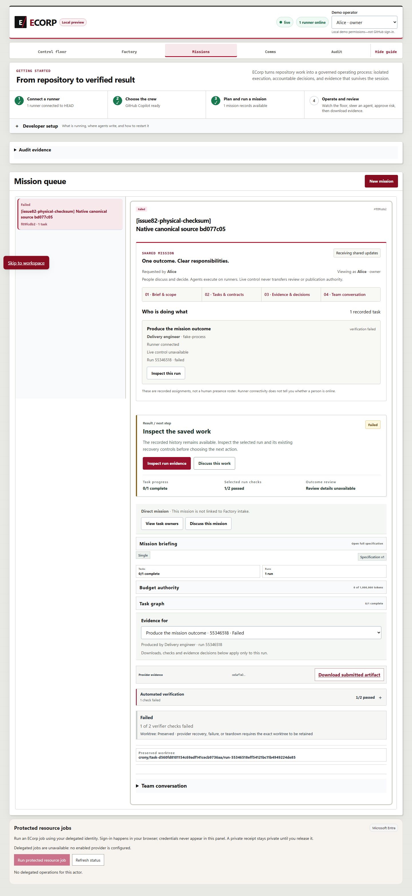
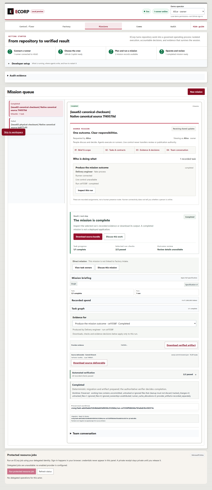

# PR #375 review follow-up — September 27, 2026

This follow-up fixes and validates substantive review findings on `640a144f3d4832a23a6b30701946ac0af3ee1506`. The original packet remains immutable history for that earlier implementation. The new tested candidate is `f69171224d33401c1391568901a44a71a93e8629`; `tested-code.patch`, source hashes and execution receipts identify the actual code used below. Publication files were added afterward and need separate equivalence checks and final-head hosted CI.

## Resolved behavior

Canonical completion now compares mutually consistent runner/upload claims with the persisted deliverable, required workspace base and every present immutable task/run source base. Producer identity remains bound to the exact Corp, task, run and artifact. A self-consistent false base fails admission.

Canonical source downloads require exact accepted artifact/run/deliverable linkage, valid metadata and persisted source bases. Automated verification must have passed. A run waiting for manual review may expose its accepted automated result only while its matching verification request is pending, so reviewers can inspect it. Rejected, unaccepted, mismatched and explicitly malformed canonical records cannot be downloaded. Both extension fields absent preserves historical reads; null or partial fields do not count as historical absence.

Typed dependency envelopes accept the paired canonical extension, reject unknown/duplicate/partial/null/array identities and preserve historical handoff content. The common identity parser also rejects positional arrays. The runner index-selection expression references its optional head on every platform while retaining Windows mode preservation; the source-recipe pin was updated after an exact parity review. The earlier full canonical r4 failed only that stale pin (3,023 passed, one failed, 65 skipped); its log and summary are retained, and the following gate is a separate execution.

## Observed validation

Locked offline root/web dependencies and Steward `npm ci` preceded the complete 11-gate `pnpm check`: migrations, state-audit compatibility, EVM, both documentation checks, full Node discovery, Rust format, strict Clippy, Rust workspace tests, web build and lint. Node: **3089 total, 3024 passed, 0 failed, 65 skipped, 0 cancelled, 0 todo**. Rust: **849 passed, 0 failed, 558 ignored**, across 41 summaries. Ignored/skipped cases are not executed acceptance.

Fresh owned SCRAM PostgreSQL: **budget-checkpoints-and-canonical-source-linkage-after-store-fix: 178 passed, 0 failed, 0 ignored; cache-admission-lifecycle: 12 passed, 0 failed, 0 ignored**. The focused seven canonical-admission cases and twelve cache-admission cases also passed earlier. The retained red database run had one pass and six failures; one failed case exposed invalid checkpoint-lineage setup in the new fixture, which was corrected across the task's run tuple. The production failures and that fixture failure are distinguished, not relabeled. Common-parser red/green and decoder logs remain separate overlapping regressions.

Native Edge authoring, server dispatch and runner execution were rerun against the corrected source and matching built binaries. The physical-CRLF checksum policy failed without accepted completion; the canonical-LF policy completed. The actual downloaded bundle imported into an independent repository and passed the migration checker over 57 migrations while preserving all 56 historical SQL hashes. Outsider download returned HTTP 404. Exact owned web/runner/server/PostgreSQL processes were stopped and fixtures retained. Signature/header equality proves record linkage, not an independent cryptographic signature check.

The unchanged Windows external-adapter CI driver passed with those same binaries and a fresh owned fixture: deterministic external adapters, parallel and mixed-provider task graphs, controlled-runner readiness, native identity rotation/revocation, and budget breakers. All six reports and the three-process cleanup receipt are included. This replaces the observed typed-envelope graph failure with new matching-source evidence; it does not rewrite that failed run. The fixture uses synthetic loopback trust authentication and is not production-authentication proof.

An exact Node 22 focused reproduction of the hosted lock-helper timeout passed. The full hosted Node lane still needs a passing result at the final PR head; a focused pass is not a waiver. No timeout or check policy was weakened.

## Evidence and limits

The images are actual native product captures from this follow-up. Scripts are readable `.txt` copies so they do not alter test discovery. Every published artifact records its private original and publication hashes in `summary.json`. Publication strips a UTF-8 BOM and replaces Windows profile roots, including shell-escaped forms, with `<USERPROFILE>`; other observed text is retained. No credentials or credential digests are publication inputs. Source fingerprints cover all 6644 original physical files before adding this subdirectory.

This is deterministic native acceptance, not live provider inference, a human review decision, deployment or an operating-system sandbox attestation. Environment-only SQLx secret delivery remains reduced assurance. Historical Cargo advisory debt is not a clean audit. Final-head hosted CI, substantive review resolution, merge and issue closure require separate receipts.
