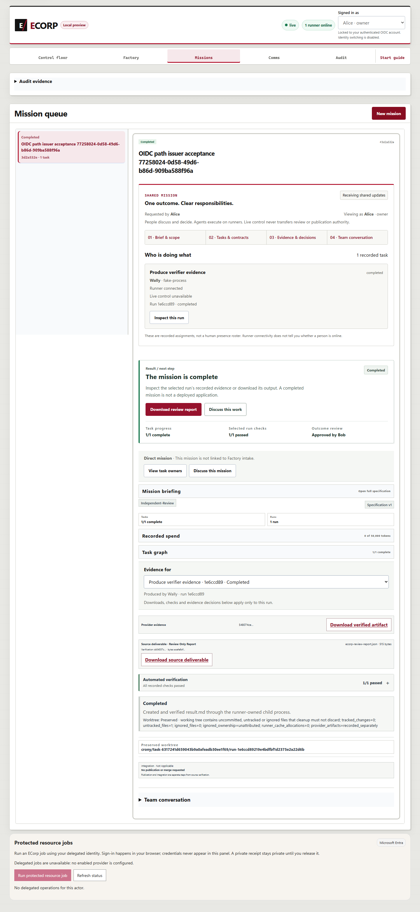

# OIDC discovery completion evidence — September 26, 2026

Issue #270 appends discovery to the complete issuer path through the pinned `url` 2.5.8 native path-segment API. The recovered contribution and the existing spending/role guards are preserved. The focused suite also verifies query/fragment removal. No permission or execution mechanism was added.

## Observed validation

- `canonical-report.json` records all 11 canonical `pnpm check` gates passing at base `08ed24829e033a39a8913d52be6a136eac1cc2aa` plus `tested-code.patch`, with locked dependencies: Node **3,023 passed / 65 skipped / 0 failed**, Rust **829 passed / 550 ignored / 0 failed**, separate EVM **1 passed**. Source stayed unchanged. Skipped/ignored cases are not passes and overlapping counts are not additive.
- `focused-red.json` retains the September 26 retrospective baseline: **6 passed / 3 failed**, exit 101. `focused-green.json` records **10 passed / 0 failed / 0 ignored**, exit 0. Neither receipt recreates September 13 development chronology.
- `native-stack.json`, the browser reports and `provider-calls.jsonl` record an owned browser/server/native-runner/PostgreSQL stack with a synthetic HTTPS issuer. The complete `/tenant/v2.0/.well-known/openid-configuration` path was requested. A mission, task, run, verifier result and artifact were persisted; server/runner restart preserved their state and artifact bytes.
- Missing/invalid bearers returned 401. Principal mismatch, unlinked subject, guest mutation and requester self-review returned 403. An independently scoped **synthetic** member supplied the fixture decision; it is not a human approval. TLS verification, SCRAM positive/negative controls and exact service cleanup are bound in the receipt.

## Source and publication

`summary.json` binds the canonical source, exact code diff, binary/source/driver identities and original/published artifact hashes. Native acceptance ran at `bdde15b25ac80139834549656e8e90f95b8d4547`; the relevant application and lockfile hashes are unchanged at the canonical base. The intervening PR #371 changed Python fixture cleanup and documentation. This is source equivalence, not a claim that the earlier stack executed on a later commit.

The September 13 reports beside this packet retain their exact original bytes, dates, counts and limitations. Narrow `.gitattributes` entries prevent newline conversion. The canonical run included their unchanged bytes and the earlier completion narrative. This packet and the updated narrative were added afterward; final publication validation separately checks code equivalence, the unchanged 11-gate/full Node discovery plan, documentation, personal paths and pinned native Gitleaks. Final-head hosted gates remain required before merge.

Text publication copies remove a UTF-8 BOM and replace local profile roots/account labels where present. Seven copied JSON receipts also clarify eight source-file fingerprint field names, with all values preserved; `summary.json` records each mapping, prior and updated artifact hashes, and the source-byte verification that resolved the generic API-key findings. All other text bytes are retained. Original hashes and private originals remain in the dated issue-completion record. Driver snapshots end in `.txt` so they do not enter test discovery. Earlier canonical setup failure and all five failed native attempts are retained explicitly; browser failure reports are included when present. They are not counted as successful acceptance or assigned unproven causes.

## Actual browser captures

These are original, unedited screenshots from the actual acceptance stack. Their identical bytes reflect the unchanged completed view after restart. Actor names and approval state are synthetic test data. The machine-readable browser and server receipts establish the transport, isolation, verification and restart assertions.

## Limits and reproduction

This qualifies discovery compatibility and the stated synthetic local stack only. It does not establish real Entra sign-in, browser onboarding, production principal provisioning, AWS signature validation, cloud durability, deployment or human review. The fixture initializes its synthetic actor links in development mode before switching to production authentication; it does not claim production onboarding. Environment-only SQLx and artifact/master-key delivery remains reduced assurance. Historical Cargo advisory debt is separate and is not a clean audit claim.

Use the locked dependencies and `pnpm check`. The focused command is `cargo test --locked --offline -p crony-server --bin crony-server auth::tests -- --test-threads=1`. Native driver snapshots document the owned fixture, source/binary guards and browser flow; reproduce with fresh owned paths, ports, database and synthetic credentials. Related #16, #242, #248 and broader provider/deployment work keep their separate acceptance criteria.
