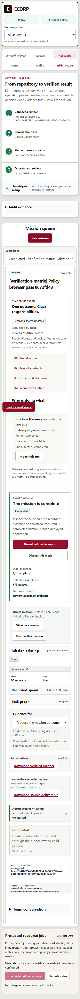
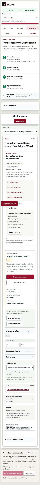

# Startup preflight completion evidence — September 26, 2026

Issue #230's read-only preflight and before-effects validation are already present through merged PR #353. This follow-up repairs a native Windows restart failure found while refreshing acceptance on current main. The retained failed run reached 21 successful checks before `get_MainModule()` raised the Windows partial-copy error 299 during valid restart.

## Change and review

`Get-LocalProcessExecutable` now retries only a null or partial-copy module snapshot within its existing 40 waits of 50 ms. It uses the same held native process and handle. Persistent partial-copy errors, access denial and every other inspection error still propagate; only confirmed native exit means absence. Start time, canonical executable, workspace and receipt checks still gate process control. This reuses the existing .NET process API and adds no supervisor, permission mechanism or approval.

The injected-getter regressions exercise transient and persistent 299, access-denied 5, 299 followed by 5, mismatched receipts, confirmed exit during loading, and verified QA cleanup. Existing null-module and other uncertainty cases remain in the suite.

The earlier PR's substantive feedback remains resolved: startup keeps the supported ignored runtime layout while every write-capable run uses an isolated worktree; the demo bootstrap request uses `?seed_crew=false`; preflight precedes process/file effects. The preserved PR #353 evidence and this newer acceptance have different source identities and dates.

## Observed results

- `focused-red.json`: September 26 retrospective baseline, **64 passed / 10 failed**, with an unchanged baseline source. These are new regression observations, not reconstructed September 18 TDD history.
- `focused-green.json`: **74 passed / 0 failed**, with source unchanged and owned child cleanup verified.
- `native-build.json`: locked, offline native server/runner build passed on base `563db5cca7e81a1347d416f78004f4d189772e00` plus the two-file staged tree `373c148967aaef3da00eaa2c14aabfee3e0446c8`.
- `startup-result.json`: **23 passed / 0 failed** on a fresh owned PostgreSQL/runtime fixture. It proves read-only preflight, safe rejection before effects, Start, second-Start identity reuse, recovery of only missing web, and valid Restart replacing all three owned application processes while retaining enrollment and source state.
- `browser-result.json`: actual Chrome → server → native runner acceptance for passing and failing persisted verifier policies. Completed work has recorded verification and downloadable evidence; the deliberately failing policy stays failed. The report's final stage is the expected failing scenario, not an acceptance failure.
- The outer supervisor verified stopped application, provisioning and PostgreSQL processes. Source HEAD/index/worktree remained unchanged; additional refs belong to the observed isolated runs. All fixture files and failed attempts remain retained.

The complete canonical `pnpm check`, with locked dependencies, full Node discovery, state-audit compatibility and EVM gates, is required on the staged publication candidate before commit. Its actual source-bound result and counts belong in the linked PR, together with the final-head hosted checks; this packet makes no prospective pass claim.

## Acceptance mapping

| Issue requirement | Evidence |
| --- | --- |
| Explicit read-only preflight and actionable redacted errors | Native missing-DB, actor, source/ref and occupied-port checks; database/files/ACL/source/credential digests unchanged |
| Retained identity, schema, dependencies, ownership, workspace and credential validation | Existing native preflight implementation and lifecycle regression lane; valid native preflight; mismatched/uncertain ownership regression cases |
| Start/Restart validate before effects and recheck ownership | Rejected restarts retain exact live identities and metadata; valid restart uses the owned-process helpers |
| No implicit provisioning or identity/credential replacement | Missing database/source inputs rejected; retained enrollment and credential scope verified |
| Complete isolated native/browser outcome | Fresh owned SCRAM database; positive and negative browser/server/runner verifier scenarios; 23 startup checks |
| Full contributor gate and review | Source-bound canonical receipt and substantive final review required in the linked PR before merge |

## Source, reproduction and limits

`summary.json` binds original and published artifact hashes, binaries, source files, driver snapshots and the exact tested patch. The native run used the stated staged source. This packet was added afterward and does not alter application code. Text copies remove a UTF-8 BOM and replace local account/profile roots when present. Three enrollment credential-file digest values are omitted from public JSON copies; original receipt hashes remain recorded, and the private originals are retained. Observed acceptance fields, source/binary hashes, other text and original screenshots are preserved. No secret-scanner rule or ignore policy was changed. Narrow `.gitattributes` keeps these evidence bytes unchanged in Git. Driver snapshots end in `.txt` and are not discovered as tests.

Reproduce with `pnpm check`, `pwsh -NoProfile -File tools/local_stack_identity.test.ps1`, and the retained native driver snapshots adjusted to fresh owned paths, ports, database and synthetic identities. Never aim the fixture at a retained operator stack. Public `tools/start_local.ps1` and the existing bootstrap/enrollment mechanisms are the paths exercised; no alternate supervisor is introduced by this fix.

Both captures are unedited images from the actual local browser. Identities and the deterministic fake-process provider are synthetic. The evidence qualifies native Windows startup and the stated persisted-policy path, not production identity, real inference, Factory publication, external deployment, multi-host isolation or a human outcome decision. Environment-only secret delivery remains reduced assurance. Existing Cargo advisory debt is separate and is not a clean-audit claim.

Earlier native attempts are preserved, including two failed results and an unfinished initial receipt; none counts as a passing acceptance result. The prior fixture's two runtime files were moved into its owned evidence directory after its processes stopped. A strict ACL-hash comparison then failed; reconciliation verified unchanged payloads, the same owner and access restricted to owner/System/local Administrators. ACL representation equality is not claimed, and no collaborator work was removed.
