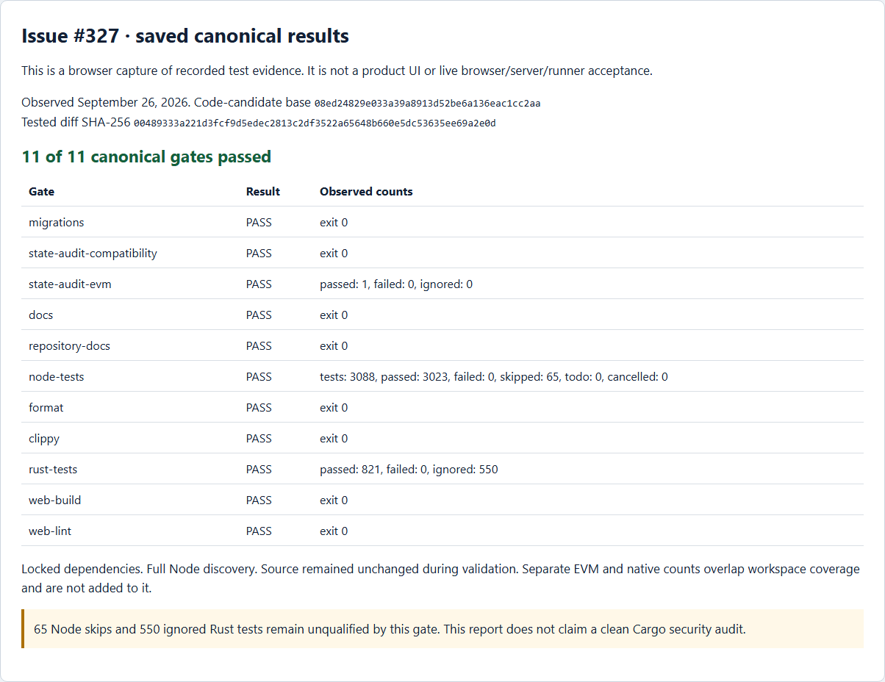
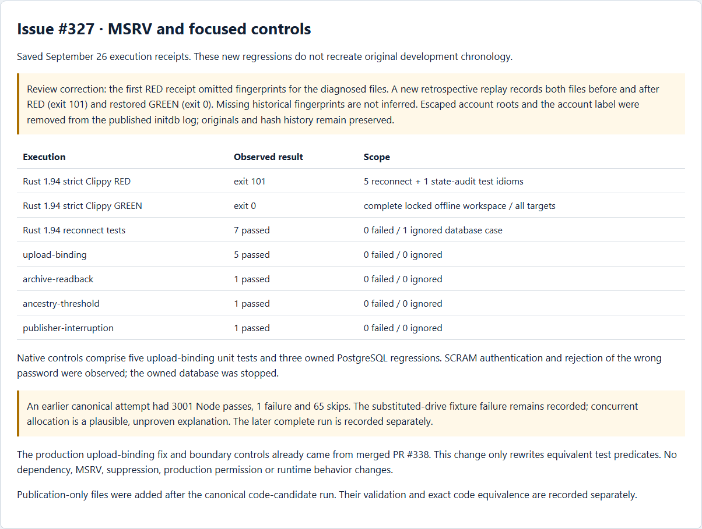

# Rust 1.94 Clippy completion — September 26, 2026

The original malformed upload-binding predicate was corrected in merged PR #338. A new strict Rust 1.94 run found five equivalent reconnect assertion idioms and one state-audit test idiom that still prevented the complete gate from passing. This patch changes only those test predicates. `Result::is_err()` is the exact complement of `is_ok()`; `Option::is_none_or(writes < threshold)` preserves the previous negated predicate, short-circuiting and lock acquisition.

## Recorded results

- `canonical-report.json` records all 11 canonical `pnpm check` gates, with locked dependencies: Node 3023 passed / 65 skipped / 0 failed; Rust 821 passed / 550 ignored / 0 failed; separate EVM 1 passed. These counts overlap other focused runs.
- `msrv-red.json` and `msrv-red.log` retain the earlier test-idiom failure, exit 101, on Rust 1.94. That run fingerprinted an unrelated source file, so it does not fully bind the diagnosed files; the receipt now explicitly records this limitation. No historical fingerprints have been added. `msrv-replay.json` and its RED/GREEN logs record a new retrospective replay: both diagnosed files are fingerprinted before and after each command, the exact current-main baseline fails with exit 101, and the restored candidate passes with exit 0. Neither run reenacts the original production defect. `msrv-green.json` and its log record the complete strict Rust 1.94 workspace/all-targets pass on current main plus the patch.
- `reconnect.json` records 7 passes and 1 ignored database case. `native-controls.json` records five upload-binding boundary/control unit tests and three owned PostgreSQL regressions, all passing with no ignored cases. The older focused base differs from the canonical base only by merged PR #371's Python cleanup/docs changes; relevant Rust/toolchain/lock bytes were verified unchanged.
- `earlier-canonical-failure.json` and its log preserve the prior substituted-drive fixture failure: 3001 passed / 1 failed / 65 skipped. A concurrency explanation remains unproven. Earlier setup failures remain in the private run history.

## Source and publication binding

The canonical command ran on base `08ed24829e033a39a8913d52be6a136eac1cc2aa` plus the exact two-file `tested-code.patch`. `summary.json` binds its diff, the original report hashes, the published copies and relevant source bytes. Publication copies replace plain, JSON-escaped and caret-escaped account roots with `<USERPROFILE>`, account labels with `<LOCAL_ACCOUNT>`, and remove a UTF-8 BOM when present; the originals are retained privately under the dated issue-completion run.

These non-executable report files were added after the canonical code-candidate run. Do not infer that the earlier command executed on the later publication tree. Final publication validation separately verifies byte-identical tested Rust files, an unchanged tracked code diff and an unchanged 11-gate plan/full Node inventory, then validates documentation and scans the added artifacts. Exact final-head hosted checks and merge receipts are recorded on the linked PR and in the run history.

## Screenshots and limits

The images are actual Edge/Playwright captures of `report.html`, rendered from the saved receipts. They cover all named gates and focused suites and are **not live product acceptance**. This test-only change introduces no user-visible behavior. The ignored/skipped native cases remain explicitly unclaimed; no clean Cargo audit, Docker qualification or new production-provider acceptance is asserted. The synthetic owned PostgreSQL fixture uses scoped test credentials; environment-only SQLx delivery remains reduced assurance.

To reproduce, use the pinned dependencies, run `pnpm check`, then `cargo +1.94.0 clippy --locked --offline --workspace --all-targets -- -D warnings`. Focused native commands and source fingerprints are retained in the linked receipts; a fresh owned PostgreSQL fixture is required for the three database tests.

## September 26 review correction

Review 5326415341/comment 4111847008 identified the incomplete RED binding and a PostgreSQL startup hint whose caret-escaped account roots escaped the earlier scanner. The hint on line 22 and the account label on line 1 of `native-owned-postgresql-initialization.log` are now redacted; every other log byte, original result and tested source file is unchanged. The old published copies and raw receipts remain privately retained, and `summary.json` records both old and corrected hashes. A supplemental scan normalizes caret escaping before checking every publication artifact; the native scanner alone did not detect that representation. Saved-result captures were regenerated from the corrected report.
