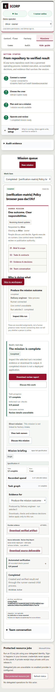
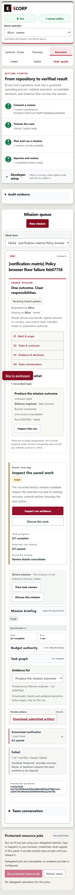

# Startup and verifier integration evidence — September 26, 2026

This contribution completes the current-source acceptance handoff for issues #136, #140 and #230. The installed-browser and verifier-cache implementations were already merged through PRs #325 and #294; startup preflight landed through #353. Native Windows acceptance exposed an additional restart defect: reading a just-started process module can temporarily raise native error 299. The scoped repair retries that observation within the existing 40 × 50 ms bound while holding the same process and native handle. Access denial, persistent uncertainty, identity mismatches and all other errors still fail closed. No additional execution or permission mechanism is introduced.

`docs/VERIFIER_BROWSER.md` also corrects the persisted-policy example to the supported 60,000 ms maximum. The existing browser/cache/preflight packets preserve original development and later retrospective results separately. The merge retains both prepared contribution heads `4c3ac517933f26c73df8f426413ecc3fac7a41b6` and `24bae9e525d2824d5469fbe5b5aacf0610cb3afc` as parents; source history is not squashed or reconstructed.

## Current combined-source observations

All observations below bind to main parent `1505aeaa21b5cd67b8d892607ea6697cf1e8ef05` plus staged tree `289f55ca6b32558f8d98a86f8aa340dc3e288db1`. `source-manifest.json` records all **6515** tested physical files and their Git blobs. These tests ran before this documentation packet existed and before the separately recorded `docs/EVALS.md` prose correction. The correction documents the already-tested bounded retry for native error 299; both documentation gates and the documentation regression were run afterward. It changes no execution or test source.

| Validation | Observed result |
| --- | --- |
| Frozen offline dependency installation | Root and web pnpm installs passed; steward npm CI passed with its lockfile and lifecycle scripts disabled |
| Canonical `pnpm check` | All 11 current gates passed, including migration, state-audit compatibility and EVM gates, full 114-file Node discovery, formatting, clippy, Rust workspace tests, web build and web lint |
| Node counts | `{"cancelled": 0, "failed": 0, "passed": 3023, "skipped": 65, "tests": 3088, "todo": 0}` |
| Rust counts | `{"failed": 0, "ignored": 550, "passed": 829, "summaries": 41}` |
| Native public preflight/Start/repeated Start/Restart | 23 passed, 0 failed, with fresh owned SCRAM database and runtime fixtures |
| Installed Edge and Chrome | Real module and CLI desktop/mobile paths passed; wrong hash, wrong host and missing executable rejected before workflow/evidence writes |
| Persisted browser policy | Browser → server → native runner path passed and stored downloadable verifier evidence |
| Cache admission | 12 passed, 0 failed, 0 ignored on a fresh SCRAM database; wrong-password access was rejected |
| Native handoff regression | 16 passed, 0 failed; native process/identity and launch-observer evidence only |
| Cache disposition | Explicit Node suppression, automatic Python no-bytecode mode, normal clean-worktree disposal, and retention of a pre-existing ignored sentinel passed |

The preflight browser lane exercised both a passing persisted verifier and a deliberately failing verifier. The latter remains failed with recorded evidence; it is the expected negative control. The two screenshots below preserve the actual browser pixels.

## Acceptance mapping and review boundaries

- **#136:** explicitly authorized, host-scoped native browser selection uses existing typed policy and thin Playwright adapters. The native results include paths with spaces, executable/hash/host rejection and both viewports. Managed Chromium was unavailable and no download was attempted; its safe unit coverage remains in full discovery. The runner policy is the supported replacement for the #117 in-memory override, but this packet does not claim a new #117 execution.
- **#140:** Python suppression is automatic for verifier children, while Node suppression is an explicit typed policy. The recorded policy still says `cleanup_authorized=false`, `zero_cache_writes_verified=false` and `scope=verifier_child`. Those limits are preserved. The 21-byte ignored sentinel remains intact; its SHA-256 is `c4c6a6069a0cc26517296eeca5b58b0f501689895f3bcb7523085ce324f5b527`. The separate historical publication correction binds the existing #294 derivatives without relabelling their original hashes.
- **#230:** read-only preflight and all rejection cases precede effects; valid native restart now tolerates the bounded partial-copy observation. The source-level identity regressions include persistent 299, denial 5, 299 then 5, mismatch, no PID reopen and confirmed exit. The original retrospective RED/GREEN receipts remain in the dated preflight packet. This combined acceptance verifies the integrated implementation, not reconstructed historical TDD.

Independent outcome review, final source review and exact-head CI/CodeQL/security/code-quality checks are required before accepted completion and issue closure. At assembly time they remain pending. This packet records no human decision, self-approval, merge or completed issue.

## Reproduction, custody and limits

Use the repository's canonical `pnpm check` with locked dependencies. `canonical-report.json` preserves the actual gate arguments, counts, durations, failures and ignored/skipped cases. Native commands, environment qualification, binary digests, fixture ownership, driver snapshots and separate results are in the receipt files. Driver snapshots end in `.txt` and do not enter test discovery; adapt only their explicitly owned paths/ports and source binding when replaying in a fresh fixture. Never direct them at retained operator data.

Original private receipts are immutable. `summary.json` records distinct original and published hashes. Published text removes any BOM, redacts personal profile/account labels and enrollment-file digests, and replaces explicitly listed duplicate source inventories with the shared manifest. The native observations, status and timestamps are preserved. PNG files are unchanged. Removing this packet and restoring the exact original `docs/EVALS.md` blob in a private index of the final commit must reconstruct the tested tree. Publication validation checks this reconstruction, the unchanged bytes and Git blobs of the other 6514 files, the exact prose-only correction, and the unchanged validation plan. The corrected document receives separate documentation checks and regression validation. This binds each observation to the source actually tested; it does not claim a full canonical run on a future commit.

The earlier combined build attempt did not execute because a generic whitespace guard misread preserved CRLF evidence. Its failure receipt and log are retained. The corrected guard recognized CR-at-EOL and excluded exactly three hash-bound raw captures without altering them or changing the product gates. Earlier individual failures remain in their original packets. Owned application and database processes were stopped and fixture files retained.

Synthetic identities, a deterministic provider and environment-only database delivery qualify only the stated local native behavior. They do not establish real inference, production authentication, cloud qualification or a human outcome decision. Historical Cargo advisory debt remains separate and is not a clean-audit claim.
