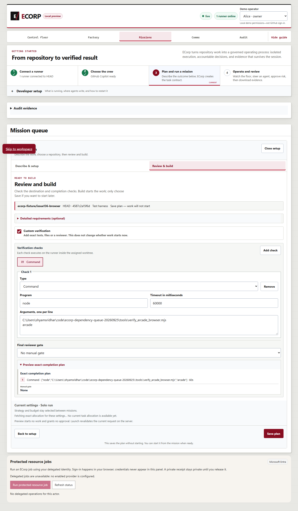
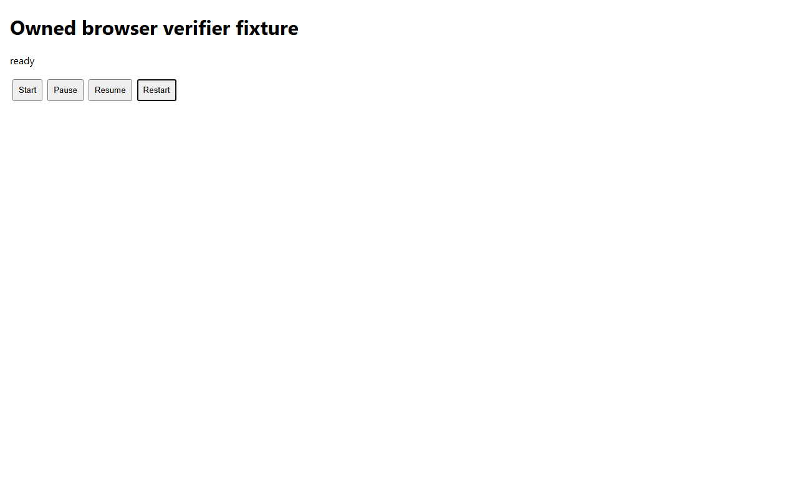

# Installed verifier browser completion packet — September 26, 2026

Issue #136 is implemented by merged PR #325. The [completion review](../2026-09-26-verifier-browser-completion.md) describes the bounded, host-scoped native browser selection, retained feedback, and the corrected 60,000 ms policy example in the [browser guide](../../VERIFIER_BROWSER.md).

## Observed results

The canonical `pnpm check` completed all 11 gates with locked dependencies and stable source: **3,023 Node passed / 65 skipped / 0 failed / 0 cancelled**, **821 Rust passed / 550 ignored / 0 failed**, and **1 separate EVM pass**. `canonical-report.json` and the original command logs retain every gate and count. This run covered the two documentation changes before this packet was added; it does not claim execution on a later publication or integration revision.

Focused resolver, verifier and startup coverage passed **96 tests, with 2 Unix FIFO cases skipped on Windows**. Native startup handoff passed **16 cases**. `documentation-red.json` records rejection of the old 120,000 ms example by the actual policy validator; `documentation-green.json` records the corrected example and existing boundary checks.

The actual Chrome UI/server/native-runner path persisted the bounded command policy, launched the verifier inside an isolated task worktree using installed Edge, and retained the verifier report and desktop/mobile screenshots in authoritative server evidence. Installed Chrome and Edge separately passed module and CLI workflows and rejected wrong-host, wrong-hash and missing-path policies before application execution. The original failed policy attempt remains in `earlier-native-failure.json`. Synthetic identities and a deterministic provider were used.

## Provenance and publication

`summary.json` binds every original artifact hash to its published hash. Text copies replace local account roots and labels and remove UTF-8 BOMs; screenshot bytes are unchanged. Native execution used source `08ed24829e033a39a8913d52be6a136eac1cc2aa` with binaries built at `a65fb99ada85363324e20f37fd84f5bb65606e70`. Their complete Git trees are identical. All recorded native physical source files match this publication checkout except a verified CRLF-only checkout representation of Cargo.lock. The separate build receipt, original/current hashes and production-prefix digest document that equivalence without inventing a build or later execution.

All owned services were stopped and retained fixtures preserved. Source paths in publication copies are descriptive placeholders; reuse requires fresh owned fixture paths, ports, database and current executable pins. Driver snapshots end in `.txt` and do not enter test discovery. The normal browser preflight and native Python launcher can replace #117's temporary in-memory override under its existing scenario contract; this packet does not complete that umbrella scenario.

Managed Chromium was absent and no browser was downloaded. Linux/macOS declared-path behavior has unit coverage but no native qualification here. No production, cloud, real-provider or human acceptance is claimed. Environment-only ephemeral secret delivery is reduced assurance; historical Cargo advisory debt is not a clean audit.

