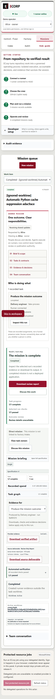

# Verifier cache completion evidence — September 26, 2026

Issue #140 is implemented by merged PR #294. Native Python verifier children use `-B` and `PYTHONDONTWRITEBYTECODE=1`; launcher/wrapper policies can explicitly request environment-only suppression. Typed Node opt-in requests `NODE_DISABLE_COMPILE_CACHE=1`. These controls do not modify arbitrary task environments or authorize ignored-file deletion.

## Observed acceptance

- `native-runtime.json` and its log record **7 passed, 0 failed, 0 ignored** across real interpreter/cache and workspace-disposition regressions. `native-cache-admission.log` records **12 passed, 0 failed, 0 ignored** against a fresh authenticated PostgreSQL fixture. `web-policy.log` records **22 passed, 0 failed, 0 skipped**. These are focused lanes, not extra unique counts to add to the canonical suite.
- The actual browser/server/native-runner stack exercised automatic Python suppression, explicit Node cache policy, persisted verification, and both successful and rejected verifier outcomes. Python ran with isolated-interpreter arguments, asserted `sys.dont_write_bytecode` and absence of `__pycache__`/`*.pyc`, and the clean worktree followed normal removal. A separate case created a pre-existing ignored sentinel, completed verification, and retained that sentinel and worktree.
- `browser-report.json` and `native-stack.json` retain task/run identities and authoritative verification/disposition events. Disposition describes tracked, untracked and ignored counts, unattributed ignored ownership, zero runner cache allocations, and separately recorded provider artifacts. Native cache settings are recorded as requests; the general event does not claim zero cache writes or cleanup authorization.
- The source-bound canonical report records all **11 `pnpm check` gates passing**, locked dependencies, **3,023 Node passes / 65 skips / 0 failures / 0 cancellations**, **821 Rust passes / 550 ignored / 0 failures**, and **1 separate EVM pass**. All gates ran and source stayed stable. Skips and ignored cases are not passes.

## Review and source identity

The runtime, database, browser and web-policy observations actually executed at `a65fb99ada85363324e20f37fd84f5bb65606e70`. The canonical correction candidate was based on `08ed24829e033a39a8913d52be6a136eac1cc2aa`. `summary.json` compares the relevant physical file fingerprints and the identical server production prefix. The runtime execution and canonical base commits have identical Git trees. The canonical candidate adds the separately fingerprinted publication correction, which changes no application runtime source. This is demonstrated source equivalence, not a claim of execution on a later commit. The stack receipt's short connection-file list alone is not verifier provenance; the focused/build receipts and recorded Git comparison supply that binding.

Substantive PR #294 feedback is resolved in current source: explicit controls require compatible runner protocol capability before dispatch; malformed and future policies fail per task without starving healthy siblings; pre-dispatch failure expires grant metadata transactionally for the exact Corp/run. Initial selection mismatch allocates nothing. An already allocated attempt rejected at final dispatch keeps its charge under the documented bounded accounting contract; no refund or retry loop is introduced. The 12 database cases exercise admission, recovery, late capability loss, cleanup/replay and rollback. Capability advertises child-control support, not certification of every selected executable: Node's native setting requires a supporting runtime (documented as 22.8+).

The original September 22 driver and historical evidence remain retained. Its schema problem has a separately validated replacement in the September 22 r3 packet, which supports both recorded tree-field names and rejects mismatches. The [dated publication correction](../2026-09-26-verifier-cache-publication-correction/README.md) resolves the remaining review finding: six caret-escaped personal roots in three historical logs, with all **105** dependent artifact references verified. Original execution hashes, dates, tests and screenshots are retained; publication edits are explicitly dated.

## Failures and publication boundaries

The first current-day canonical attempt cancelled one Teams test after its unchanged 60-second initialization limit: **3,022 passed / 65 skipped / 1 cancelled**. Its report is retained. An 18-test focused follow-up passed in 15.916 seconds, and the next complete canonical run passed. No timing cause was established, and the earlier cancellation is not erased or reclassified as a pass.

This packet was added after that canonical run. Original and published artifact hashes are in `summary.json`; local profile roots/account labels and UTF-8 BOMs are normalized only in publication copies. Actual screenshots retain their original bytes. Driver snapshots end in `.txt` and do not join test discovery. Final publication validation and exact reviewed-head checks are recorded separately in the linked completion PR; this packet does not backdate those results.

## Limits and reproduction

The stack uses owned native Windows services, real Python/Node verification, a deterministic fake-process provider, development identity and synthetic fixtures. It does not qualify production authentication, an external provider, cloud deployment or human approval. Environment-only server credential delivery remains reduced assurance. Historical Cargo advisories remain separate debt.

Run locked dependencies and `pnpm check` for the full plan. The retained focused/native commands and driver snapshots require fresh owned paths, ports, database and synthetic source. Never reuse a collaborator's worktree or delete unknown ignored files. Broader #51 and #117 contracts remain separate.
