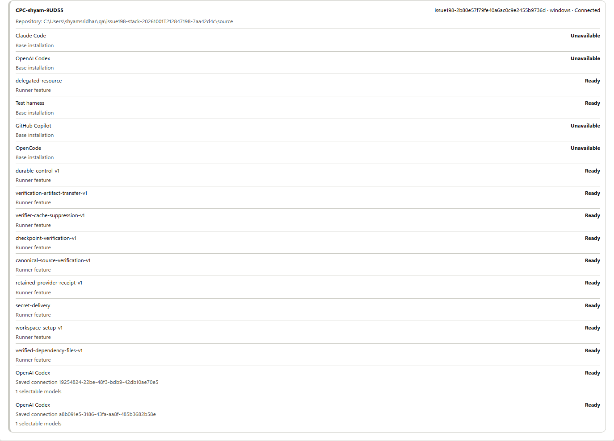
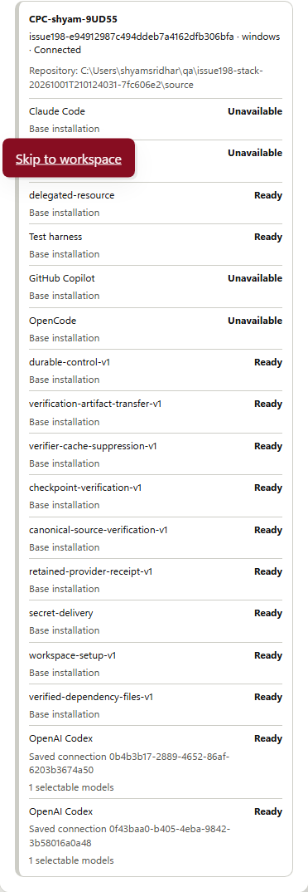
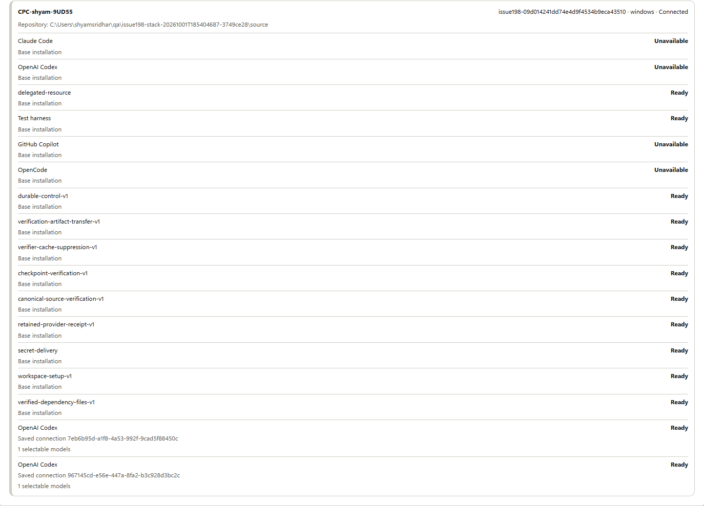

# Runner readiness identities — October 1, 2026

## New native application acceptance

The [native acceptance packet](native-acceptance-r1/README.md) records a real Copilot application
run, four passed persisted verifier checks, exact source download, 14 combined
application assertions and six demo-role review assertions. Real Connect/Test
receipts cover Copilot, Codex and unsigned-in Claude. These observations supersede
older statements below that provider inference and the application journey were
unproven. See the [exact scope and limits](native-acceptance-r1/summary.json), including the
two-attempt policy with one observed attempt, failed observer runs and development
identity limits. Product code is unchanged from d41efee. Required hosted checks
remain unavailable; the PR stays draft and #198 stays open. The historical sections
below preserve their original chronology and do not impose parent-only acceptance
requirements on child #198.

## Current protocol-label correction

The [protocol correction](protocol-correction.md) addresses review comment
4160606480 and records the current product source. Full canonical validation
passed all 11 gates; the complete local stack passed **60 assertions**.
See the [source-bound results](protocol-correction-r1/summary.json) and
[canonical report](protocol-correction-r1/canonical-report.json). The focused regression
passed 19/19 after its observed red result. These results supersede the
older product-validation counts below.

The narrow capture retains a focused skip-link overlay. The sections below
preserve earlier evidence chronology, including the source-claim correction.

## Current review correction

The [review correction](review-correction.md) supersedes the historical R2
non-ECorp default-source claim. Fresh [R3 acceptance](acceptance-r3/browser.json)
passed **44 assertions** with explicit synthetic default and saved local source
identities. Product source did not change. The original R1/R2 evidence, old
summary and pre-canonical self-review are preserved as historical checkpoints.
Previously omitted successful publication checks for the parent revision are
now in [publication-r3](publication-r3/issue198-publication-validation-r3.json).
The [correction receipt](review-correction.json) binds the new source observations
and explains the separate final publication checks. New original images:

The sections below retain the initial publication's chronology. R2's default
origin identified ECorp; its saved local clones had distinct local identities.
Only R3 proves the newly asserted synthetic default identity.

This partial contribution addresses issue #198 comment 5710390211. A runner can
legitimately advertise an unavailable base provider and multiple ready saved
connections using the same provider name. The old list reused that name as its
React key and did not identify the connection behind each row.

`apps/web/src/App.tsx:6151` now keys each row by provider plus saved-connection ID
and labels its base or saved connection. Every authoritative record, status and
model count is preserved. Null and omitted connection IDs identify the same base.
No execution, authorization, permission, source selection or native harness code
changes. Existing native connection/account/catalog capabilities are reused.

## Source and validation

- Base: `878a1774774b0630c904cbaf4b05e1b346777817`.
- Tested product tree: `2c987005dba4d5bd1a47cd4d5f0fd34a40231118`; 7,147 unchanged physical source inputs.
- `source-manifest.json` binds the original physical bytes. The publication
  adds this evidence directory to that product tree; the final PR commit binds
  the packet. The original check ran before evidence-only additions.
- Locked installation used pnpm 11.19.0; locked server/runner build passed.
  Installation preceded the new regression and product correction: its separate
  manifest records 7,146 unchanged inputs, with identical dependency inputs.
- The documented standalone Teams scenario required its own locked npm install:
  `npm ci --ignore-scripts --no-fund --workspaces=false`. This installed the
  declared `@microsoft/teams.apps` 2.1.0 without source or lockfile changes.
- All 11 canonical `pnpm check` gates passed: migrations, state-audit compatibility,
  native EVM, both docs gates, full Node discovery, formatting, clippy, Rust tests,
  web build and lint. No lane was replaced by the old unit-test subset.
- Node: 3,107 total, 3,042 passed, 0 failed,
  65 skipped, 0 cancelled, 0 todo.
- Rust workspace: 877 passed, 0 failed,
  564 ignored across 41 summaries. EVM is separately
  recorded in the canonical report; ignored tests are not passes.
- New retrospective regression: four tests against unchanged main first yielded
  one pass and three failures. The same tests then passed four of four against
  the correction, with zero skips/cancellations/todo. These tests are included
  in full discovery and are not added again to its counts.

The original canonical R1 failed: 3,107 Node tests, 3,039 passed, three failed,
65 skipped, none cancelled or todo. Formatting, clippy, Rust tests and web
build/lint did not run in that attempt. Two tests lacked the separately locked
Teams SDK. After the documented setup, all 18 focused Teams tests passed.
The third failure was the existing F02 near-limit Git filter fixture: its native
probe completed with exit 128, but the subsequent CLI's preparatory `read-tree`
timed out before reaching the filter classifier. Source/index/refs stayed
unchanged and its scratch directory was empty. The original native receipt
retains the 8,385,017-byte stderr length/hash and prefix/tail observations; the
large raw native stderr itself was not persisted by the fixture.

Three exact F02 repetitions then passed with unchanged source, assertions,
timeouts and cleanup guards. These passes and the final canonical R2 do not
establish the cause of the earlier timeout or claim it was repaired. R1, all
setup and diagnostic receipts, original CLI diagnostics, and their logs remain
published. `validation-history.json` extracts the actual Node log summaries:
the diagnostic driver's original `results` arrays were empty because it matched
`#` while the installed reporter used `ℹ`; the raw logs and exits are preserved.

## Local product acceptance

The real browser, server and runner ran against fresh private PostgreSQL and an
independent disposable Git source with the default crew disabled. The explicit
native fixture supplies account/catalog results only; it is not provider inference.

R2 passed 31 assertions: an unavailable base plus two ready saved connections;
exact actor/runner/connection/source identities; reload and retest; signed-out
and restored-account transitions; preserved saved connection; a 390px viewport
without horizontal overflow; and no duplicate-key or browser runtime errors.
Native calls were limited to version, initialization, account and model catalog.
All owned processes stopped, cleanup had no errors, and product/source hashes
remained unchanged. Binary hashes are in `summary.json` and `build.json`.

R1 failed because its fixture returned a successful base `--version` probe while
expecting an unavailable installation. The external R2 wrapper returns exit 69
for that specific probe and delegates private account/catalog setup to the
unchanged production fixture. No product source was changed between R1 and R2.
Both attempts remain recorded. Executed R2 driver copies are inert `.txt` files
so they cannot enter Node discovery. Original screenshots are committed without
image modification, with hashes in `screenshots.json` and byte provenance below.
They contain disposable fixture paths and a machine hostname, without credentials.
Failed fixture directories remain local. The narrow capture contains the focused
skip-link overlay; it is not evidence of an unrelated UI defect.
The [failed R1 capture](acceptance-r1/failure.png) records the original fixture
setup failure and is not passing acceptance evidence.

## Review and remaining limits

The implementing agent reviewed the production JSX, capability construction,
base-plus-connection advertisement and the regressions. This is self-review,
not an independent approval. Provider names are unique in base adapters; saved
capabilities already carry UUID connection identity. No records are deduplicated.
Wrong-source dispatch or an authentication bypass was not established by the
reported finding or this patch.

This does not close issue #198. All-provider native inference, the complete
application/verification/export journey, multiplayer and Factory publication
acceptance remain outside this narrow correction. Required hosted CI, CodeQL
and quality/security gates remain unavailable while Actions is disabled.
Independent approval has not been provided. No merge, issue closure, settings
change or historical clean Cargo
audit is claimed. The configured source checkout and previous work are preserved.

Public copies normalize text and substitute personal paths. Repeated identical
physical manifests are referenced once; counts, failures and observations are
retained. `artifact-provenance.json` records original and published hashes.
Manifest references in nested receipts are relative to this packet root.
`install-source-manifest.json` reconstructs the distinct earlier installation
snapshot from the canonical manifest and validated path/hash differences.

The first publication inventory preflight stopped before documentation or secret
checks because Git excludes eleven intended `.log` evidence files from its normal
untracked-file inventory. `publication-preflight-r1.json` retains that failure.
The revised publisher inventories those exact ignored packet files explicitly,
then stages and scans the complete packet without changing ignore or security
policy. Product source and canonical results are unchanged.
The second publication preflight rejected eight whitespace-only diagnostic-log
lines in two published copies. `publication-preflight-r2.json` records the failure.
Those copies now trim trailing spaces/tabs; `artifact-provenance.json` records
both published hashes and the exact transformation. Original raw logs and the
failed preflight remain local and unchanged. Product source and screenshots
were not modified, and no validation or security rule was relaxed.
