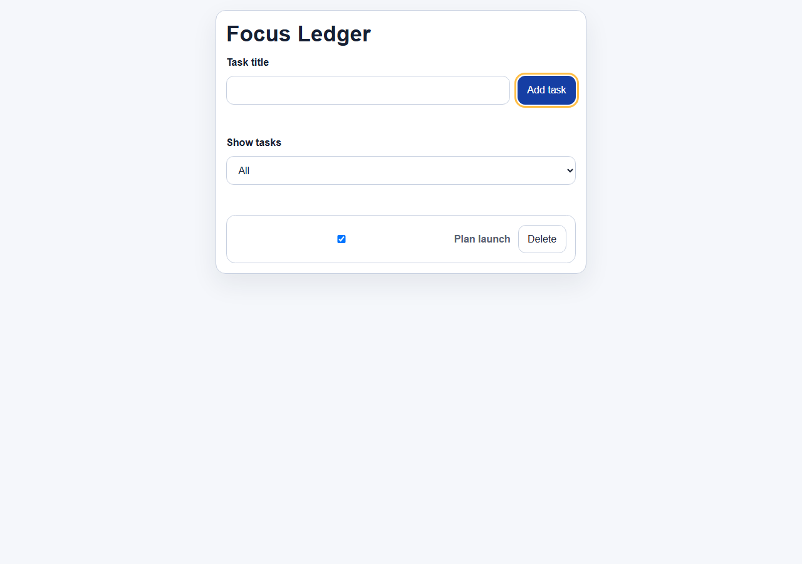
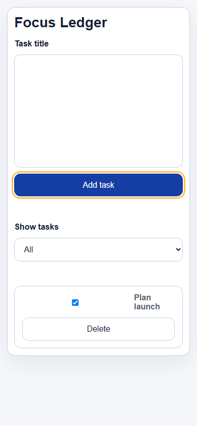
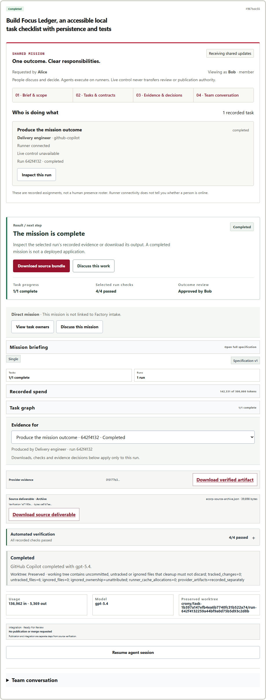

# Native saved-connection acceptance — October 1, 2026

Issue #198 now has a real Copilot application journey on its selected non-ECorp
local source. The browser launched mission `967bdc55-3c3f-4342-a434-356927e00f86` and run `642f4132-259a-44bf-9a0d-75b5d93c2d8b` on
product revision `d41efee9386064fcb73ae0ef660054439b0390e5`. Copilot CLI 1.0.79 / SDK 1.0.11 with gpt-5.4 generated
the dependency-free Focus Ledger application. One task attempt was used under
the persisted **two-attempt** policy. The observer did not reset, retry or replace
the run. Token and cost limits were 500,000 tokens and 1,000,000 microusd; observed
usage was 136,962 input and 5,369 output tokens. Reported zero cost is not a billing
guarantee.

The provider process stopped before four persisted verifier checks passed.
The actual Node verifier command passed 8 tests, with zero failures, skips,
cancellations or todo cases. The browser downloaded the 39,898-byte source
deliverable; its exact SHA256 is `ce61b7eef5c8195e72037ec084d6bc499513e6af3ea1f411180c572819dbb3dc`. The verified source candidate
is `28686d75ea0a73000b5a7e1ec57634947b5e6e95`, tree `621808addbb665f825db18909047dc1d98c82790`, based on `57fd05449410dc05c99c7acdf4b77e7f65607d51`.
The archive has a patch and all five changed files, and no committed-head or Git
bundle claim. Its candidate is the verifier's source identity, not a fabricated
provider commit or published branch.

The downloaded application passed 14 combined browser/Node assertions: empty
state, validation, trimmed Enter submission, adding, filtering, completion,
deletion, persistence, title limit, keyboard focus, 390px fit and corrupt-storage
recovery. One assertion reruns the same 8 Node tests; these are not 16 distinct
tests. The native R4 driver passed 12 assertions and download verification passed
5. These are separately scoped observations, not a summed product test count.

The requester was disabled in the real review UI, and a direct requester decision
was denied with HTTP 403 without changing the pending request. The actual demo
operator selector changed Alice to Bob; the UI submitted one eligible decision.
Six authorization assertions passed, and persisted run, task and mission state
then became completed. This is an **automated development-principal role test**,
not independent human approval, production identity assurance or GitHub approval.
Three exact shell permissions were approved in this owned task: two git-status
reads and its real Node test command. This is not evidence of a zero-approval lane.

## Connection and recovery evidence

Native setup R1 completed 22 assertions before its observer selector failed.
Its overall result remains failed. It contains actual Connect/Test receipts for
Copilot (ready), Codex 0.154.0 (ready) and Claude Code 2.1.263 (needs sign-in in a
private unsigned-in profile), three same-key replays, wrong-demo-actor receipt
denials, saved selection across reload, an owned runner stop/start, immutable
source retention, 390px fit and Escape focus restoration. R4 recovered those same
three connections and source identities and created the first actual mission.
Existing native account stores were used without copying credentials. Public
copies omit native account identities and private catalogs; retained statuses,
model counts, source and authority scopes remain explicit.

R1 and R2 failed at different selectors before any mission. R3 failed on Windows
EPERM replacing the observer mailbox before any mission. R4 corrected observer
selectors and used bounded EPERM/EBUSY retries. Download R2 initially compared
physical CRLF bytes with canonical LF blobs; R3 checked exact immutable Git blobs
and separately established that the physical difference was only CRLF. Product
and generated source were not repaired. Original failed receipts remain.

The [first publication scan](publication-history/README.md) also failed on two
UUID idempotency values. Public replay copies now retain stable fingerprints
instead of the values. Original failures and the unchanged scan policy remain.

## Source binding and scope

The native physical manifest has 7,286 files: 7,147 product inputs and 139 prior
evidence files. The product subset equals the successful complete canonical
`pnpm check` inputs at product tree `d62abf4e59887f84f3848ccf5c839fe487e51c30`. All 11 gates passed there:
migrations, state-audit compatibility and EVM, both documentation checks, full
JavaScript discovery, Rust formatting/clippy/workspace tests, web build and lint.
Node: 3,108 total / 3,043 passed / 65 skipped / 0 failed, cancelled or todo.
Rust workspace: 877 passed / 564 ignored / 0 failed across 41 summaries. Native
EVM separately: 1 passed / 0 failed / 0 ignored. The focused 19/19 tests overlap
canonical discovery. No skipped or ignored case is relabeled a pass.

This publication only adds evidence and a README notice. The unchanged product
reuses that canonical validation; documentation, whitespace, exact source/policy
binding, test-discovery equality and secret scans validate the added evidence.
Final-head publication receipts are recorded separately in the PR comment to
avoid claiming that a commit can contain its own final hash. Passing receipts
for parent d41efee are included in parent-publication/ with their original scope.
Every earlier packet file is retained unchanged except the additive README notice.

The child #198 contract permits an approved local checkout without a remote.
It asks for Connect/Test on all three native agents and one actual bounded
application task; it does not require inference on all providers. Real GitHub
publication, Factory and the wider operating lane remain parent #145/#63 work.
These new observations supersede earlier statements that no native application
journey was observed. They do not establish every unsupported/missing-installation
state or all adversarial authority/recovery paths solely from this happy path.
Those requirements retain their focused regression and source-review obligations.
The child remains open while its linked PR and required hosted gates are pending.

## Limits and preserved resources

The four screenshots were visually inspected and copied unchanged. At 390px the
app fits and works, but its input is unnecessarily tall (about 224px) and checkbox
spacing is awkward; no polished-UI claim is made. Corrupt-storage recovery passed;
storage denial/quota was not exercised. One local 404 console message remains of
undetermined resource, with no JavaScript exceptions or external requests.
The provider's result.md correctly says it did not run browser tests. Observer
browser acceptance was retrospective and is not rewritten as provider history.

All owned PostgreSQL/server/runner/web/acceptance processes stopped cleanly.
The original source remains clean at the same commit. The generated task worktree
contains preserved untracked work and was not removed. Earlier failed evidence,
the unestablished F02 preparatory read-tree timeout and historical Cargo advisory
debt remain. GitHub Actions is disabled; required hosted checks cannot be replaced
by these local results. No independent GitHub approval, merge, policy exception
or issue completion is claimed.

