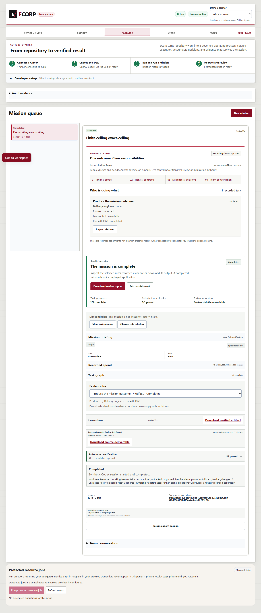
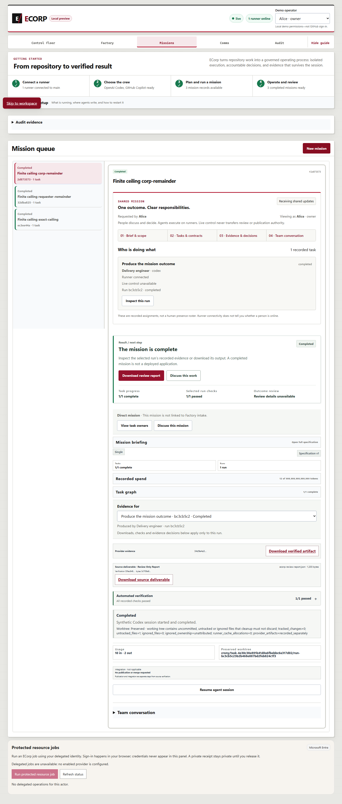

# Retained browser screenshots for #394

These are the three original full-page PNGs from the successful October 2, 2026
Edge/server/PostgreSQL/runner run (04:07:21.215Z to 04:08:41.312Z). They are copied
without image edits. Publishing this packet does not rerun the browser.

The run used the explicitly synthetic Codex protocol peer and development
principals. [The existing browser receipt](../receipts/browser-server-runner-r2.json)
records all 18 scenarios and their native persistence, verifier and artifact
results. [The image provenance](provenance.json) maps each capture to its mission,
run and current digest. The original receipt did not hash screenshots; these
digests were observed for publication. Retained timestamps support the mapping
but do not prove capture time cryptographically.

| Original capture | Mission / run prefix | Allowance in the persisted run receipt |
| --- | --- | --- |
| [Exact ceiling](exact-ceiling.png) | `ec3ee44a` / `4f0df860` | `999999999999999` |
| [Requester remainder](requester-remainder.png) | `32dba825` / `e4f9558b` | `20` |
| [Corp remainder](corp-remainder.png) | `2d873573` / `bc3cb5c2` | `20` |

Each image shows the selected completed mission, 1/1 automated checks and
10 input plus 2 output tokens. The mission-level display retains its authored
large budget; the smaller initial run allowances are proven by the persisted
receipt, not by the screenshots. The zero-remainder and fourteen invalid API
checks have receipt evidence but no separate captures. Failed browser r1 has
no retained PNG; its failed receipt and log remain visible in the parent packet.

All 7,151 historical physical product files still match fingerprint
`e366d091bab92043a0e67a4efc30fa84f19e632bf17541d31a8ae6510e218fce`.
Product commit `44a451be3262016635fa1dcca8d0365291664678` and publication parent
`945902b75c27e08e48ee743a4f313f700b1ee107` retain their existing physical-to-Git
CRLF/LF mapping. This addition changes only evidence documentation and images.

The images do not establish vendor inference, independent human acceptance,
Factory publication, hosted checks or merge readiness. Issue #291 remains open.

