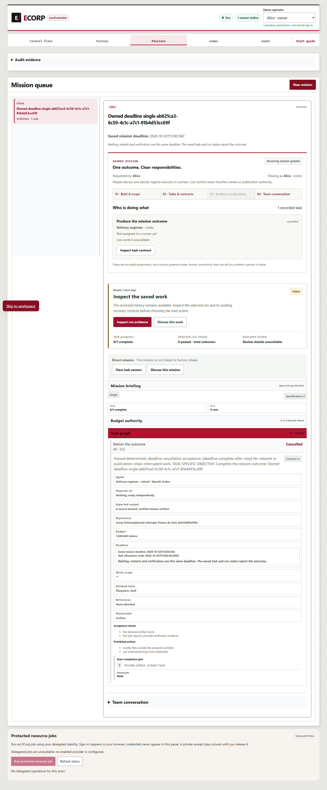
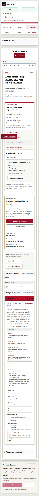
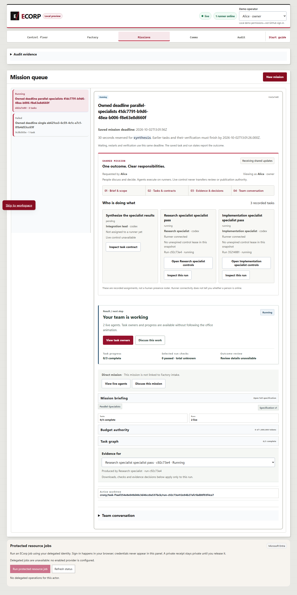
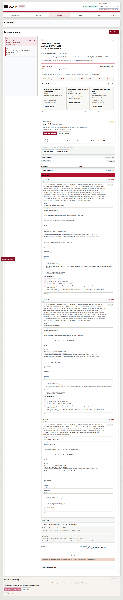


# Mission deadline acceptance evidence

Issue #298 introduces one optional immutable absolute mission deadline and a
requester-declared reserve for a descendant-closed set of final tasks. Every
stage consumes that same clock. Queueing, dependency wait, restart/resume and
verification cannot renew the allowance. An expired parent remains cancelled
and cannot release a dependent task. The existing native stop, durable runner
command, worktree preservation and committed completion receipt paths are reused.

## Source and chronology

This contribution is stacked on PR #392 at
`ddc24c427c90773ee6a3c5d46d4a5a1becc9cf01`, based on main
`878a1774774b0630c904cbaf4b05e1b346777817`.
[Source mapping](source-mapping.json) records physical and Git-normalized hashes
for every changed source file, original receipts and unchanged image bytes.
The browser capture used fingerprint
`5f435b1405c6be63bc174b513f5b1461f05876809caf6838c3ce8ee18a25f3f9`.
It ran on October 2, 2026, from 13:00:09.355 to 13:01:29.615 UTC. Focused/native
R4 ran later. A server test, the missing manifest57 entry and output in one domain
test were added after the browser capture. In-memory whole-file hash checks
establish that those differences do not change the captured production code.
No capture is relabeled as execution on the future publication commit.

## Observed acceptance

[The selected browser report](browser-report.json) retains 15 passing checks
across two missions in actual Edge with an owned PostgreSQL, server, runner,
Vite and deterministic native Codex transport. It includes original selected
mission/task/run readbacks and events. Prompts and unrelated snapshot objects
are omitted and local paths normalized; its original raw-report hash is retained.

The solo mission was saved without launching, expired in the queue and rejected
a later launch with HTTP 409. No run or physical-stop receipt was invented.
The parallel mission waited before launch and gave its two specialists the
earlier cutoff, reserving 30 seconds for `synthesis`. The native transport reported
success after interruption. Both runs remained cancelled, kept their dirty
worktrees and had separate termination receipts. Synthesis never launched, and
the mission explicitly failed its declared reserve contract without resetting
its time or budget. Persisted API and browser state agreed at 1440 and 390 pixels.

[The native fake-clock trace](fake-clock-trace.json) records actual policy return
values at supplied test times: 480,000, 180,000, 130,000, 50,000 and 1,000 remaining
milliseconds, then expired dispatch. These are simulated clock inputs, separate
from the real test execution timestamps. Native store reopen/resume, lock waits
and runner cancellation are covered by the separate regressions.

## Validation and limits

[Validation](validation.json) preserves exact commands, source identity, counts,
filtered/ignored cases, log hashes and prior failures. Focused R4 passed 43 Node
and 21 Rust tests. The fresh SCRAM PostgreSQL lane explicitly executed 39 native
tests: 15 deadline, 13 recovery and 11 checkpoint cases. The later trace run
passed all eight domain deadline cases again; those are not extra unique tests.
Wrong-password controls passed. All exact owned fixture processes were verified
stopped and database/workspace/evidence files preserved.

The first browser attempt failed to open collapsed specification details; the
driver was corrected and that failed attempt retained. The migration checker
initially reported 56 manifest entries for 57 SQL files; appending the new,
unapplied migration57 checksum fixed the check without changing applied SQL.
The evidence-inclusive canonical `pnpm check` result will be published separately
after execution, before committing this candidate. Original receipts remain under
`output/issue-completion/20261002T023252Z` in the owned completion workspace.

See [the contract and opt-in fixture setup](../../MISSION_DEADLINES.md) for exact
field meanings and reproduction. Safe `*.test.mjs` tests stay in full Node
discovery; `tools/e2e_mission_deadline.mjs` requires an explicit fresh owned stack.
Native SQLx tests require an owned maintenance database and `--ignored`.

Independent deadline/cancellation review and required hosted checks remain
outstanding. No production authentication, real-provider inference, historical R4
reproduction, independent acceptance, merge or issue completion is claimed.
The observed Codex version is not an enforced pin. Environment-only fixture
secret delivery is reduced assurance. The historical Cargo audit still has 12
advisories (2 high, 1 moderate, 9 low); this evidence does not claim a clean audit.
