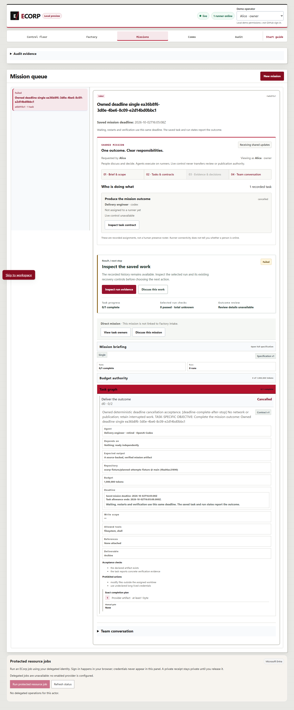
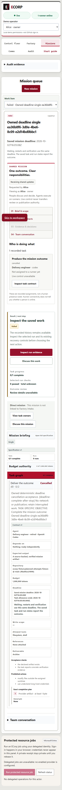
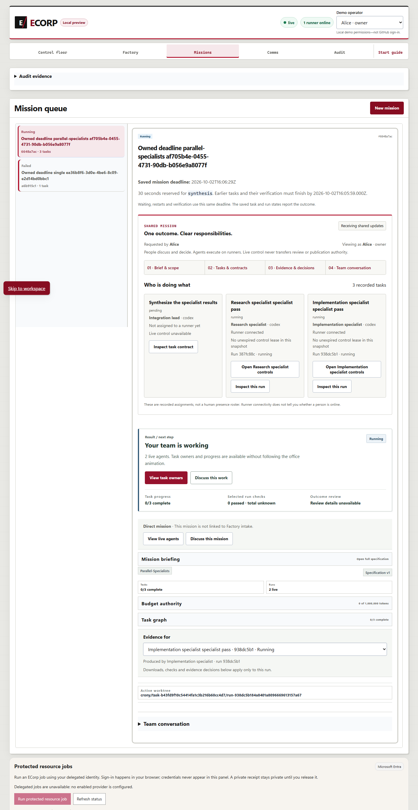
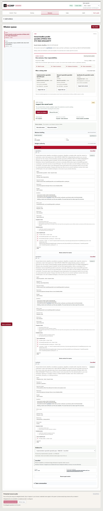


# Review-fix regression evidence for PR #400

These captures and tests follow the review of `998f8e2ca6290f894f93b2fdb36d99af79548120`.
The original implementation evidence remains in the parent directory. This packet
does not change its chronology or claim independent acceptance.

The fixes require every reserved task to follow all unreserved work, bind fixture
paths to canonical nonlink directories and the actual module checkout, preserve
the first durable cancellation cause, and leave earlier terminal mission causes
unchanged. An indexed derived task cutoff selects due unfinished work. Recovery
warnings retain the actual rejection detail.

[Validation](validation.json) records 48 passing Node and 26 passing Rust focused
cases, then 53 passing native database cases: 29 deadline/authority, 13 recovery
and 11 checkpoint cases. Executed native names match discovery; zero tests failed
or were ignored in those successful native lanes. Focused R5 differs only by the
later migration58 SQL ordering and manifest checksum; native R6 executes that
corrected migration. Exact filtered counts and commands remain in the receipts.

Native R5 failed its upgrade regression with `cannot CREATE INDEX "tasks" because
it has pending trigger events` (28 passed, 1 failed). The subsequent recovery and
checkpoint lanes did not run in that failed attempt. Moving index creation before
backfill in the new unpublished migration58 fixed the upgrade while preserving
deferred audit enforcement and all applied SQL. The failed output is retained.

[Browser acceptance](browser-report.json) records 15 passing checks across two
missions in actual Edge with fresh owned PostgreSQL, server and runner. The queued
mission expires with no invented run and rejects later launch. Both active parents
retain cancelled state despite late native success, keep their dirty worktrees,
and have separate physical-termination receipts. Synthesis never starts; the
declared reserve fails explicitly without renewing time or budgets. Browser and
durable state agree at 1440 and 390 pixels. All exact owned services were stopped
and their fixtures retained. Deterministic transport is not real-model acceptance.

[Source mapping](source-mapping.json) records the actual execution fingerprint,
changed-source hashes, original receipt hashes and unchanged image bytes.
The full canonical `pnpm check` for this evidence-inclusive candidate will be
recorded separately. Earlier canonical success does not validate these fixes.
Independent deadline/cancellation acceptance, dependency integration and required
hosted gates remain outstanding. No merge or issue completion is claimed.
