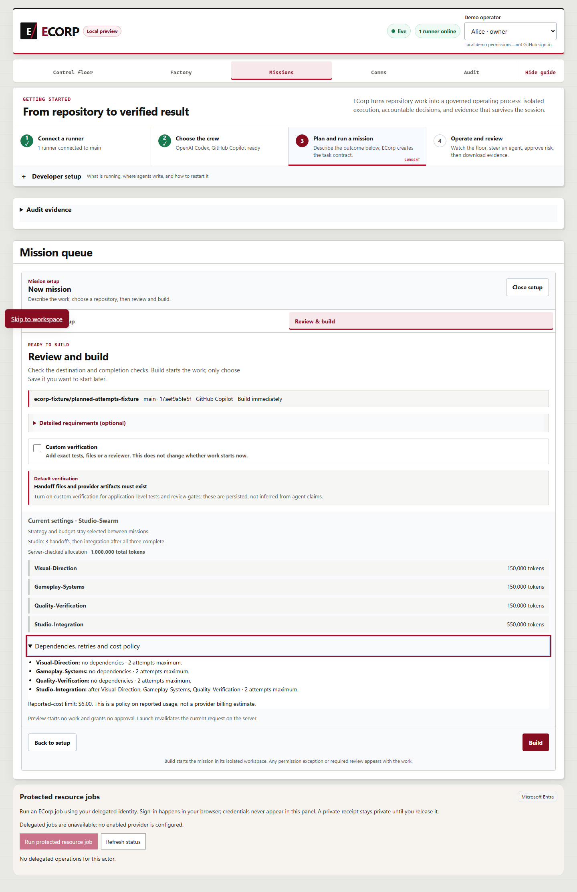
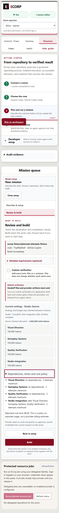
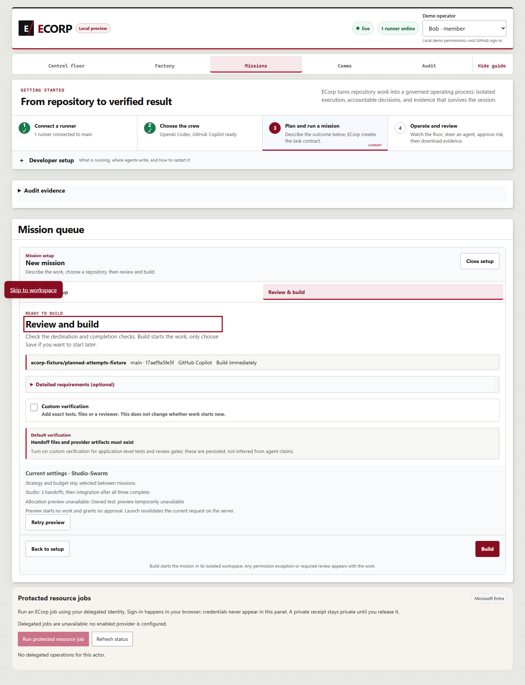

# Mission-preview fixture regression evidence

PR #399 corrects the positive `parallel-specialists` preview fixture to authorize
`handoffs/**` explicitly and first verifies rejection without that directory scope.
The production planner, authorization and budgets are unchanged.

These screenshots and assertions were captured on October 2, 2026 against a fresh
owned PostgreSQL, server, runner and Vite stack using Microsoft Edge. The connected
runner launched no run: this is acceptance of read-only preview behavior.

## Revision and chronology

The tested source was main `878a1774774b0630c904cbaf4b05e1b346777817` plus the
four-line fixture correction. Its physical-file fingerprint was
`ee504d0cba61c7a79a2bd8675fd45346434c79f3f057e5f7b8619e5b76acd834`.
Tests and captures ran before the correction was committed as
`502205ed1872d29e3be0f09e66b293e11f455b56`; the retained commit receipt verified
unchanged physical bytes and Git's configured line-ending normalization. The
captures are not represented as tests run under that later commit ID.

This evidence-only packet preserves those screenshot bytes and all recorded
assertions. [Source mapping](source-mapping.json) includes the original receipt
hashes, tested source identity, helper blob and screenshot hashes. Paths in the
published browser report are normalized; its original hash is recorded separately.
The packet does not change the tested production or fixture code.

## Browser results

[The report](browser-report.json) records ten passing checks, zero blocked
requests, zero page errors and identical visible-state hashes before and after.
Screenshots show three observed states; temporal fencing and state comparisons
are assertions in the report, not facts inferred from a still image.

| Checks | Evidence |
| --- | --- |
| Exact Studio allocation and one explicit Build control; keyboard disclosure; 1440-pixel layout | [Desktop capture](studio-1440.png) and report checks 1–3 |
| Exact allocations without horizontal overflow at 390 pixels | [Mobile capture](studio-390.png) and report check 4 |
| Actor change clears target and former allocations, then fences the next request | Report checks 5–6 |
| Failed preview removes obsolete allocations | [Failed-preview capture](failed-preview-no-obsolete-allocation.png) and report check 7 |
| Retry uses current 500K allocation; late earlier-budget response cannot replace the current 2M allocation | Report checks 8–9 |
| Visible rows and events unchanged; connected runner started zero runs | Report check 10 and matching before/after hashes |

The first check's recorded name says “single launch”; `launch_clicked: false`
means it checked the single available Build action without activating it.
The three specialist allocations are 150,000 tokens each, followed by 550,000
tokens for integration. The desktop and mobile captures expose dependency,
attempt and reported-cost policy details.

## API and contributor validation

[The API report](api-report.json) records 30 cases in 64 requests, including
HTTP 400 for parallel handoffs without directory scope and HTTP 200 with the
explicit handoff scope. Every case preserved visible state.

[Validation details](validation.json) retain all eleven canonical `pnpm check`
gates, exit codes, durations, counts and the original report hash:

- Node discovery: 3,103 total, 3,038 passed, 65 skipped, zero failed or cancelled.
- Rust workspace: 877 passed, 564 ignored, zero failed across 41 summaries.
- Separate local-EVM test: one passed.
- Migrations, state-audit compatibility, both documentation gates, Rust formatting
  and Clippy, web build and lint all passed.
- Matching-source native server/runner build and the fresh local-stack checks
  passed. Exact owned processes were stopped and their fixture data retained.

To reproduce the public API regression, provision an isolated owned local stack
with an enrolled runner, valid source checkout and development fixture actors.
Follow the required environment contract at the top of
`tools/e2e_mission_preview.mjs`: set `CRONY_MISSION_PREVIEW_TEST=1`, the owned
`CRONY_SERVER_HTTP`, `CRONY_CORP_ID`, `CRONY_ACTOR_ID` and runner identity;
`CRONY_PREVIEW_COPILOT_FIXTURE=1` explicitly enables synthetic Studio capability.
Run `node tools/e2e_mission_preview.mjs`. The script only reads snapshots and
posts previews; it does not provision, reset or launch work. Run locked dependency
installation and `pnpm check` for the complete contributor plan.

The exact browser driver, supervisor, logs and original receipts are retained in
`output/issue-completion/20261002T023252Z`; the driver's original hash is in the
source mapping. Reproducing browser fault injection requires that isolated
fixture and driver, not just opening a screenshot.

## Scope and remaining requirements

The test uses synthetic Copilot capabilities and development principals. It did
not exercise production OIDC or an existing roomless operator. No provider ran,
no game was completed and no human outcome decision was created. Issue #164 stays
open for its separate real-provider playable-game acceptance. The stopped
historical brick-breaker lineage was not resumed or reset.

Required hosted CI, CodeQL, security and code-quality gates remain unavailable
while organization Actions are disabled. These local results do not substitute
for those required gates or constitute an approval or merge.
