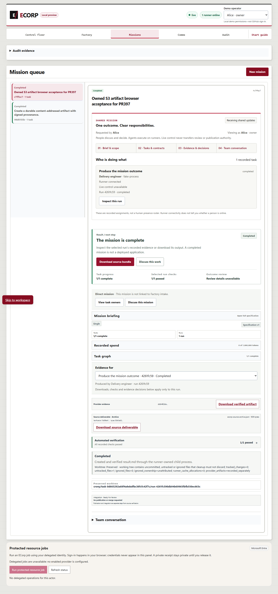
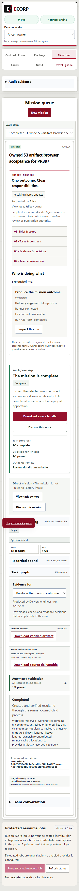

# Object-store upgrade acceptance evidence

PR #397 updates `object_store` from 0.12.5 to 0.14.2. ECorp imports the native
`ObjectStoreExt` convenience methods and initializes native test-result extensions;
the storage, signing, authorization and size-boundary mechanisms remain in place.
The native artifact fixture now supplies the current signed source identity and
verification-request table. Its synthetic identity is explicitly labeled and a
safe offline signing/decoding regression covers it.

## Source and chronology

The captures below ran on October 2, 2026 at original head
`782803de6cbb0f42174ba37b3b576ded2ff79fba` plus the two compatibility/fixture changes
in `crates/crony-server/src/artifacts.rs` and `issue297_native_fixture.rs`.
The tested physical-source fingerprint was
`71855e9110c458a39f265959b7185f43d850412e0c1aeade36df78ba1b25dab9`.
[Source mapping](source-mapping.json) binds every changed code/lockfile blob,
original receipt hash and unchanged screenshot. The evidence was captured before
the publication commit; it is not described as a run under that later commit.

## Local acceptance

[The browser report](browser-report.json) records six passing checks in real Edge
against a fresh owned PostgreSQL, server, runner, Vite and digest-pinned Moto S3
emulator. The browser selected a synthetic source and deterministic provider,
created and launched a mission, and observed completed state with persisted
verification. The API and browser both downloaded the selected signed artifact
with matching bytes. An unrelated actor received HTTP 404. Controls remained
visible at 1440 and 390 pixels; both screenshots were visually inspected.

The separate [signed S3 probe](signed-s3-read.json) used native boto3 request
signing, inspected three emulator objects and matched the browser artifact SHA-256.
The [public-artifact helper](public-artifacts.json) also passed with a persisted
signed artifact and denied an unauthorized download. Screenshots show final UI;
the reports establish request ordering, bytes and authorization assertions.

## Validation and reproduction

[Validation](validation.json) retains the complete canonical `pnpm check` plan,
actual counts, ignored/skipped cases and original receipt hashes. Before adding
this packet, all eleven canonical gates passed: migrations, state-audit
compatibility/EVM, both documentation checks, full Node discovery, formatting,
Clippy, Rust workspace tests, web build and lint. Node: 3,103 total, 3,038 passed,
65 skipped, zero failures or cancellations. Rust: 878 passed, 564 ignored, zero
failures across 41 summaries. The separate EVM gate passed one test. Focused
artifact/receipt regressions passed 24 with one ignored; the native fixture lane
passed 13. Matching server/runner binaries built successfully.

Use an isolated owned checkout with locked dependencies and `pnpm check` for the
full contributor plan. For native acceptance, provision a fresh owned PostgreSQL
database and run the dedicated ignored native artifact fixtures; the exact
commands and counts are in the native-regression receipt. Provision private S3
compatible storage and the complete local stack, then run the canonical
`tools/e2e_public_artifacts.mjs` helper using its documented environment contract.
The retained browser driver and signed probe are hashed in the source mapping;
they require the owned fixture described above. They do not use the configured
source checkout as an agent workspace. All exact owned processes and the emulator
were stopped after testing; their data and original logs are retained.

The first two harness attempts remain recorded as failures: an anonymous private
object GET, then an in-memory credential-handoff error. R3 fixed only the harness
handoff and passed both browser and independent signed-object verification.
No historical test result, reviewer identity or human decision was invented.

## Limits

The principals and provider are synthetic; the S3 endpoint is a loopback emulator.
Environment-only fixture credential delivery is reduced assurance. This is not
cloud IAM/TLS-provider, production OIDC, real-model, signed-installer or other-OS
qualification. Existing Cargo advisory debt is not a clean audit. Required hosted
CI, CodeQL, security and code-quality successes remain unavailable while the
organization has Actions disabled. Local validation is not an approval or merge.

Publication metadata uses `object_path_sha256` for object-name digests. The original receipts use `key_sha256`; all digest values are unchanged. This label clarification resolves a secret-scanner false positive without changing scanner rules. Original receipts remain bound by the hashes in `source-mapping.json`.
