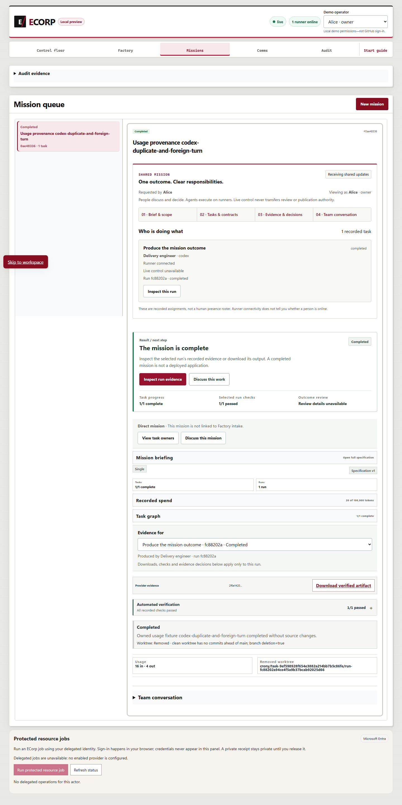
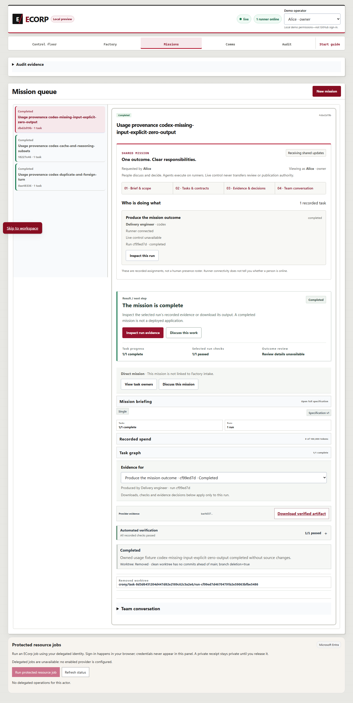
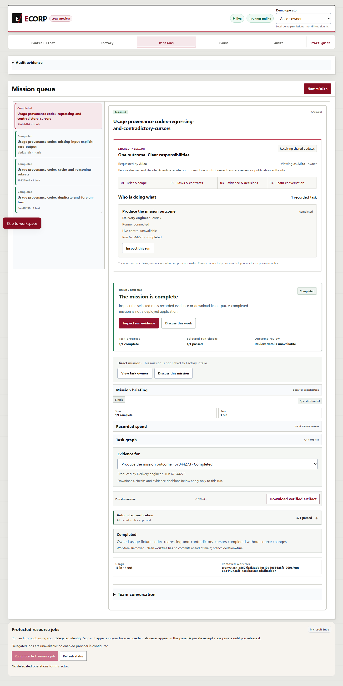
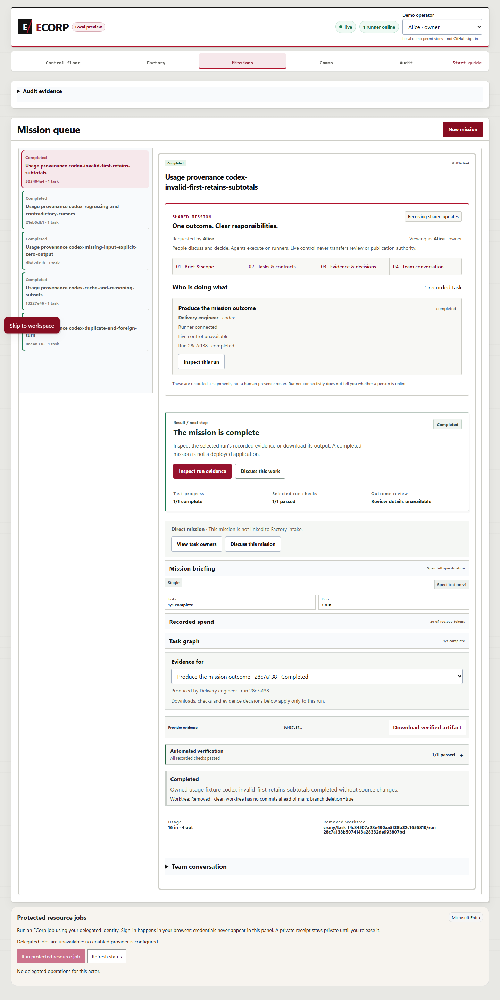

# Invalid-first usage and CMD continuation corrections

This packet records observed corrections to review comments 4173113909,
4173113933 and 4173113950 on draft PR #402. It is a partial prerequisite for #236.

Implementation: `49a5c47d3fda8ca9e3925647639677f912bdeef2`. Tree: `47a09075cbd44f8dc9e47ad2e143e71de291a2a1`.
Previous published head: `ac3a6764638406af0e13fa118ea68767a093324b`. Dependency #392: `ddc24c427c90773ee6a3c5d46d4a5a1becc9cf01`.
Physical validated source fingerprint: `da95d33bc3706d1a67ec8cc260392780f466b6d0866f2009326225ace87707ce`.

Both evidence scanners join caret-LF and caret-CRLF continuations before removing
remaining carets. Literal matching, placeholder handling and retained-handle
containment remain in place. The nonserialized usage accumulator distinguishes
empty state from accepted unknown values and invalid-only observations. Invalid
evidence keeps coverage invalid without erasing later accepted subtotals. Trusted
session merges retain accepted usage from an invalid-marked run. Overflow and
unknown quantities remain monotonic; the serialized UsageReport contract is unchanged.

## Observed validation

Locked dependencies and all eleven canonical `pnpm check` gates passed before
the implementation commit. The commit receipt binds the same physical bytes.

| Gate | Result |
| --- | --- |
| migrations | passed |
| state-audit-compatibility | passed |
| state-audit-evm | passed |
| docs | passed |
| repository-docs | passed |
| node-tests | passed |
| format | passed |
| clippy | passed |
| rust-tests | passed |
| web-build | passed |
| web-lint | passed |

Exact full Node, Rust and ignored/skipped counts are retained in `evidence.json`
and the canonical receipt and log. Focused native scanner: 27 passed; Node
scanner: 13 passed; domain usage: 18 passed (25 filtered); Codex invalid-first:
1 passed (321 filtered); retained-session execute/resume: 1 passed (321 filtered).
All five lanes had zero failed, ignored or skipped tests. Two synthetic runs in
one retained session each preserve 10 input / 2 output tokens, with 20 input / 4
output retained across the session and invalid coverage.

The fresh native SQL lane discovered and passed all 13 tests. Its exact filtered
count, wrong-password rejection and owned shutdown are in the receipt. Five
browser scenarios passed 54 assertions, with zero failed assertions,
execution errors or unexecuted scenarios. Actual Edge, server, runner and fresh
SCRAM PostgreSQL used a deterministic Codex transport. Every scenario downloads
the authorized provider artifact, verifies its server digest and identities,
and checks persisted termination subtotals, verification before completion,
source preservation and disposable workspace cleanup.

The added invalid-first scenario sends a malformed input count at cursor 12,
then valid 10/2 at cursor 12, its duplicate, valid 6/2 at cursor 20 and its
duplicate. It retains invalid / accepted / accepted observations and 16 input /
4 output tokens, with unknown cost and invalid aggregate coverage. Downloaded
provider artifacts in this packet preserve their exact authoritative bytes.
This is deterministic integration acceptance, not provider inference or billing.

## Retained failures and remaining work

Before correction, the new retrospective native scanner reproduction had 24
passed / 3 failed; Node had 10 passed / 3 failed; domain usage had 10 passed /
4 failed / 25 filtered; Codex invalid-first had 0 passed / 1 failed / 320
filtered. The original logs and source hashes remain in `history/`. The wrapper
status means the failures were reproduced; it does not label failed tests passed.
The expanded retained-session tests were added afterward and have no claimed
before-correction execution. Previous packets and failures remain preserved.

At 2026-10-03T08:59:28.0113929Z, repository settings reported Actions disabled by
organization administrators. Required hosted CI, CodeQL, security and quality
remain unavailable; local checks cannot replace them. No gate or review policy
was bypassed. Historical Cargo advisory debt remains unresolved, and the stopped
#193/#235 paired R4 experiment was not rerun.

Full #236 still needs delegated independent audits, early headroom, durable
decisions, atomic bounded grants, same-lineage recoverable continuation, operating
UI and concurrency/revocation acceptance. The $10 assurance remains unknown.
Dependency #392 and independent outcome review are outstanding. Keep #402 draft
and #236 open. Environment-only fixture delivery is reduced assurance.

Text copies normalize only declared local roots, the local operator name,
synthetic-user examples, line endings and trailing whitespace. Original and
published hashes are recorded for every copy. Executable tests and retained
logs are untouched. Screenshots and downloaded artifacts are byte-for-byte copies.

