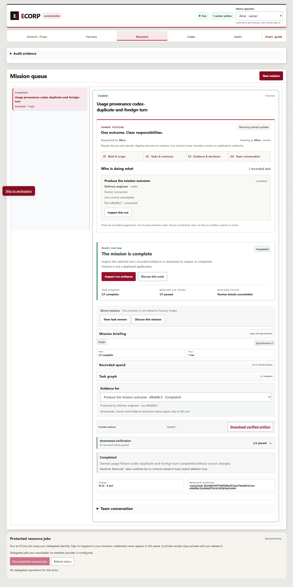
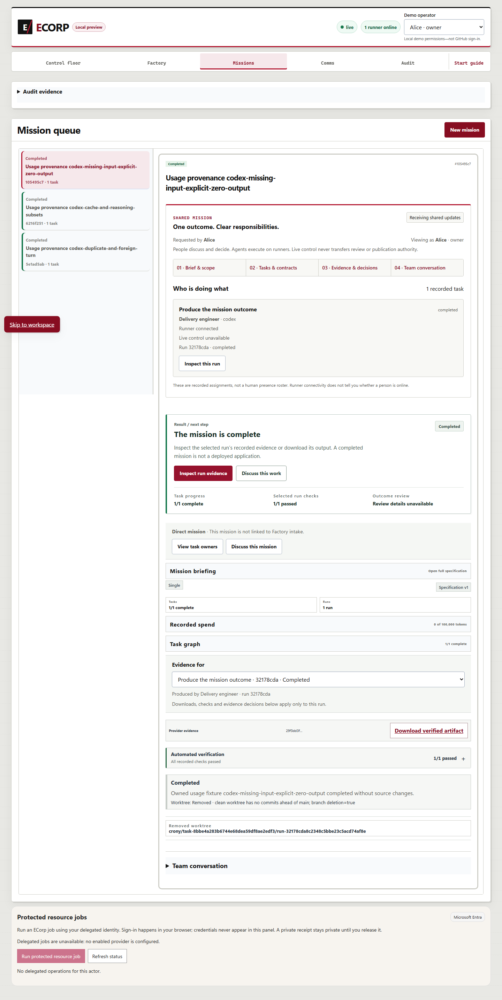
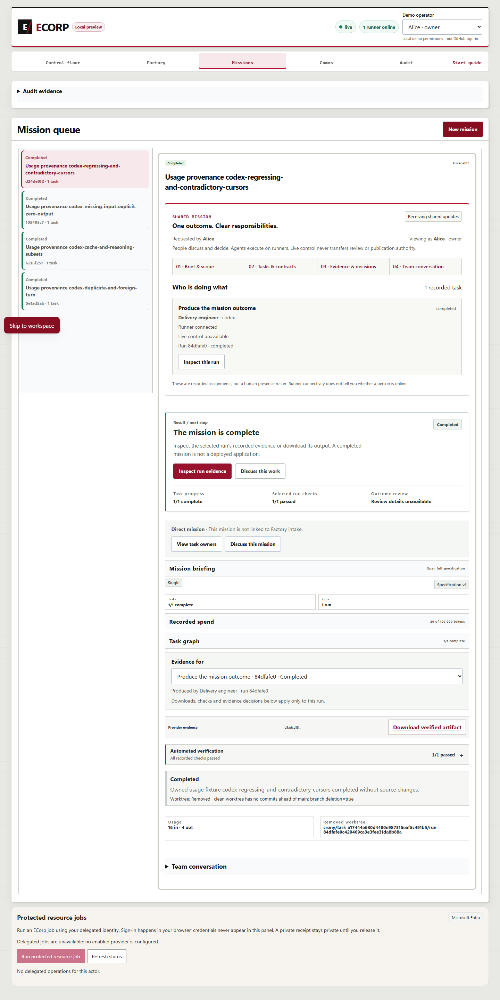

# Usage provenance review corrections

Correction `609463ae65771b0763ae9de563c5f25cb1332f8b` (tree `05b2f80f369e7d07a89c7ea8e53c4b41c836b397`), parent `ffe61f19e6a5f309f363102f0e76aea8a96e3bf2`, on dependency
PR #392 at `ddc24c427c90773ee6a3c5d46d4a5a1becc9cf01`. This is a prerequisite for #236, which remains incomplete.

The correction retains lower and contradictory equal Codex usage cursors as
invalid, uncharged observations without rewinding the accepted cursor. Persisted
call identity coverage follows admission to the stored session. Exact accepted
duplicates are suppressed, and a later increase is admitted once. Scanner changes
detect caret-escaped personal paths; two earlier published log copies have explicit
repairs whose original bytes and historical outcomes remain recorded.

## Observed validation

Locked dependencies and all eleven `pnpm check` gates passed before the correction
commit. The commit receipt binds the same physical bytes to the source above.

| Gate | Result |
| --- | --- |
| migrations | passed |
| state-audit-compatibility | passed |
| state-audit-evm | passed |
| docs | passed |
| repository-docs | passed |
| node-tests | passed |
| format | passed |
| clippy | passed |
| rust-tests | passed |
| web-build | passed |
| web-lint | passed |

Detailed Node, Rust, skipped and ignored counts remain in `evidence.json`, the
canonical receipt and log. The existing cumulative-cursor regression passed 1 test,
with 0 failed or ignored. Focused runner tests: 15 passed, 0 failed, 0 ignored;
domain tests: 9 passed, 0 failed, 0 ignored. Native scanner: 25 passed; Node scanner:
11 passed, with no failed or skipped tests. The owned native SQL lane discovered
and passed 13 tests, with 0 failed, 0 ignored and 571 filtered. Wrong-password
authentication was rejected, and its owned database was stopped.

Four browser scenarios passed: 24 assertions, 0 failed,
0 unexecuted scenarios. Actual Edge, server, runner and
a fresh SCRAM PostgreSQL database used a synthetic Codex transport. The added
12 → 10 → 0 → contradictory 12 → duplicate 12 → 20 → duplicate 20 sequence
retains five observations, charges only the 16 input / 4 output subtotal, and
requires persisted verification before accepted completion. This does not claim
provider inference or complete billing. Owned processes were verified stopped.

## Retained failures and limits

The new retrospective runner reproduction failed 1 of 15 tests; native SQL
failed 4 of 13; native scanner failed 2 of 25; Node scanner failed 2 of 11.
Their original receipts and logs remain under `history/`. The scanner wrapper's
zero exit represented a completed reproduction, not passing tests. These are
observed before-correction regressions, not invented original development history.

Canonical R3 passed its first seven gates, including 3,038 Node tests with
65 skipped, then failed strict Clippy on `clippy::collapsible-if`. Rust tests,
web build and web lint did not run in that attempt. Its logs, source manifest
and prior guard remain in `history/`. The guard was collapsed without changing
its body. Canonical R4 then passed eight gates but failed the existing cumulative
regression, which expected a lower cursor to be discarded. Its partial Rust result
was 657 passed, 1 failed, 9 ignored across 31 summaries; web build and lint did not
run. R4 logs, source and original test are retained. The test now requires invalid,
uncharged evidence and asserts the accepted cursor, accepted report and charged
totals remain unchanged, while preserving duplicate suppression. The complete
source R6 validation above was then executed.

The [earlier packet](../2026-10-03-usage-provenance/README.md) retains the failed
historical browser attempt and stopped paired comparison. No #193/#235 experiment
was rerun. The paired candidate never executed. At 2026-10-03T08:59:28.0113929Z,
ECorp repository settings stated that Actions were disabled by organization
administrators. Required hosted CI, CodeQL, security and quality cannot run until
an organization administrator restores Actions eligibility. The retained
[settings observation](receipts/actions-organization-restriction-observation-r1.json)
records the displayed text and disabled controls; its inspected screenshot was
not saved as a file. No settings were changed and no check was bypassed.
Dependency #392 and independent outcome review remain unresolved.

Full #236 still requires delegated audits, reserved headroom, durable audit
decisions, bounded atomic grants, recoverable continuation/waiting and operating
UI acceptance. The $10 assurance is unknown. Keep #402 draft and #236 open.

Text copies replace exact known local roots (including caret escapes) and the
standalone operator name, normalize UTF-8/LF and trim trailing whitespace. Every
copy records original and published hashes. Test outcomes and quantities are
unchanged; screenshots are byte-for-byte copies inspected before publication.

## Publication normalization after a failed path check

The first publication validation (R2) passed documentation checks, then failed
the personal-path gate on three historical files containing synthetic scanner
test examples. Gitleaks did not execute in that attempt. Its actual result,
check logs, original hashes and the complete prior packet remain retained.

Only published copies replace the synthetic username, literal-caret username and
Unicode whitespace examples with explicit placeholders. Line numbers, failure
outcomes, quantities and timestamps remain unchanged. The normalization receipt
lists each changed line and the original, prior published and corrected hashes.
These normalized historical `.patch.txt` excerpts are non-executable records;
their original bytes remain retained, and the committed scanner test source
keeps its exact test fixtures. No replay fixture or scanner policy was changed.

The current publication driver is R3, and the final staged canonical validation
driver is R8. Earlier R2 and R7 driver copies remain as preparation history and
are not claims of successful execution. New publication results must be observed
before staging or committing this packet.
