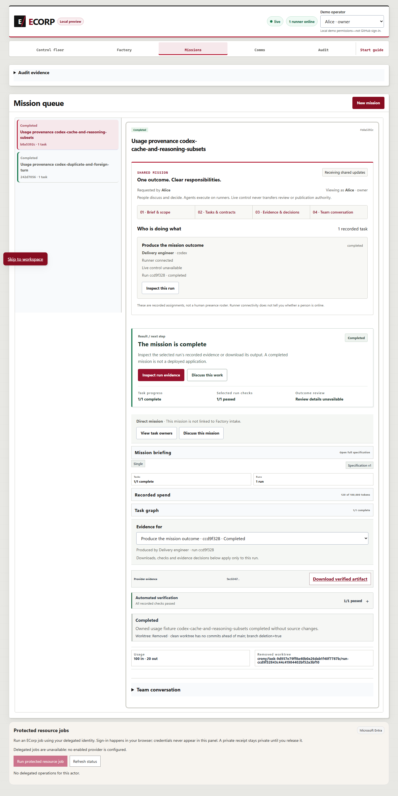
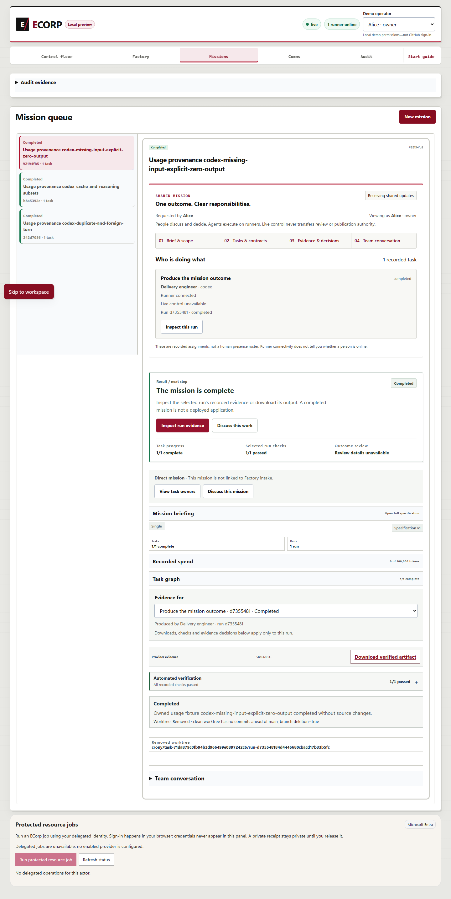

# Usage provenance prerequisite: observed validation

Implementation `fb13446f099ddc550a653ed6c4b13800169ba599` (tree `78370df4797a84ae363b5df9d2cafd3e898887de`), based on PR #392
`ddc24c427c90773ee6a3c5d46d4a5a1becc9cf01`. This is a partial prerequisite for #236. Delegated audits,
bounded grants, recoverable waiting, UI and independent outcome review remain open.

## Canonical contributor checks

Locked dependency installation and `pnpm check` passed on the physical implementation
source before its commit; the commit receipt binds the same bytes to the tree above.
The evidence-only publication commit has separate documentation and artifact checks.
No post-publication full execution is claimed.

| Gate | Observed result |
| --- | --- |
| migrations | passed |
| state-audit-compatibility | passed |
| state-audit-evm | passed |
| docs | passed |
| repository-docs | passed |
| node-tests | passed |
| format | passed |
| clippy | passed |
| rust-tests | passed |
| web-build | passed |
| web-lint | passed |

Full Node discovery: 3103 total, 3038 passed, 65 skipped,
0 failed, 0 cancelled, 0 todo.
Workspace Rust: 924 passed, 0 failed, 594 ignored,
0 measured, 0 filtered, across 41 test summaries.
Ignored native cases are not counted as executed. Canonical R1 failed Clippy for
an oversized usage event; boxing fixed it, and canonical R2 is the successful run.

## Native SQL and full-stack acceptance

The separately opted-in SQL lane passed all 12 discovered cases, with zero failures
or ignored cases. Its earlier source fingerprint is retained. The later differences
are confined to runner files and usage documentation; store/domain and every other
physical source file are identical. This is applicability evidence, not a new SQL run.

The actual Edge browser, native server/runner and a fresh owned SCRAM PostgreSQL
fixture passed 3 usage scenarios and
19 assertions. The native Codex transport is synthetic:
no provider inference or billing, auditor decision, learning experiment, or independent
review is claimed. Assertions cover journal quantities/unknown USD, exact assignment,
persisted verifier acceptance, and clean disposable workspace cleanup. Owned stack
processes were stopped and their identities verified; fixture files remain preserved.

Browser acceptance R2 failed with HTTP 400 before launching its first scenario.
Its original report counted one passed assertion and zero failed assertions because
the old driver omitted the failed HTTP assertion from its counter. One scenario
failed and two were unexecuted; that run is not a pass. Its response body was not
captured, and its screenshot is blank. The fixture availability probe separately
confirmed that the old space-separated command setting supplied one nonexistent
script filename. R3 uses the runner's semicolon argument delimiter, asserts the
exact advertised adapter/source, and counts HTTP failures and execution errors.
The corrected equivalent availability probe exited zero. This is a harness repair;
the implementation source and binary hashes did not change between these runs.

The three successful screenshots were inspected. They show completed missions,
persisted checks and removed owned worktrees. The missing-input screenshot still
shows the legacy zero known subtotal without missing-quantity coverage; its journal
retains missing input and explicit zero output. The remaining #236 UI work must
make this uncertainty visible. Outcome review says review details unavailable.

## Frozen comparison

The frozen baseline/candidate comparison status is **stopped**:
1 row executed, 33 unexecuted.
First accounting mismatch or failed fixture: baseline/codex-duplicate-and-foreign-turn; both arms stopped.
Observed fixture runtime: 1.234 seconds.
The first baseline row reported 21 input / 7 output / 3 emissions / zero cost and
no coverage. The frozen expectation was 16 input / 4 output / 2 emissions /
unknown cost with reported token and unavailable USD coverage. It failed
(0 passed, 1 failed, 0 ignored, 286 filtered); the candidate arm was never run.
This comparison is stopped permanently for this epoch; do not rerun it.
An earlier unexecuted preparation reused baseline artifacts for the candidate and
was rejected. This execution uses separate owned target caches with every local
package invalidated before compilation; compiler receipts bind each executable to
its own arm. The first failing row stops both arms. Unexecuted rows are not passes; standalone
candidate acceptance does not replace a comparative pass. The candidate also contains
PR #392, so differences cannot all be attributed to this prerequisite. Preparation,
implementation, review, monitoring and complete process costs remain unknown.

## Reproduction and artifact interpretation

Use the implementation commit above and its locked dependencies. Run `pnpm check`,
`cargo test --locked -p crony-domain usage::tests`, and
`cargo test --locked -p crony-runner usage`. With an explicitly owned disposable
PostgreSQL fixture, run `cargo test --locked -p crony-store issue236_ -- --ignored --test-threads=1`.
Never point fixture drivers at a retained or operator database.

The `drivers/` text files preserve the executed harness versions outside automatic
Node discovery. They are reference captures with local paths replaced by explicit
placeholders; configure owned paths and the documented pinned tools before replay.
The paired source/probe/corpus and its expected row order are frozen in `comparison/`.
Do not change protected expectations and call a later replay the same comparison.

`evidence.json` maps original and published SHA-256 hashes. Text uses UTF-8/LF normalization and explicit
case-insensitive local-path placeholders; outcome values and screenshot bytes are unchanged. Original receipts/logs remain in
the durable run records. This packet contains no provider credentials or fixture secrets.
Required hosted CI, CodeQL, security and code-quality gates remain unavailable while repository Actions are disabled. Local results do not replace those gates or authorize a merge.
Historical Cargo advisory debt is not a clean audit.

The first publication path check rejected a lower-case local path in a captured
source-snapshot driver. Its original and failed check are retained in the durable
run records; only the published reference capture was normalized.

The first staged whitespace check rejected six reference captures. Their published
versions remove trailing spaces/tabs and final blank lines, as listed in
`evidence.json`; original logs, reference drivers, rejected copies and the failed
check remain preserved in the durable records. No outcomes, quantities or
screenshot bytes changed.

A later review found that both retained startup logs still contained an initdb
operator name and Windows caret-escaped local paths. Only published lines 23
and 44 were normalized; `evidence.json` records the original, previous published,
and corrected hashes and exact transformations. The original logs and historical
validation outcomes remain retained. This correction does not upgrade historical
acceptance to the subsequently reviewed implementation.
