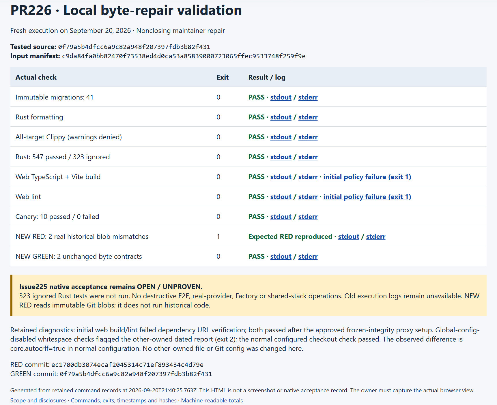

# PR226: fresh local validation, not native acceptance

Executed September 20, 2026, on Windows x64. This package supports the human
review's **nonclosing maintainer byte-repair alternative**. Issue225's original
native acceptance remains **unproven/open**; no requirement or historical
identity is redefined.

Tested source: `0f79a5b4dfcc6a9c82a948f207397fdb3b82f431`.
The integration branch was `codex/pr226-review-evidence`. No commit, push,
GitHub mutation, Factory operation, real provider run, credential/model change,
or operation on the manual API8791/web5187/DB54329/runner-local was performed.
The other fixer's dated-report addendum and PR metadata are outside this
fixer's ownership.

## Genuine current results

Commands ran from the owned integration worktree. They are fresh local
executions, not results transferred from an earlier PR or hosted checks.

| Command | Final exit | Actual result |
| --- | ---: | --- |
| `node tools/check_migrations.mjs` | 0 | 41 immutable migrations |
| `cargo fmt --check` | 0 | Passed |
| `cargo clippy --workspace --all-targets -- -D warnings` | 0 | Passed |
| `cargo test --workspace` | 0 | 547 passed, 0 failed, **323 ignored** |
| `pnpm build:web` | 0 | TypeScript and Vite build passed after approved dependency setup |
| `pnpm lint:web` | 0 | 0 warnings, 0 errors; 42 files, 116 rules; passed after setup |
| `node --test --test-reporter=tap scenarios/factory-live-canary/status.test.mjs scenarios/factory-live-canary/git-bytes.test.mjs` | 0 | **10 passed**, 0 failed/skipped |

Versions actually printed: Node `v24.16.0`, Git `2.55.0.windows.5`,
Cargo `1.98.1`, Rust `1.98.1`, pnpm `11.19.0`. See the version logs for full
build strings. The web build reported Vite `8.2.2`.

The Rust command used the default test scheduling, without `--ignored` or
provider/database opt-ins. Ignored SQLx/native-probe/platform cases, Unix-only
cases on this Windows host, destructive E2E, full-stack/browser acceptance,
and real-provider/Factory execution are **not passed by implication**.
This is not a full-source audit, a new 435-test suite, or a recursive
frontend-test claim.

## Retained failures and bounded recovery

- Initial `pnpm build:web` and `pnpm lint:web` both exited **1**. pnpm's
  automatic dependency materialization rejected 70 tarball URL mappings with
  `ERR_PNPM_TARBALL_URL_MISMATCH`. Both original streams and records remain.
- Recovery copied the **existing approved** proxy descriptor from the owned
  trusted checkout. `proxy-preflight.json` proves that, after neutralizing only
  the approved tarball base URL and importer-relative prefixes, its content
  equals the committed lockfile, including every integrity value.
- `pnpm install --frozen-lockfile` then exited 0; it reused 27 cached packages,
  downloaded 0, and reported its cached supply-chain-policy verification
  (“verified 10d ago”). This is not a newly performed dependency security audit.
  Both exact requested web commands were genuinely rerun and exited 0.
  No `--trust-lockfile`, policy bypass, new tooling, or tracked lock edit occurred.
- Whole-tree `git diff --check` with global Git configuration disabled exited
  **2**, identifying CRLF/trailing whitespace in the **other-owned dated report**;
  a later identical check reproduced it. Both streams are retained. Diagnosis:
  the normal checkout config has `core.autocrlf=true`, but the sanitized Git
  environment removed that newline-conversion setting. The normal configured
  `git diff --check` exits **0**. This is a validation-environment difference,
  not a confirmed report defect; this fixer did not edit the file or Git config.
  The owned-path tracked diff check also exited 0;
  because these new evidence files are untracked until owner integration,
  automated self-review also directly checks their authored text whitespace.
- Two preflight-helper mistakes occurred before baseline execution: a Windows
  import needed a `file:///` URL, and the config guard initially rejected the
  tracked `.npmrc`. Both were corrected after inspection. Their separate
  diagnostic summaries retain actual tool-output references; they are not
  historical RED evidence or baseline-suite failures.

## NEW RED reproduction and GREEN

This is **not the historical operator's RED/GREEN execution**. Those old raw
execution records remain unavailable here. No historical runtime was executed.
The new `blob-contract.mjs` reads immutable objects using native
`git cat-file blob`, hashes raw bytes, and returns exit 1 on any mismatch.
Automated self-review verifies that the real RED commit is an ancestor of GREEN.

| File | NEW RED at `ec1700db3074ecaf2045314c71ef893434c4d79e` | GREEN at tested source; unchanged required SHA256 |
| --- | --- | --- |
| `status.mjs` | `1c02e7e18433d419039da13ccfc1789b62cc227c6c907ee0cb5e457a635c6091` | `df8af8ce2c756d230c1d303c2121c88a8495c608c3616592504b42a3d47c520b` |
| `README.md` | `75091bd742b2714b2e164ca10dd6ecd912f8f3b516160ad8ca4a22cf6f1bbda8` | `123cc52972ec592813f99069b97b79423bff1b04fa9025822327190fd646fa8e` |

NEW RED exited **1**, with two genuine mismatches. GREEN exited **0**, with
both contracts satisfied. The four existing Git-byte tests plus six behavior
tests also passed against the current index/working copy. The historical
`ec1700` identity and old native digests are not retagged or re-attested.

```powershell
node docs/evidence/pr226-local-validation/blob-contract.mjs ec1700db3074ecaf2045314c71ef893434c4d79e
# Expected exit 1: both original byte contracts fail.
node docs/evidence/pr226-local-validation/blob-contract.mjs 0f79a5b4dfcc6a9c82a948f207397fdb3b82f431
# Expected exit 0.
```

## Executed inputs and safe reuse

Before any broad test, `input-trust.json` established exact Git blob/mode and
working-byte equality for **334 application/database/tool/manifest/lock inputs**
against the clean, already-validated owned checkout at
`7b955ed180937a51430c0dd6c54c02deb6738a8d`. Differences outside those inputs
are explicitly listed, not represented as whole-repository equality.

The timestamped process observations found no Rust build or owned-cache
consumer. Only that owned checkout's target cache and dependencies were
reused, with dependency junctions recorded in `cache-reuse.json`. Ignored
outputs/junctions remain for the owner; no original/manual checkout cache was
used. Process observations and an environment allowlist are **not OS isolation
attestation**.

`tested-inputs.json` conservatively records all **388 tracked non-doc paths**,
sorted by path, with Git blob IDs, modes and exact working-byte SHA256 values.
Its SHA256 is
`c9da84fa0bb82470f73538ed4d0ca53a85839000723065ffec9533748f259f9e`.
The inputs were checked again after baseline and proxy recovery.

After a documentation-only integration commit, the owner can prove the
recorded non-documentation inputs still match:

```powershell
node docs/evidence/pr226-local-validation/verify-inputs.mjs
node docs/evidence/pr226-local-validation/self-review.mjs
```

The verifier fails on changed tracked non-doc content, blob/mode, or file set.
It deliberately excludes `docs/**` and ignored build/dependency artifacts;
it does not attest arbitrary untracked files, installed dependency bytes, or
future runtime/environment equivalence. The author self-review hashes this
package's files separately. It is automated self-review, **not human approval
or independent review**.

## Portable records, redaction and presentation

- `baseline-results.json` and `web-retry-results.json`: actual argv, cwd,
  timestamps, process IDs, exit/signal, expected outcome, source-manifest hash,
  and stdout/stderr hashes.
- `logs/*.txt`: complete portable streams, including empty stderr and failed
  attempts. NEW RED's `result: PASS` means the expected exit-1 reproduction
  succeeded, not that historical bytes satisfied the contract.
- `summary.json` / `summary.html`: totals and a static HTML view generated from
  those records, with links to actual logs.
- `*-environment.json`, `process-*.json`, `proxy-preflight.json`,
  `packaging.json`: environment, cache/materialization and redaction provenance.
- `self-review-result.json`: actual automated author-check output and exact
  reviewed-file hashes; separate command receipt records its execution.

Raw private receipts remain under the assigned `round-2/validation/` root.
Portable streams replace host paths with `<INTEGRATION>`, `<OWNED_CACHE>`,
`<PRIVATE_VALIDATION>`, `<USER_HOME>` or `<OTHER_USER_HOME>`. Raw/private and
portable SHA256 values preserve the before/after relationship. JSON metadata
also normalizes path separators and formatting as disclosed in `packaging.json`.
Known inherited credentials and credential-shaped strings were checked in
memory before persistence; matched values are never saved. Command environments
omitted unrelated CRONY variables, DATABASE_URL, provider credentials,
NODE_OPTIONS, RUSTFLAGS and all opt-ins.

**No screenshot was captured by this fixer.** The owner must open `summary.html`
in the existing browser and capture a genuine image. HTML generation alone
does not satisfy the screenshot requirement.

The original eight persisted checks, independent native outcome review,
corrected-head export/publication and Project binding, native replay, and
watcher restart remain unproven. Nothing here supplies native acceptance,
issue closure, human approval, or merge authority.

## Owner browser capture after validation

On 2026-09-20T21:52:04.201Z, the integration owner rendered the actual `summary.html` in the existing browser, captured it through Kimi Browser Extension, and visually inspected this image. This is a screenshot of the genuine local-result summary, not application/Factory E2E or native acceptance. The earlier fixer statement describes that lane before this separate capture.



PNG SHA-256: `879744179d87747c2de3b695dd54f431ceac639d82c9fdc5ff8300e6b1c2739f`. The private capture response and snapshot are retained by the owner; no browser credentials are included.

## Literal receipt bytes across Git configurations

This directory uses a scoped `* -text` attribute, like the canary byte contracts, so Git does not rewrite hashed evidence during staging/checkout. The root attributes and all 388 executed non-documentation inputs are unchanged. An owner check on the actual input manifest, command record and Rust log reproduced newline-induced mismatches before this rule; all nine file/configuration cases then preserved both raw object and checkout bytes for `core.autocrlf=false`, `true` and `input`. This preserves evidence; it does not relax hashes or rewrite original logs.

Literal `logs/**` transcripts are also excluded from Git whitespace diagnostics via a directory-scoped data attribute. The retained output of a failed whitespace check necessarily contains the offending whitespace, and other streams have real terminal newlines; editing those bytes would falsify the records and their hashes. This exception covers only recorded streams, not authored Markdown, JSON, JavaScript, application code or the root Git-byte rules. Their whitespace and integrity checks remain enabled. The owner retained the initial staged diagnostic instead of erasing it.

A fresh detached checkout exposed an index-cache-dependent diagnostic error in the first author check: removing global `core.autocrlf=true` made a working-tree diff report unchanged CRLF inputs as edits. Normal status was clean and the complete raw-input check passed; reading normal status refreshed the cache and the original diagnostic then passed. Separate fresh private-index controls reproduced non-doc differences only under false, not true. The author check now compares staged Git objects against the recorded tested source, while the unchanged full index/working-byte manifest guard still detects real input changes. The initial failed pinned check and all controls remain retained; no application input or original log was changed.
