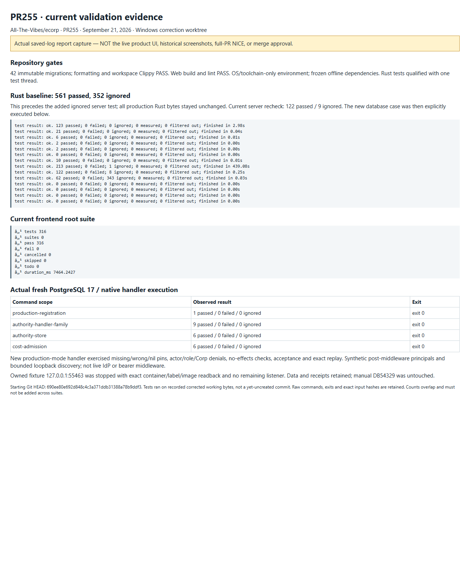
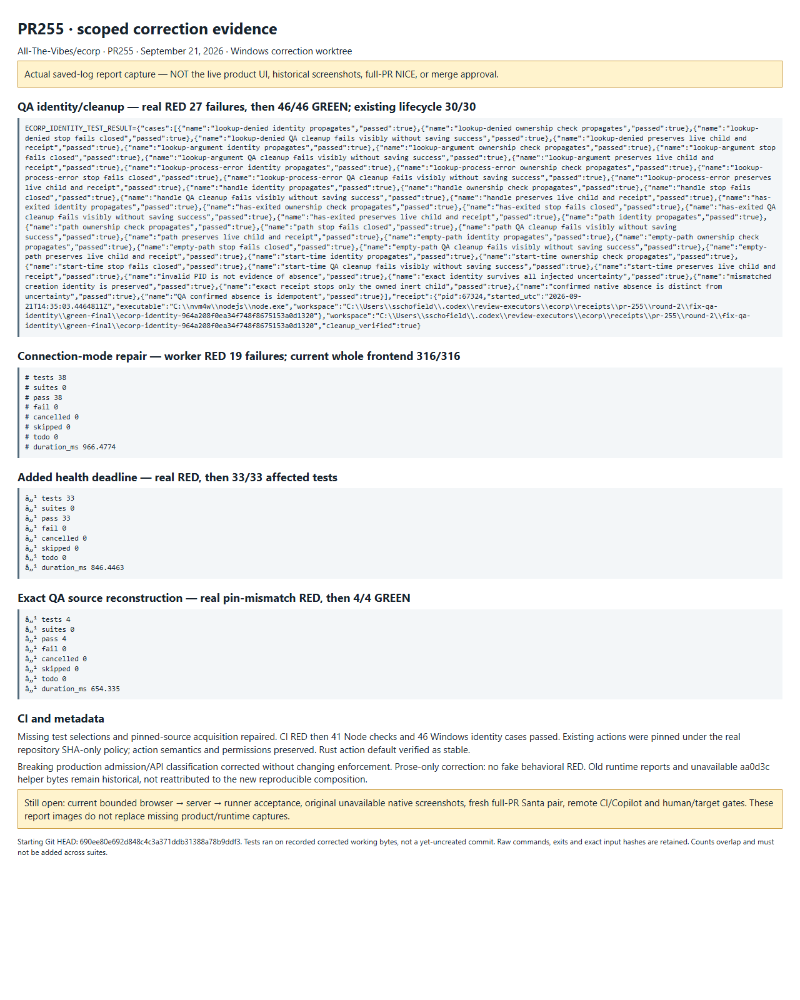

# PR255: scoped review corrections

September 21, 2026. Corrections to remote head
`690ee80e692d848c4c3a371ddb31388a78b9ddf3`, not full-PR NICE or merge approval.
The original contribution and historical reports remain intact.

## Corrections

- Process inspection now distinguishes confirmed absence from uncertainty.
  Cleanup cannot certify an unreadable process as stopped. The existing reviewed
  shared identity/retained-handle contract was reused, not replaced by a new supervisor.
- Connection attempts and failures clear authentication-mode assurance. Both
  connection paths validate the current health response; the new form request
  also has a bounded deadline. Backend authorization is unchanged.
- The published QA base and patch now reconstruct an explicitly new, exact LF
  helper binding. The inaccessible historical `aa0d3c…` bytes and reports were
  not rewritten or promoted into current evidence.
- Documentation and the proposed PR classification disclose the breaking
  production-pin admission change and coordinated upgrade requirements.
- A production-mode controller-registration handler regression checks omitted,
  wrong and nil pins, actor/role/Corp denials, no persistence on denial, valid
  registration and exact replay.
- Existing CI jobs select the added regressions and acquire the exact pinned
  provenance source. Repository policy requires immutable action SHAs; accepted
  mappings preserve the prior action versions, inputs and permissions.

## Actual verification

The [manifest](manifest.json) binds the selected portable receipts to their
original bytes. Each command's output, exit and source bindings are retained;
counts below overlap and must not be added together.

| Check | Observed result |
| --- | --- |
| Shared identity and actual QA Stop-clause regression | RED: 27 failures; GREEN: 46 passed; existing lifecycle suites: 30 passed |
| Connection-mode correction | RED: 19 failures; affected GREEN: 38 passed |
| Additional health deadline | Real failing regression, then 33 affected tests passed |
| QA reconstruction and integrity guards | RED: 1 failure; GREEN: 4 passed |
| CI selection/source-availability contracts | RED: 4 failures; selected Node command: 41 passed; Windows identity cases: 46 passed |
| Full frontend root suite | 316 passed, zero failed/skipped; exact 19-file selection retained |
| Migration checker | 42 immutable migrations passed |
| Formatting and workspace/all-target Clippy | Passed |
| Initial full Rust workspace | 561 passed, 352 ignored, zero failures; serial Windows qualification |
| Added server-test source | Formatting, compilation and package/all-target Clippy passed; server unit suite: 122 passed, 9 SQLx cases ignored |
| Actual new production registration SQLx case | 1 passed, zero failed/ignored |
| Actual affected server-handler family | 9 passed, zero failed/ignored |
| Actual authority-store family | 6 passed, zero failed/ignored |
| Actual cost-admission store/server cases | 6 passed, zero failed/ignored |
| `pnpm build:web` / `pnpm lint:web` | Both passed with frozen existing dependencies |

All six repository baseline commands were executed. The full workspace run
preceded the **test-only** Rust addition; its 154 input hashes are retained.
Only that test file subsequently changed among those inputs. It was separately
compiled, linted and exercised against the database. This is qualified baseline
reuse, not a claim that the full workspace command was rerun after the addition.
All production Rust and migration bytes remain unchanged by these corrections.
Frontend validation includes the delivered health-deadline refinement.

The SQLx runs used a newly owned, image-pinned PostgreSQL 17 fixture bound only
to loopback port 55463. Actual migrations and native handlers ran. Production
mode used synthetic post-middleware OIDC principals and a bounded in-process
discovery fixture: this is **not** bearer/UserInfo middleware, a real identity
provider, or production deployment. Fixture credentials were delivered only in
the scoped child environment, explicitly reduced assurance, and not recorded.
The exact owned container was stopped and its listener absence verified; its
data and receipts were retained. No manual office/database/runner was used.

The initial linker-setup failure, intermediate test diagnostics and unsuccessful
headless-CLI capture remain recorded rather than being counted as passes.
The final images were captured by the bundled Playwright SDK in a fresh
sandbox-enabled Edge profile after the failed capture's owned processes exited.

## Images and remaining limits

These are genuine browser captures of the **saved-log validation reports**,
not live ECorp UI screenshots or reconstructions of the author's old native runs.

Current bounded browser → server → runner acceptance and its genuine product
captures remain open. The original unavailable native screenshots are not
replaced by these report images. The local-command/DB portion of the evidence
gap has new portable proof; the runtime portion remains separately open.

Publication requires two fresh independent scoped `SAFE_TO_PUBLISH` reviews.
Those do not substitute for the separate full-template Santa pair or establish
NICE. Exact new-head hosted CI/Copilot, current target/dependency checks and
required human approvals remain separate. The observed Copilot quota refusal is
not a completed code review. No merge, approval dismissal, protection change,
live Factory activation or issue closure is claimed.
