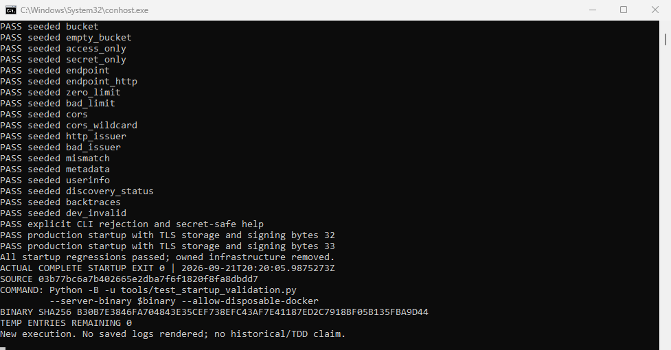

> **PUBLIC REDACTED PACKAGE.** Machine/home/worktree prefixes and transcript identity headers use
> named tokens in archive text. Masked PNGs are explicit derivatives: path-only
> masks and a disclosure footer; source IDs, assertions, results and counts remain
> visible. Unmasked PNGs are byte-identical originals. Redacted bytes are NOT raw. `manifest.json` records each
> raw/public SHA-256 and each image rectangle. Untouched assembled owner copies and raw archive
> remain in the local integration scratch `owner-originals/pr362-startup-20260921/`.
> Archive links below resolve to `receipts.zip`; the adjacent member path identifies
> the exact file. Historical manifest/receipt hash fields still refer to raw bytes;
> use the public manifest to verify the redacted members. This packaging adds no
> test run or reviewer verdict. The combined run is documented separately in
> [combined validation](../pr362-combined-20260921/README.md).

# PR 362 — new complete-startup capture (F-362-B-01 only)

## Result and boundary

On **September 21, 2026**, the unmodified complete startup regression ran against
a newly built standalone server at published source
`03b77bc6a7b402665e2dba7f6f1820f8fa8dbdd7` and **exited 0**.
Invocation: `20:15:48.5612187Z`; completion: `20:20:05.9875273Z`.

This supplies the missing complete-startup test-surface images for F-362-B-01.
It is **a new execution**, not a photograph of the original `09f9163` run,
original TDD chronology, or a source-equivalence substitute. The historical
reports, screenshots, failed attempts and committed receipts were not changed.
The five Python harness unit tests are not substituted for this complete run.

No application/test code, lockfile, protection, other branch, or existing evidence
report changed in this worker. Nonce/TLS test remediation (F-362-B-02), combined
contributor gates, publication and a fresh independent reviewer pair belong to
the parent. These receipts do not declare all of T11/T21 satisfied, Santa NICE,
human approval, production acceptance, or merge readiness.

## Genuine native captures

The original images were unedited PNGs returned by Cua Driver for the same native console
window: **PID 44088, HWND 64495882**. The launcher used
`start_minimized:false` / the driver's `SW_SHOWNOACTIVATE` route and returned
`active:false`. No foreground, desktop-input, UI shell shim, screenshot renderer
or saved-log replay was used. `capture-startup.ps1` invokes the actual Python
process and tees its live output to the console and raw log.

- [Invocation and binary binding](startup-invocation.png)
- [Live recovery, migration and rejection output](startup-progress.png)
- [Complete-run result, TLS positives and actual exit](startup-result.png)



The invocation image precedes the actual test call. The progress and result
images show that call's native output. The result image includes the final
success line, exit 0, full source/binary hashes and empty temporary-root count.
Raw Cua requests/responses and the transcript are in `receipts.zip`; screenshots
are separate committed-candidate files, not only archive members.

## Exact source and build

| Item | Identity |
| --- | --- |
| Base | `410eddfc8bfcfa874dae05555128d39a914f0456` |
| Tested source | `03b77bc6a7b402665e2dba7f6f1820f8fa8dbdd7` |
| Source tree | `31f244d38a70dbefdb10a4f82748e075cce6b2bc` |
| Owned branch | `codex/pr362-startup-evidence-20260921` |
| Server SHA-256 | `b30b7e3846fa704843e35cef738efc43af7e41187ed2c7918bf05b135fba9d44` |
| Harness SHA-256 | `e9dab2e3ec7c5cdf0ce5afe4c29317b9002523632c4a1e783d8af9a112131149` |
| Cargo.lock SHA-256 | `b7fc7c8561587c8a119d6acdf5f57de5eb66b91c009020b34973182248bd52ab` |

The native worktree is
`<STARTUP_WORKTREE>`.
Its tracked source was clean before execution and unchanged afterward.
`source-inputs.json` records Git blobs, working-byte hashes and lengths for all
765 original tracked files; the separately recorded Git tree binds the parent.
The server binary hash matched the successful build receipt before and after
the run. Native GitHub/remote reads confirmed the published parent and base.

Build: `cargo build -p crony-server --locked --offline`, exit 0, with
`CARGO_BUILD_JOBS=2`, `CARGO_PROFILE_DEV_DEBUG=0`, `CARGO_INCREMENTAL=0` and a new
isolated target directory. No dependency installation, lockfile change, integrity
override or compiler/test timeout alteration was used.

Windows x64, build 26200; Rust 1.98.1 / Cargo 1.98.1; bundled Python 3.12.14
(linked OpenSSL 3.5.8); existing Git OpenSSL 3.5.7; PowerShell 7.6.5; Cua Driver
0.24.0; Docker 29.7.2 / Docker Desktop 4.90.0. Executable hashes, Rust commit/LLVM
identity, Docker/image metadata and complete build output are retained.
No provider SDK session or hardware/firmware acceptance is claimed.

## Actual complete-run coverage

`startup.log` has **63 PASS lines**, not 63 independent unit tests:

- 29 rejected configurations on an empty database and the same 29 on a
  populated, recovery-sensitive clone: **58 rejection cases**.
- Runner grace recovery and orphan-staging cleanup, preserving an unrelated
  artifact marker.
- Development startup, all migrations, demo persistence and quiescent restart.
- CLI rejection and secret-safe help with unchanged database fingerprints,
  no fixture requests and no application filesystem writes.
- Production-mode startup against certificate-verified local TLS storage with
  both 32- and 33-byte signing keys.

The inspected harness checks schema, table contents, migration ledger and
sequences; filesystem nonmutation; sampled listeners; OIDC/storage request
counts; bounded diagnostics and secret markers. Its Python assertions remained
enabled, all cases ran, and `--baseline` was absent. Listener sampling does not
prove absence of an arbitrarily brief bind. This is local fixture acceptance,
not real production identity, external S3 authorization, provider execution,
browser/runner acceptance or Factory operation.

## Ownership and cleanup

The unmodified harness created only its own PostgreSQL fixture:

- Name: `ecorp-271-1b099150cb4047b68eaa1e593df52188`
- ID: `0056a78140889fedd9e9f8be1dd8c713bee08abf4f873151c86b29923137f8d8`
- Label: `ecorp.test-owner=1b099150cb4047b68eaa1e593df52188`
- Binding: `127.0.0.1:50619` to container 5432; tmpfs database storage,
  no mounted volumes.
- Locally available image: `postgres:17-alpine`,
  `sha256:18cfe3ef5e6815560c98237d6216d1e5119702fb0f3894c8785dd58b8bbe5d73`.

The observed Python process (62204, child of shell 44088) invoked the exact
harness/binary arguments. Its observed Docker child addressed that exact
container. Live inspection verified name, label, port and tmpfs before cleanup.
The harness's existing cleanup verifies exact name and owner before removal.

Independent post-run reads confirmed an empty exact-name container query
(Docker exit 0), no process using the exact server binary, no harness process,
an empty owned temporary root and removal of `ecorp271-47yi0mda`.
Docker's bounded historical event query returned the container's `die` and
`destroy` events; it did not return earlier create/start events, so those are
not claimed as retained event receipts. Live creation/ownership metadata is
recorded separately. The container's exit 137 is the harness's existing
owner-verified `docker rm --force` cleanup, not the regression exit (0).
After capture acknowledgement the script exited normally
and Cua found no window for PID 44088.

Manual API 8791, web 5187 and DB 54329 were not used. No real provider,
production identity, system trust, retained runtime, Factory or GitHub write
was used. Compiled outputs and evidence remain in the owned scratch directory;
these retained build artifacts are not live fixture infrastructure.

## Reproduction and retained receipts

Scratch root used for this execution:
`<STARTUP_SCRATCH>`.
`run.json` contains the absolute Python/binary paths and the exact argument
array. The actual test command was:

```powershell
& $python -B -u tools/test_startup_validation.py `
  --server-binary $binary --allow-disposable-docker
```

For another run, use a fresh owned output/temp directory and independently build
the standalone server from the intended clean source with the locked/offline
command above. Set `TEMP`, `TMP`, `TMPDIR` to that owned directory and retain
`SystemRoot`; do not set Python optimization. The harness requires the existing
OpenSSL and Docker tools and an already available image, refuses dotenv
ancestors, generates loopback-only fixtures and strips the server environment.
Do not reuse this receipt directory or point it at a shared database.

The local original `receipts.zip` retains raw build/test/transcript output, invocation wrapper,
source/tool identities, native capture requests/responses, owned-resource
observations, cleanup reads and honest non-test diagnostic failures.
Unrelated window titles and unrelated containers from scratch discovery are
excluded from the portable archive. `manifest.json` hashes every archive
member and all delivered files except itself. Packaging validation checks
the raw case list, source hashes, exit, cleanup and image signatures; it is
not another application regression run.

This evidence-only correction has no meaningful executable red-before/green-after
code change. The preceding independent review records the missing-image state;
these new images supply evidence for the parent's fresh review without
inventing a red test or modifying the original chronology.
